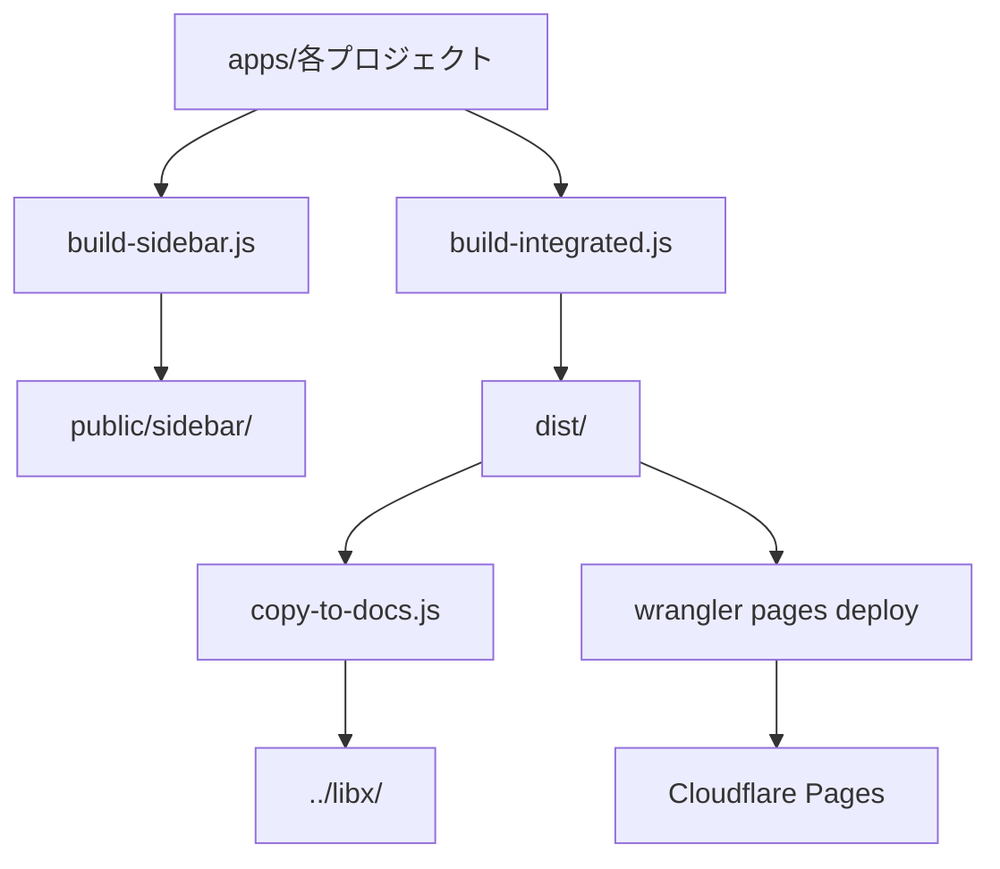

# ビルド・デプロイメントガイド

このガイドでは、ドキュメントサイトのビルドとデプロイメントプロセスについて詳しく説明します。統合ビルドシステムからCloudflare Pagesへのデプロイまで、すべての手順を網羅します。

## 🚀 クイックスタート（推奨）

最も効率的なビルド・デプロイ方法から始めましょう。

### 基本的なデプロイワークフロー

```bash
# 完全なビルドとデプロイ（すべてのプロジェクト）
pnpm build:deploy && pnpm deploy:pages

# 選択的ビルド・デプロイ（変更されたプロジェクトのみ - 🆕推奨）
pnpm build:deploy-selective --projects=sample-docs && pnpm deploy:pages

# または段階的に実行
pnpm build:sidebar    # サイドバー生成
pnpm build           # 統合ビルド
pnpm copy:docs       # 出力コピー
pnpm deploy:pages    # Cloudflare Pagesにデプロイ
```

### 選択的ビルド（🆕 新機能）

```bash
# 特定のプロジェクトのみビルド（単体）
pnpm build:selective --projects=sample-docs

# 複数のプロジェクトをビルド
pnpm build:selective --projects=sample-docs,test-verification

# ローカル開発用選択的ビルド
pnpm build:selective:local --projects=sample-docs

# 選択的サイドバー生成
pnpm build:sidebar-selective --projects=sample-docs
```

### ローカル開発用ビルド

```bash
# ローカル環境用ビルド（ベースパスなし）
pnpm build:local

# 開発サーバー起動
pnpm dev
```

### よく使用するコマンド

| コマンド | 説明 | 使用場面 |
|---------|------|----------|
| `pnpm build:deploy` | サイドバー → ビルド → コピーの統合実行 | **最も推奨** |
| `pnpm build:deploy-selective --projects=sample-docs` | 選択的ビルド・デプロイ | **少数プロジェクト変更時** |
| `pnpm deploy` | ビルド → デプロイの統合実行 | 直接デプロイ時 |
| `pnpm build:local` | ローカル用ビルド | 開発・テスト時 |
| `pnpm build:selective --projects=sample-docs` | 選択的ビルド | 特定プロジェクトのみ |
| `pnpm build:sidebar` | サイドバー生成のみ | サイドバー更新時 |

## 📋 前提条件

- Node.js 18以上
- pnpm 8以上
- Wrangler CLI（Cloudflareデプロイ用）
- 正しいプロジェクト構造

### Wranglerセットアップ

```bash
# Wranglerをインストール（未インストールの場合）
npm install -g wrangler

# Cloudflareにログイン
wrangler login

# プロジェクト設定を確認
wrangler pages project list
```

## 🏗️ ビルドシステムの概要

### システムアーキテクチャ



### 主要コンポーネント

1. **`build-sidebar.js`** - ドキュメントからサイドバーJSONを自動生成
2. **`build-integrated.js`** - 各アプリをビルドして統合
3. **`build-selective.js`** - 🆕 指定されたプロジェクトのみをビルドして統合
4. **`build-sidebar-selective.js`** - 🆕 指定されたプロジェクトのみのサイドバー生成
5. **`copy-to-docs.js`** - ビルド出力を外部ディレクトリにコピー
6. **`wrangler`** - Cloudflare Pagesへのデプロイ

### プロジェクト検出と処理

システムは`apps/`ディレクトリを自動スキャンし：

- **含まれるプロジェクト**: `sample-docs`, `test-verification`等のドキュメントプロジェクト
- **除外されるプロジェクト**: `project-template`（テンプレート）, `top-page`（サイドバー生成では除外）
- **特別扱い**: `top-page`はルート（`/`）に配置、他は`/docs/{project-name}/`に配置

## 🔧 詳細ビルドプロセス

### 1. サイドバー生成（`build-sidebar.js`）

```bash
pnpm build:sidebar
```

**処理内容**:
1. `apps/`ディレクトリのプロジェクト自動検出
2. 各プロジェクトの言語・バージョンを動的分析
3. MDXファイルのフロントマター解析
4. カテゴリ別・順序別でサイドバーJSONを生成
5. 通常版と圧縮版（.gz）の両方を出力

**出力場所**:
```
apps/{project}/public/sidebar/
├── sidebar-en-v2.json
├── sidebar-en-v2.json.gz
├── sidebar-ja-v2.json
└── sidebar-ja-v2.json.gz
```

### 1b. 選択的サイドバー生成（`build-sidebar-selective.js`）🆕

```bash
pnpm build:sidebar-selective --projects=sample-docs
```

**処理内容**:
- 指定されたプロジェクトのみサイドバーJSONを生成
- 既存のサイドバーファイルは保持され、指定プロジェクトのみ更新
- 全プロジェクトスキャンを回避し、ビルド時間を短縮

**使用例**:
```bash
# 単一プロジェクト
pnpm build:sidebar-selective --projects=sample-docs

# 複数プロジェクト
pnpm build:sidebar-selective --projects=sample-docs,test-verification
```

### 2. 統合ビルド（`build-integrated.js`）

```bash
# プロダクション用
pnpm build

# ローカル開発用
pnpm build:local
```

**処理フロー**:
1. **プロジェクト検出**: `apps/`内のディレクトリを自動スキャン
2. **個別ビルド**: 各プロジェクトを順次`pnpm build`
3. **出力統合**: すべてのビルド結果を`dist/`に統合
4. **ベースパス修正**: HTML内のパス書き換え
5. **サイドバーコピー**: JSONファイルを適切な場所に配置

**ディレクトリ構造**:
```
dist/
├── index.html              # top-page（ルート）
├── assets/                 # 共通アセット
├── docs/
│   ├── sample-docs/        # sample-docsプロジェクト
│   │   ├── v2/ja/
│   │   ├── sidebar/        # サイドバーJSON
│   │   └── ...
│   └── test-verification/  # test-verificationプロジェクト
```

### 2b. 選択的統合ビルド（`build-selective.js`）🆕

```bash
# プロダクション用
pnpm build:selective --projects=sample-docs

# ローカル開発用
pnpm build:selective:local --projects=sample-docs
```

**処理フロー**:
1. **プロジェクト検証**: 指定されたプロジェクトの存在確認
2. **個別ビルド**: 指定されたプロジェクトのみを順次`pnpm build`
3. **増分統合**: 既存の`dist/`内容を保持し、指定プロジェクトのみ置換
4. **ベースパス修正**: HTML内のパス書き換え（従来と同じ）
5. **サイドバーコピー**: JSONファイルを適切な場所に配置

**メリット**:
- ⚡ **大幅な時間短縮**: 変更されたプロジェクトのみビルド
- 💾 **効率的なリソース利用**: 不要な処理を回避
- 🔄 **既存distとの統合**: 他のプロジェクトは影響を受けない

**使用例**:
```bash
# 単一プロジェクトの選択的ビルド
pnpm build:selective --projects=sample-docs

# 複数プロジェクトの選択的ビルド
pnpm build:selective --projects=sample-docs,test-verification

# ローカル開発用（ベースパスなし）
pnpm build:selective:local --projects=top-page
```

### 3. ベースパス処理

**プロダクション環境**:
- ベースパス: `/libx`
- URL例: `https://libx.dev/docs/sample-docs/v2/ja/`

**ローカル開発環境**:
- ベースパスなし
- URL例: `http://localhost:8080/v2/ja/`

**処理内容**:
- HTMLファイル内のアセットパスを環境に応じて書き換え
- リダイレクト先URLの修正
- canonical URLの環境別設定

### 4. 出力コピー（`copy-to-docs.js`）

```bash
pnpm copy:docs
```

**目的**: `dist/`の内容を`../libx/`ディレクトリにコピー
**用途**: 外部ドキュメントリポジトリとの連携

## 🚀 デプロイメント詳細

### Cloudflare Pagesへのデプロイ

#### 設定ファイル（`wrangler.toml`）

```toml
name = "libx"
compatibility_date = "2024-01-01"
pages_build_output_dir = "dist"
```

#### デプロイコマンド

```bash
# 直接デプロイ
pnpm deploy:pages

# ビルドとデプロイを統合実行
pnpm deploy
```

#### デプロイプロセス

1. **認証確認**: Wranglerでのログイン状態確認
2. **ビルド出力検証**: `dist/`ディレクトリの存在確認
3. **ファイルアップロード**: Cloudflare Pagesへの転送
4. **デプロイ完了**: 新しいデプロイメントのアクティベート

### デプロイ環境の設定

#### 初回セットアップ

```bash
# Cloudflareアカウントでログイン
wrangler login

# プロジェクト作成（初回のみ）
wrangler pages project create libx

# 設定確認
wrangler pages project list
```

#### 環境変数（必要に応じて）

```bash
# 環境変数の設定
wrangler pages secret put SECRET_NAME

# 環境変数の確認
wrangler pages secret list
```

## 🚨 トラブルシューティング

### ビルドエラー

#### 問題1: プロジェクト検出失敗

```bash
# エラーメッセージ例
ドキュメントプロジェクトが見つかりませんでした。
```

**原因と解決方法**:
- `apps/`ディレクトリ内にドキュメントプロジェクトがない
- `src/content/docs`ディレクトリが存在しない

```bash
# 確認方法
ls apps/                                    # プロジェクト一覧
ls apps/sample-docs/src/content/docs/      # ドキュメント構造確認
```

#### 問題2: サイドバー生成エラー

```bash
# エラーメッセージ例
ファイルの処理中にエラーが発生しました: v2/ja/01-guide/01-getting-started.mdx
```

**原因と解決方法**:
- MDXファイルのフロントマターが不正
- 必須フィールド（title, description）の不足

```bash
# 確認方法
# MDXファイルの先頭を確認
head -10 apps/sample-docs/src/content/docs/v2/ja/01-guide/01-getting-started.mdx
```

**修正例**:
```mdx
---
title: "正しいタイトル"
description: "正しい説明文"
---
```

#### 問題3: 個別アプリのビルド失敗

```bash
# エラーメッセージ例
sample-docsのビルドに失敗しました: Command failed with exit code 1
```

**診断手順**:
```bash
# 個別プロジェクトのビルドテスト
cd apps/sample-docs
pnpm build

# 依存関係の確認
pnpm install

# 設定ファイルの確認
cat astro.config.mjs
```

#### 問題4: ベースパス修正エラー

**症状**: HTMLファイル内のリンクが正しく書き換わらない

**確認方法**:
```bash
# ビルド結果のHTMLファイルを確認
grep -r "libx" dist/docs/sample-docs/ | head -5
```

**解決方法**: `build-integrated.js`の`updateBasePath`関数の正規表現を確認

### デプロイエラー

#### 問題1: Wrangler認証エラー

```bash
# エラーメッセージ例
Authentication error: please run `wrangler login`
```

**解決方法**:
```bash
# 再ログイン
wrangler logout
wrangler login

# 認証状態確認
wrangler whoami
```

#### 問題2: プロジェクトが見つからない

```bash
# エラーメッセージ例
Project "libx" not found
```

**解決方法**:
```bash
# プロジェクト一覧確認
wrangler pages project list

# プロジェクト作成（存在しない場合）
wrangler pages project create libx
```

#### 問題3: ファイルサイズ制限

```bash
# エラーメッセージ例
File size exceeds limit
```

**解決方法**:
- 不要なファイルの除去
- 画像の最適化
- ビルド出力の最適化

```bash
# ビルドサイズの確認
du -sh dist/
find dist/ -size +1M -type f | head -10
```

#### 問題4: デプロイタイムアウト

**解決方法**:
- ネットワーク環境の確認
- ファイル数の削減
- 再試行

```bash
# 手動で再試行
wrangler pages deploy dist --project-name libx --compatibility-date 2024-01-01
```

### パフォーマンス問題

#### ビルド時間の最適化

**現状確認**:
```bash
# 完全ビルド時間の測定
time pnpm build

# 選択的ビルド時間の測定（🆕推奨）
time pnpm build:selective --projects=sample-docs
```

**選択的ビルドによる最適化効果**:
- 📊 **1プロジェクト変更時**: 約70-80%の時間短縮
- 📊 **2プロジェクト変更時**: 約50-60%の時間短縮
- 📊 **全プロジェクト変更時**: 従来の`pnpm build`と同等

**最適化方法**:
1. **選択的ビルド**: 変更されたプロジェクトのみ処理（🆕推奨）
2. **並列処理**: 各プロジェクトのビルドを並列化（今後の改善予定）
3. **キャッシュ活用**: Node.jsモジュールキャッシュの最適化
4. **不要なファイル除外**: ビルド対象の絞り込み

**推奨ワークフロー**:
```bash
# 開発中（特定プロジェクト変更）
pnpm build:deploy-selective --projects=sample-docs

# リリース前（全プロジェクト確認）
pnpm build:deploy
```

#### メモリ使用量の管理

**大量ドキュメント処理時の対策**:
```bash
# Node.jsメモリ制限の調整
NODE_OPTIONS="--max-old-space-size=4096" pnpm build
```

## 🔧 高度な設定

### カスタムビルド設定

#### プロジェクト固有の処理

特定のプロジェクトのみ異なる処理を行う場合：

```javascript
// build-integrated.js内でのカスタマイズ例
if (app.name === 'special-project') {
  // 特別な処理
  execSync(`custom-build-script.sh`, { stdio: 'inherit' });
}
```

#### 除外プロジェクトの追加

```javascript
// build-integrated.jsで新しい除外ルールを追加
const excludedProjects = ['project-template', 'experimental-project'];
```

### CI/CD統合

#### GitHub Actionsでの自動化

```yaml
# .github/workflows/deploy.yml
name: Build and Deploy
on:
  push:
    branches: [main]

jobs:
  deploy:
    runs-on: ubuntu-latest
    steps:
      - uses: actions/checkout@v3
      - uses: pnpm/action-setup@v2
        with:
          version: 8
      - name: Setup Node.js
        uses: actions/setup-node@v3
        with:
          node-version: 18
          cache: 'pnpm'
      - name: Install dependencies
        run: pnpm install
      - name: Build and deploy
        run: pnpm build:deploy && pnpm deploy:pages
        env:
          CLOUDFLARE_API_TOKEN: ${{ secrets.CLOUDFLARE_API_TOKEN }}
```

#### 環境別デプロイ

```bash
# 開発環境デプロイ
wrangler pages deploy dist --project-name libx-dev

# ステージング環境デプロイ
wrangler pages deploy dist --project-name libx-staging

# プロダクション環境デプロイ
wrangler pages deploy dist --project-name libx
```

### モニタリングとログ

#### ビルド情報の記録

```bash
# ビルド情報をログファイルに記録
pnpm build 2>&1 | tee build.log

# エラーのみを抽出
grep -i error build.log
```

#### デプロイ履歴の確認

```bash
# デプロイメント履歴
wrangler pages deployment list --project-name libx

# 特定のデプロイメント詳細
wrangler pages deployment tail
```

## 📚 ベストプラクティス

### 効率的なワークフロー

#### 開発フェーズ

1. **コンテンツ追加・編集**
   ```bash
   # 開発サーバーでの確認
   pnpm dev
   ```

2. **ローカルビルドテスト**
   ```bash
   # 本番環境と同様のビルドテスト
   pnpm build:local
   ```

3. **サイドバー更新確認**
   ```bash
   # サイドバーのみ生成してテスト
   pnpm build:sidebar
   ```

#### リリースフェーズ

1. **完全ビルドテスト**
   ```bash
   pnpm build:deploy
   ```

2. **ローカルプレビュー**
   ```bash
   # 静的ファイルサーバーでプレビュー
   npx serve dist
   ```

3. **本番デプロイ**
   ```bash
   pnpm deploy:pages
   ```

### 品質管理

#### ビルド前チェック

```bash
# Lintエラーの確認
pnpm lint

# フォーマットの適用
pnpm format

# 設定ファイルのバリデーション
node -c scripts/build-integrated.js
```

#### デプロイ前確認

- [ ] ローカルでのビルド成功
- [ ] サイドバー生成の正常完了
- [ ] 主要ページの表示確認
- [ ] リンク切れのチェック
- [ ] レスポンシブデザインの確認

### チーム開発での運用

#### ルール策定

1. **ブランチ戦略**
   - `main` - プロダクションビルド
   - `develop` - 開発統合ブランチ
   - `feature/*` - 機能開発ブランチ

2. **デプロイ権限**
   - プロダクションデプロイは限定メンバーのみ
   - ステージング環境での事前確認必須

3. **ビルドエラー対応**
   - ビルド失敗時は速やかに修正
   - 複雑な問題は issue で報告・共有

#### コミュニケーション

```bash
# デプロイ通知の自動化例
pnpm deploy:pages && \
echo "✅ デプロイ完了: $(date)" | \
# Slack webhook等での通知
```

### セキュリティと保守

#### 機密情報の管理

```bash
# 環境変数での管理
export CLOUDFLARE_API_TOKEN="your-token"

# .env.local での管理（.gitignoreに追加）
echo "CLOUDFLARE_API_TOKEN=your-token" > .env.local
```

#### 定期的なメンテナンス

- [ ] 依存関係の更新
- [ ] Wranglerバージョンの更新  
- [ ] ビルドスクリプトの最適化
- [ ] 不要ファイルのクリーンアップ

```bash
# 依存関係の更新
pnpm update

# Wranglerの更新
npm update -g wrangler

# 古いビルドファイルの削除
rm -rf dist/ apps/*/dist/
```

## 🔄 スクリプト詳細リファレンス

### build-integrated.js

**主要関数**:
- `generateAppsList()` - プロジェクトの動的検出
- `updateBasePath()` - HTMLファイル内パス書き換え
- `updateBasePathsRecursive()` - ディレクトリ再帰処理

**設定可能項目**:
- `isLocalBuild` - ローカルビルドフラグ
- 除外プロジェクト一覧
- ベースパス設定

### build-selective.js 🆕

**主要関数**:
- `parseProjectsFromArgs()` - コマンドライン引数解析
- `getAvailableProjects()` - 利用可能プロジェクト検出
- `validateProjects()` - 指定プロジェクト存在確認
- `generateProjectConfig()` - プロジェクト設定生成
- `updateBasePath()` / `updateBasePathsRecursive()` - パス修正（継承）

**設定可能項目**:
- `--projects` - 対象プロジェクト指定（必須）
- `--local` - ローカルビルドフラグ

**エラーハンドリング**:
- 不正プロジェクト名の検証とエラーメッセージ
- 利用可能プロジェクト一覧の表示
- ビルド失敗時の詳細エラー報告

### build-sidebar.js

**主要機能**:
- プロジェクト自動検出
- 言語・バージョン動的分析
- MDXフロントマター解析
- JSON圧縮出力

**カスタマイズポイント**:
- 除外プロジェクトの追加
- カテゴリ翻訳の設定
- 出力形式の調整

### build-sidebar-selective.js 🆕

**主要機能**:
- 指定プロジェクトのみのサイドバー生成
- 既存サイドバーファイルの保持
- プロジェクト検証とエラーハンドリング

**カスタマイズポイント**:
- `--projects` - 対象プロジェクト指定（必須）
- 除外プロジェクトの追加（build-sidebar.jsと同じ設定）
- エラー時の詳細ログ出力

### copy-to-docs.js

**単純な機能**:
- `dist/` → `../libx/` のファイルコピー
- 既存ファイルの上書き
- エラーハンドリング

**使用場面**:
- 外部リポジトリとの連携
- バックアップ用途
- CI/CD でのファイル転送

## 📖 関連ドキュメント

- [新しいプロジェクト作成ガイド](./NEW_PROJECT_CREATION_GUIDE.md) - 新規プロジェクトの作成方法
- [バージョン追加ガイド](./VERSION_ADDITION_GUIDE.md) - 新しいバージョンの追加方法  
- [言語追加ガイド](./LANGUAGE_ADDITION_GUIDE.md) - 新しい言語の追加方法
- [ドキュメント追加ガイド](./DOCUMENT_ADDITION_GUIDE.md) - 新しいドキュメントの追加方法
- [トラブルシューティングガイド](./TROUBLESHOOTING_GUIDE.md) - 問題解決の総合ガイド

## 🔄 更新履歴

- **2025年8月**: 初回作成、統合ビルドシステム対応版
- ビルドスクリプト: `build-integrated.js`, `build-sidebar.js`, `copy-to-docs.js`
- デプロイ: Cloudflare Pages + Wrangler CLI
- プロジェクト名: `libx`

---

このガイドでは、ビルドとデプロイの包括的な手順を詳しく説明しました。**推奨は`pnpm build:deploy`による統合ワークフローの使用**ですが、個別のステップも理解しておくことで、問題発生時に適切な対応が可能になります。

質問や問題がある場合は、プロジェクトのIssueトラッカーまたはドキュメントメンテナーにお問い合わせください。