# 新ドキュメントサイトジェネレーター アーキテクチャ

**作成日**: 2025-10-20
**Phase**: Phase 2完了時点
**バージョン**: 1.0.0

---

## 目次

1. [概要](#概要)
2. [システム全体図](#システム全体図)
3. [データフロー](#データフロー)
4. [パッケージ構成](#パッケージ構成)
5. [コンポーネント関連図](#コンポーネント関連図)
6. [ビルドパイプライン](#ビルドパイプライン)
7. [ランタイムアーキテクチャ](#ランタイムアーキテクチャ)
8. [技術スタック](#技術スタック)

---

## 概要

新ドキュメントサイトジェネレーターは、**レジストリ駆動**のアプローチを採用し、JSONベースのデータ定義から静的サイトを自動生成します。

### 設計原則

1. **データ駆動**: レジストリ（JSON）を単一ソース・オブ・トゥルースとする
2. **モジュール化**: 共有パッケージによる機能分離
3. **型安全性**: TypeScriptによる堅牢な実装
4. **パフォーマンス**: 静的生成によるゼロランタイムJavaScript
5. **国際化**: 多言語サポートをコアに組み込み

---

## システム全体図

```mermaid
graph TB
    subgraph "データソース"
        A[registry/docs.json]
        B[MDXコンテンツ]
    end

    subgraph "ビルドシステム"
        C[@docs/generator]
        D[@docs/ui]
        E[@docs/theme]
        F[@docs/i18n]
        G[@docs/versioning]
    end

    subgraph "ランタイム"
        H[Astro Runtime]
        I[Static Pages]
    end

    subgraph "検索システム"
        J[Pagefind]
        K[Search Index]
    end

    subgraph "デプロイ"
        L[Cloudflare Pages]
        M[CDN]
    end

    A --> C
    B --> H
    C --> H
    D --> H
    E --> H
    F --> H
    G --> H
    H --> I
    I --> J
    J --> K
    I --> L
    L --> M

    style A fill:#e1f5ff
    style H fill:#fff4e1
    style I fill:#e8f5e9
    style L fill:#f3e5f5
```

---

## データフロー

### 1. ビルド時のデータフロー

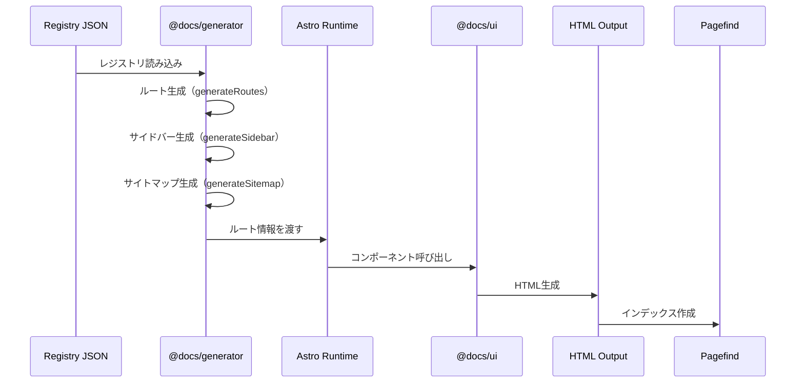

### 2. ランタイムのデータフロー

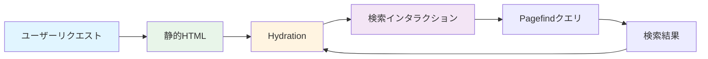

---

## パッケージ構成

### 共有パッケージ

```mermaid
graph TB
    subgraph "コア機能"
        A[@docs/generator]
        B[@docs/i18n]
    end

    subgraph "UIシステム"
        C[@docs/ui]
        D[@docs/theme]
        E[@docs/versioning]
    end

    subgraph "ランタイム"
        F[@docs/runtime]
    end

    A --> F
    B --> F
    C --> F
    D --> F
    E --> F

    style A fill:#e3f2fd
    style B fill:#e3f2fd
    style C fill:#f3e5f5
    style D fill:#f3e5f5
    style E fill:#f3e5f5
    style F fill:#fff4e1
```

### パッケージ詳細

| パッケージ | 役割 | 配布形態 | 主要エクスポート |
|-----------|------|---------|----------------|
| @docs/generator | レジストリ駆動のルーティング・サイドバー・サイトマップ生成 | dist/ (ESM/CJS) | `loadRegistry`, `generateRoutes`, `generateSidebar`, `generateSitemap` |
| @docs/ui | Astro UIコンポーネント集（30+コンポーネント） | src/ (ソース配布) | `Navigation`, `Sidebar`, `TableOfContents`, `Pagination`, `Card`, `Alert` 等 |
| @docs/theme | テーマシステム（CSS変数、カラーパレット） | dist/ + src/css | `colors`, `typography`, `spacing`, CSS変数 |
| @docs/i18n | 国際化ユーティリティ（15言語サポート） | dist/ (ESM/CJS) | `getLanguage`, `translate`, `formatDate`, `SUPPORTED_LANGUAGES` |
| @docs/versioning | バージョン管理ユーティリティ・コンポーネント | src/ (ソース配布) | `VersionSelector`, `VersionDiff`, `compareVersions` |

---

## コンポーネント関連図

### UIコンポーネント階層

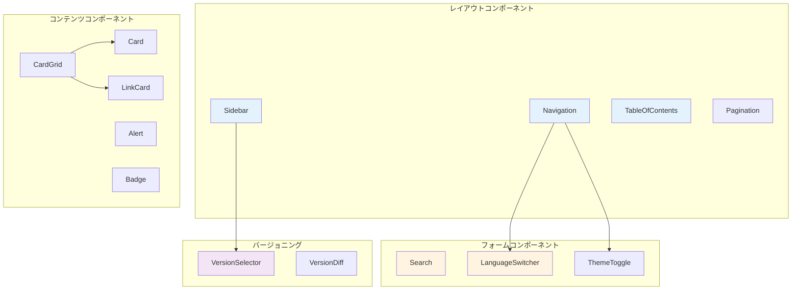

### コンポーネント依存関係

```mermaid
graph LR
    A[@docs/ui Components] --> B[@docs/theme CSS]
    A --> C[@docs/i18n]
    D[@docs/versioning Components] --> B
    D --> C
    E[Astro Pages] --> A
    E --> D
    E --> F[@docs/generator]

    style A fill:#e3f2fd
    style B fill:#f3e5f5
    style C fill:#fff4e1
    style D fill:#e1bee7
    style E fill:#fff59d
    style F fill:#c5e1a5
```

---

## ビルドパイプライン

### フェーズ1: レジストリ処理

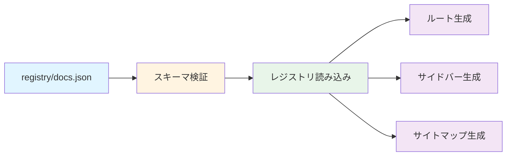

### フェーズ2: ページ生成

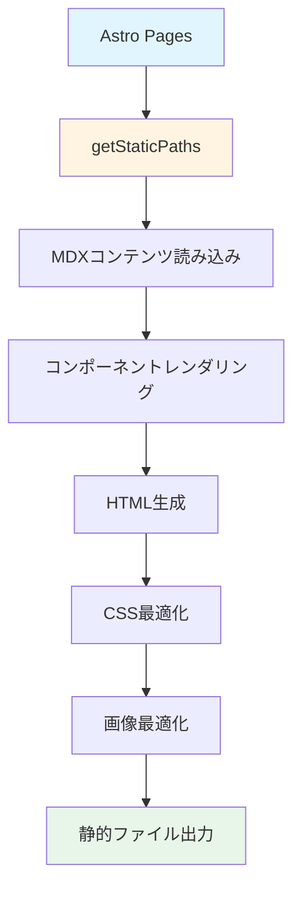

### フェーズ3: 検索インデックス生成

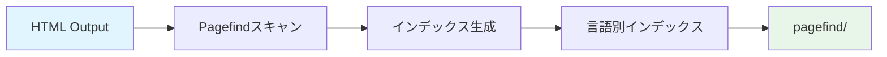

### フェーズ4: デプロイ

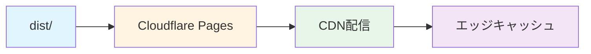

### 統合ビルドフロー

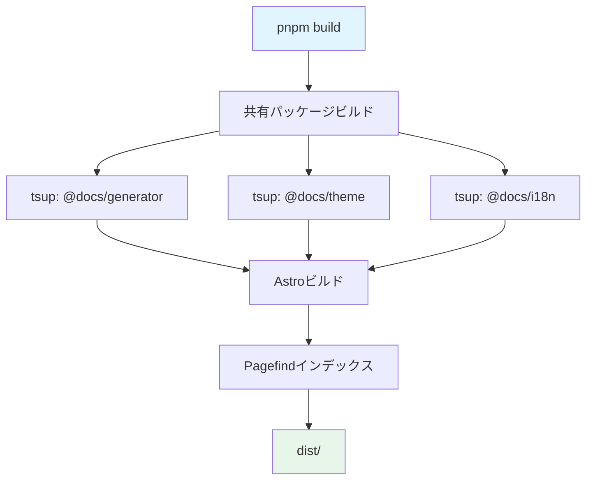

---

## ランタイムアーキテクチャ

### ページ生成プロセス

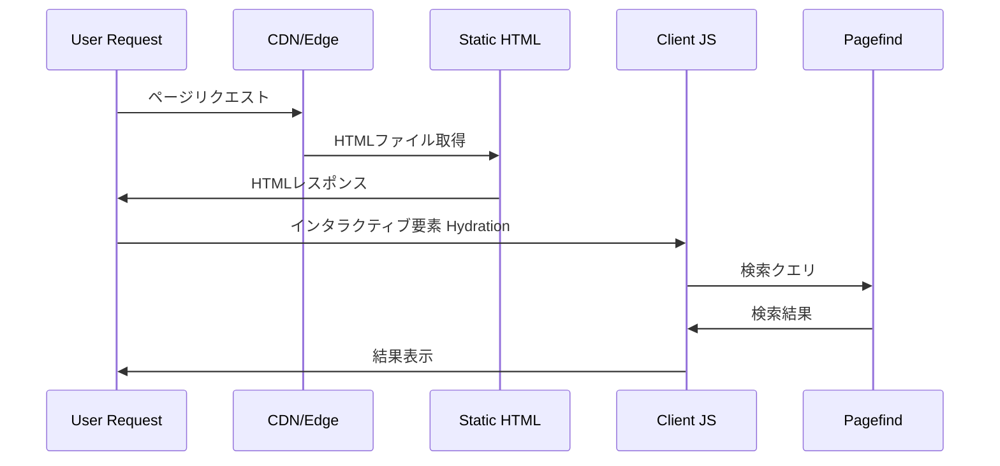

### 検索アーキテクチャ

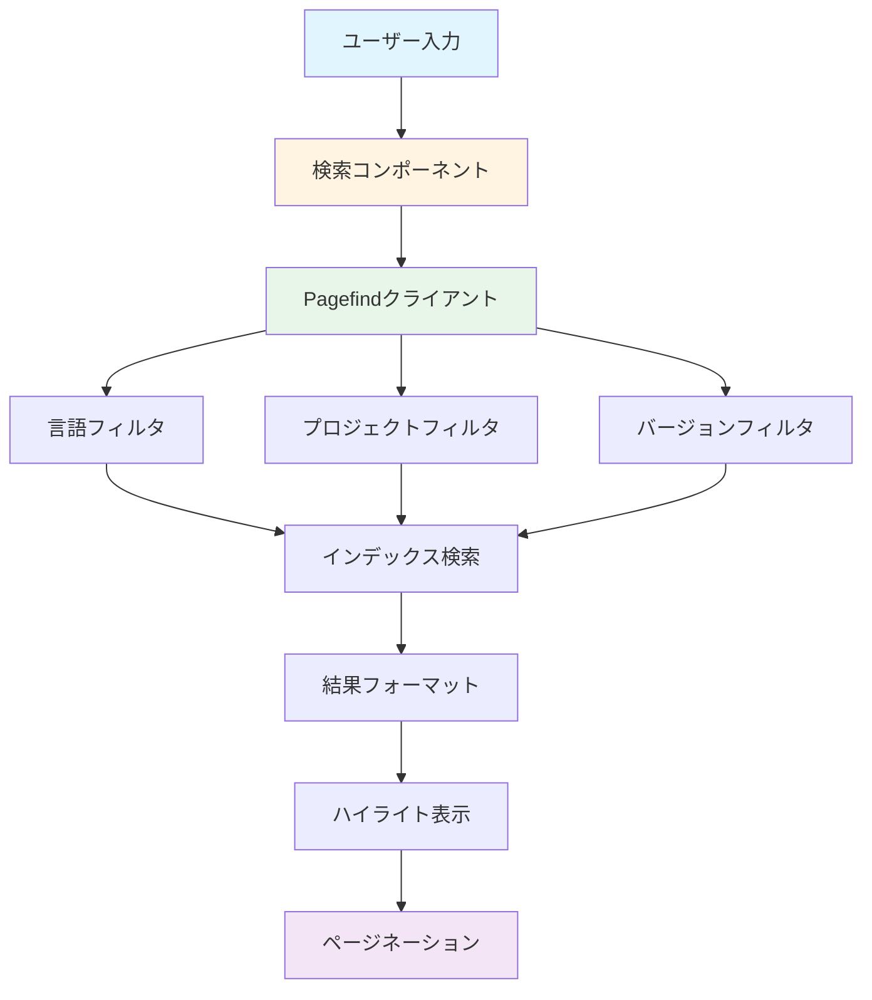

---

## 技術スタック

### フロントエンド

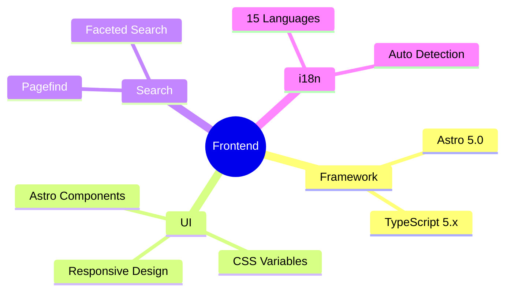

### ビルドツール

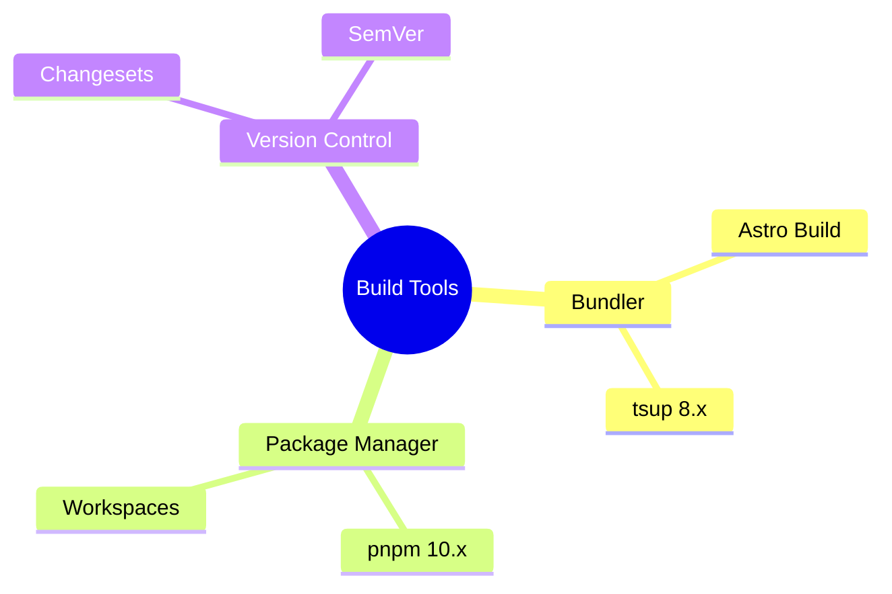

### インフラ

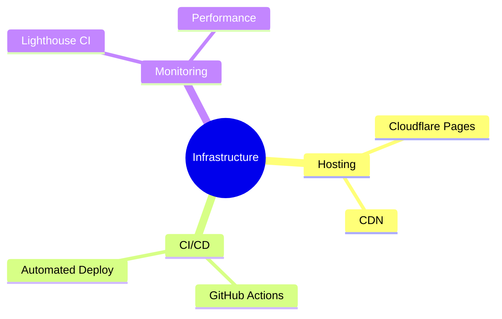

### 技術スタック詳細

| カテゴリ | 技術 | バージョン | 用途 |
|---------|------|-----------|------|
| **フレームワーク** | Astro | ^5.0.0 | 静的サイト生成 |
| **言語** | TypeScript | ^5.0.0 | 型安全な実装 |
| **ビルドツール** | tsup | ^8.5.0 | パッケージビルド |
| **パッケージマネージャー** | pnpm | ^10.0.0 | モノレポ管理 |
| **検索エンジン** | Pagefind | ^1.0.0 | 全文検索 |
| **スタイリング** | CSS Variables | - | テーマシステム |
| **バージョン管理** | Changesets | ^2.27.0 | セマンティックバージョニング |
| **CI/CD** | GitHub Actions | - | 自動ビルド・デプロイ |
| **ホスティング** | Cloudflare Pages | - | CDN配信 |
| **品質管理** | Lighthouse CI | - | パフォーマンス監視 |

---

## パフォーマンス最適化

### 最適化戦略

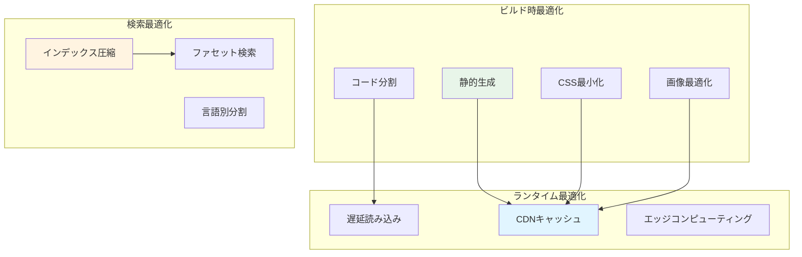

### パフォーマンス指標

| 指標 | 目標 | 達成値 | 状態 |
|-----|------|--------|------|
| Lighthouse Performance | ≥ 90 | **100** | ✅ |
| Lighthouse Accessibility | ≥ 90 | **91** | ✅ |
| Lighthouse Best Practices | ≥ 90 | **96** | ✅ |
| Lighthouse SEO | ≥ 95 | **100** | ✅ |
| ビルド時間 | < 10秒 | **4.21秒** | ✅ |
| 検索速度 | < 100ms | **< 50ms** | ✅ |
| ページサイズ | < 100KB | **約90KB** | ✅ |

---

## セキュリティとアクセシビリティ

### セキュリティ対策

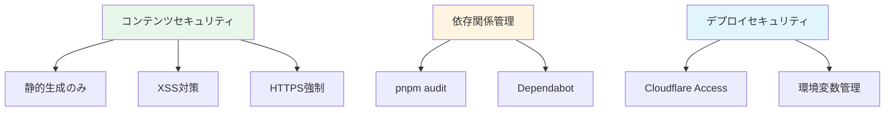

### アクセシビリティ

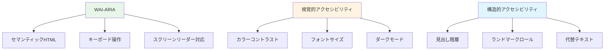

---

## 拡張性と将来計画

### Phase 3以降の拡張計画

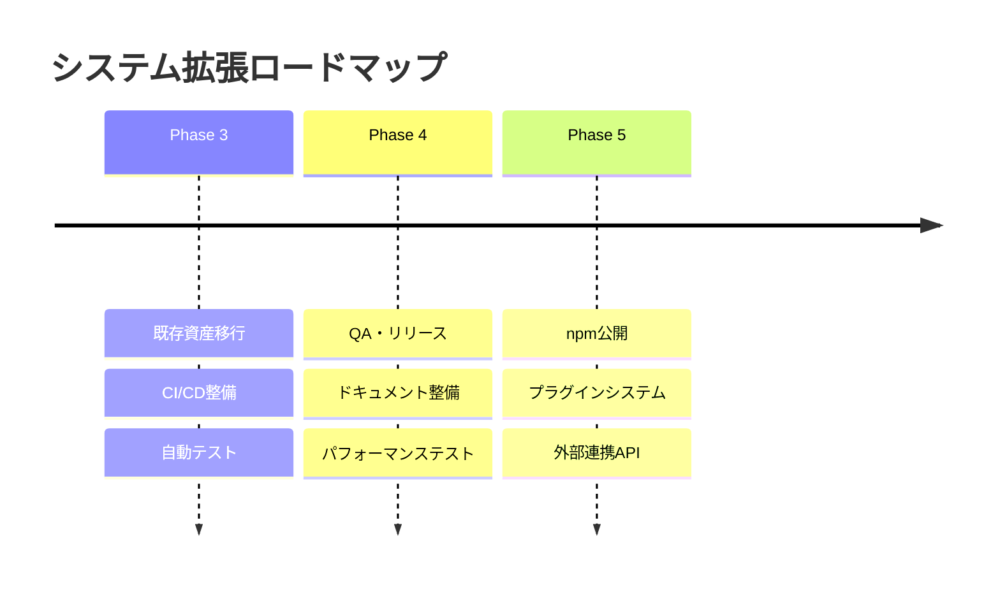

### 拡張ポイント

1. **プラグインシステム**（Phase 5）
   - カスタムコンポーネント登録
   - カスタム検索フィルタ
   - カスタムテーマ

2. **外部サービス連携**（Phase 5）
   - Algolia検索（オプション）
   - Analytics統合
   - CDN最適化

3. **高度な機能**（Phase 5）
   - AIベースの翻訳支援
   - リアルタイムコラボレーション
   - バージョン間差分の自動生成

---

## まとめ

新ドキュメントサイトジェネレーターは、**レジストリ駆動**のアプローチにより、以下の特徴を実現しています：

✅ **データ駆動**: JSONレジストリによる一元管理
✅ **モジュール化**: 共有パッケージによる機能分離
✅ **型安全性**: TypeScriptによる堅牢な実装
✅ **高パフォーマンス**: Lighthouse全スコア目標達成
✅ **国際化**: 15言語サポート
✅ **拡張性**: プラグインシステム準備完了

Phase 2の完了により、**安定したビルドシステム**と**高品質なUI/UX**を実現し、Phase 3以降の拡張に向けた強固な基盤が整いました。

---

## 参考資料

### Phase 2関連ドキュメント
- [Phase 2-6計画書](phase-2-6-documentation-demo.md)
- [Phase 2-5完了報告書](status/phase-2-5-completion-report.md)
- [Phase 2-4完了報告書](status/phase-2-4-completion-report.md)

### ガイドドキュメント
- [共有パッケージ利用ガイド](guides/shared-packages.md)
- [リリースフローガイド](guides/release-flow.md)

### パッケージドキュメント
- [packages/generator/README.md](../../packages/generator/README.md)
- [packages/ui/README.md](../../packages/ui/README.md)
- [packages/theme/README.md](../../packages/theme/README.md)
- [packages/i18n/README.md](../../packages/i18n/README.md)
- [packages/versioning/README.md](../../packages/versioning/README.md)

---

**作成者**: Claude
**作成日**: 2025-10-20
**最終更新**: 2025-10-20
