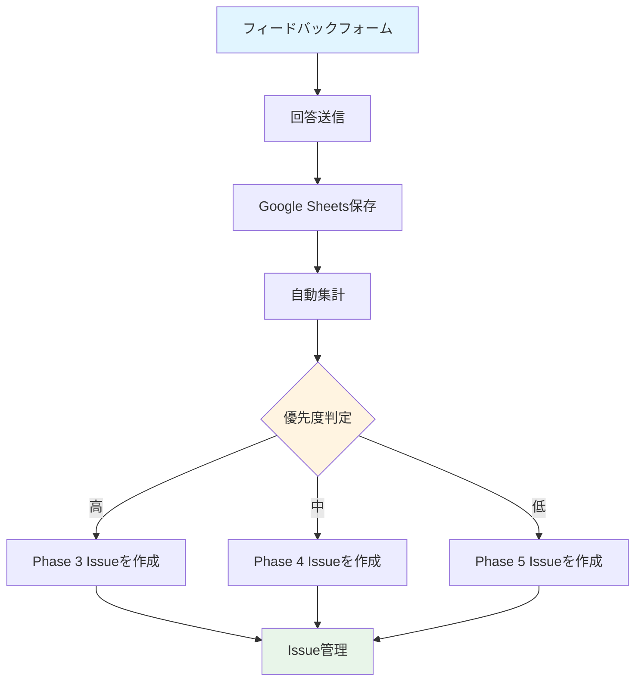

# デモサイトフィードバックフォーム

**Phase**: Phase 2-6（ドキュメント/デモ）
**目的**: ステークホルダーからのフィードバック収集

---

## 📝 フィードバックフォームについて

このテンプレートは、Google FormsやTypeFormで実装するフィードバックフォームの項目定義です。

**フォームURL**: （準備中）

---

## フォーム構成

### セクション1: 基本情報

| フィールド | タイプ | 必須 | 説明 |
|----------|-------|------|------|
| お名前 | テキスト | ✅ | レビュアーのお名前 |
| 所属チーム | 選択肢 | ✅ | コンテンツチーム / QAチーム / 翻訳担当 / その他 |
| メールアドレス | メール | ✅ | フォローアップ用 |
| レビュー日 | 日付 | ✅ | レビュー実施日 |

---

### セクション2: 環境情報

| フィールド | タイプ | 必須 | 説明 |
|----------|-------|------|------|
| 使用ブラウザ | 選択肢 | ✅ | Chrome / Firefox / Safari / Edge / その他 |
| 使用デバイス | 選択肢 | ✅ | デスクトップ / タブレット / モバイル |
| OS | 選択肢 | ⬜ | Windows / macOS / Linux / iOS / Android |

---

### セクション3: UI/UX評価

#### 3-1. ナビゲーション

| フィールド | タイプ | 必須 | 選択肢 |
|----------|-------|------|--------|
| トップページの分かりやすさ | 1-5点評価 | ✅ | 1（不合格） 〜 5（優秀） |
| サイドバーの使いやすさ | 1-5点評価 | ✅ | 1（不合格） 〜 5（優秀） |
| 前後ページナビゲーションの使いやすさ | 1-5点評価 | ✅ | 1（不合格） 〜 5（優秀） |
| **コメント（ナビゲーション）** | 長文テキスト | ⬜ | 自由記述 |

#### 3-2. 検索機能

| フィールド | タイプ | 必須 | 選択肢 |
|----------|-------|------|--------|
| 検索ボックスの見つけやすさ | 1-5点評価 | ✅ | 1（不合格） 〜 5（優秀） |
| 検索結果の関連性 | 1-5点評価 | ✅ | 1（不合格） 〜 5（優秀） |
| フィルタ機能の使いやすさ | 1-5点評価 | ✅ | 1（不合格） 〜 5（優秀） |
| **コメント（検索機能）** | 長文テキスト | ⬜ | 自由記述 |

#### 3-3. バージョン切り替え

| フィールド | タイプ | 必須 | 選択肢 |
|----------|-------|------|--------|
| バージョンセレクターの見つけやすさ | 1-5点評価 | ✅ | 1（不合格） 〜 5（優秀） |
| バージョン切り替えのスムーズさ | 1-5点評価 | ✅ | 1（不合格） 〜 5（優秀） |
| **コメント（バージョン切り替え）** | 長文テキスト | ⬜ | 自由記述 |

#### 3-4. 言語切り替え

| フィールド | タイプ | 必須 | 選択肢 |
|----------|-------|------|--------|
| 言語セレクターの見つけやすさ | 1-5点評価 | ✅ | 1（不合格） 〜 5（優秀） |
| 翻訳品質 | 1-5点評価 | ✅ | 1（不合格） 〜 5（優秀） |
| **コメント（言語切り替え）** | 長文テキスト | ⬜ | 自由記述 |

#### 3-5. レスポンシブデザイン

| フィールド | タイプ | 必須 | 選択肢 |
|----------|-------|------|--------|
| デスクトップ表示の適切さ | 1-5点評価 | ✅ | 1（不合格） 〜 5（優秀） |
| モバイル表示の適切さ | 1-5点評価 | ✅ | 1（不合格） 〜 5（優秀） |
| **コメント（レスポンシブデザイン）** | 長文テキスト | ⬜ | 自由記述 |

---

### セクション4: パフォーマンス評価

| フィールド | タイプ | 必須 | 選択肢 |
|----------|-------|------|--------|
| ページロード速度 | 1-5点評価 | ✅ | 1（非常に遅い） 〜 5（非常に速い） |
| 検索速度 | 1-5点評価 | ✅ | 1（非常に遅い） 〜 5（非常に速い） |
| インタラクションのスムーズさ | 1-5点評価 | ✅ | 1（カクカクする） 〜 5（非常にスムーズ） |
| **コメント（パフォーマンス）** | 長文テキスト | ⬜ | 自由記述 |

---

### セクション5: アクセシビリティ評価

| フィールド | タイプ | 必須 | 選択肢 |
|----------|-------|------|--------|
| キーボード操作の使いやすさ | 1-5点評価 | ✅ | 1（不合格） 〜 5（優秀） |
| カラーコントラスト | 1-5点評価 | ✅ | 1（見づらい） 〜 5（見やすい） |
| フォントサイズの適切さ | 1-5点評価 | ✅ | 1（小さすぎる） 〜 5（適切） |
| **コメント（アクセシビリティ）** | 長文テキスト | ⬜ | 自由記述 |

---

### セクション6: コンテンツ構造評価

| フィールド | タイプ | 必須 | 選択肢 |
|----------|-------|------|--------|
| カテゴリ分類の分かりやすさ | 1-5点評価 | ✅ | 1（不合格） 〜 5（優秀） |
| ドキュメント内容の理解しやすさ | 1-5点評価 | ✅ | 1（不合格） 〜 5（優秀） |
| コード例の適切さ | 1-5点評価 | ✅ | 1（不合格） 〜 5（優秀） |
| **コメント（コンテンツ構造）** | 長文テキスト | ⬜ | 自由記述 |

---

### セクション7: 総合評価

| フィールド | タイプ | 必須 | 選択肢 |
|----------|-------|------|--------|
| デザインの統一性 | 1-5点評価 | ✅ | 1（不合格） 〜 5（優秀） |
| 使いやすさ | 1-5点評価 | ✅ | 1（使いにくい） 〜 5（非常に使いやすい） |
| プロフェッショナルな印象 | 1-5点評価 | ✅ | 1（不合格） 〜 5（優秀） |
| 目的達成への適合性 | 1-5点評価 | ✅ | 1（不適切） 〜 5（非常に適切） |
| **総合満足度** | 1-5点評価 | ✅ | 1（非常に不満） 〜 5（非常に満足） |

---

### セクション8: 改善提案

#### 8-1. 具体的な改善提案

| フィールド | タイプ | 必須 | 説明 |
|----------|-------|------|------|
| 改善提案1 | 長文テキスト | ⬜ | 具体的な改善提案を記述してください |
| 改善提案2 | 長文テキスト | ⬜ | 具体的な改善提案を記述してください |
| 改善提案3 | 長文テキスト | ⬜ | 具体的な改善提案を記述してください |

#### 8-2. 優先度設定

| フィールド | タイプ | 必須 | 選択肢 |
|----------|-------|------|--------|
| 改善提案1の優先度 | 選択肢 | ⬜ | 高（Phase 3で対応） / 中（Phase 4で対応） / 低（Phase 5で対応） |
| 改善提案2の優先度 | 選択肢 | ⬜ | 高（Phase 3で対応） / 中（Phase 4で対応） / 低（Phase 5で対応） |
| 改善提案3の優先度 | 選択肢 | ⬜ | 高（Phase 3で対応） / 中（Phase 4で対応） / 低（Phase 5で対応） |

---

### セクション9: 自由記述

| フィールド | タイプ | 必須 | 説明 |
|----------|-------|------|------|
| 良かった点 | 長文テキスト | ⬜ | デモサイトで特に良かった点を記述してください |
| 改善が必要な点 | 長文テキスト | ⬜ | デモサイトで特に改善が必要な点を記述してください |
| その他のフィードバック | 長文テキスト | ⬜ | その他、何でもお書きください |

---

## 📊 フィードバック集計方法

### 1. Google Formsの場合

**設定手順**:
1. Google Formsで新しいフォームを作成
2. 上記の項目を追加
3. 回答をGoogle Sheetsに自動保存
4. 集計スクリプトで平均点を計算

**集計スプレッドシート**:
```
| レビュアー | 所属 | UI/UX平均 | パフォーマンス平均 | アクセシビリティ平均 | 総合満足度 | 改善提案 |
|-----------|------|-----------|-------------------|---------------------|-----------|---------|
| ...       | ...  | ...       | ...               | ...                 | ...       | ...     |
```

### 2. TypeFormの場合

**設定手順**:
1. TypeFormで新しいフォームを作成
2. 上記の項目を追加
3. Logic Jumps機能で動的な質問遷移を設定
4. Zapier連携でGoogle Sheetsに保存

---

## 📋 フィードバック処理フロー



---

## 🎯 フィードバック収集目標

| 目標 | 数値 | 期限 |
|-----|------|------|
| 回答数 | 10件以上 | Phase 2-6完了後1週間 |
| 回答率 | 80%以上 | （参加者が15人の場合、12件以上） |
| 平均満足度 | 4.0以上 | - |

---

## 📖 参考資料

- [デモサイトウォークスルー](walkthrough.md)
- [レビューチェックリスト](review-checklist.md)
- [Phase 2-6計画書](../phase-2-6-documentation-demo.md)

---

## 次のステップ

1. Google FormsまたはTypeFormでフォームを作成
2. フォームURLを関係者に共有
3. 1週間後にフィードバックを集計
4. Issue化して対応計画を立てる

---

**作成者**: Claude
**作成日**: 2025-10-20
**最終更新**: 2025-10-20
