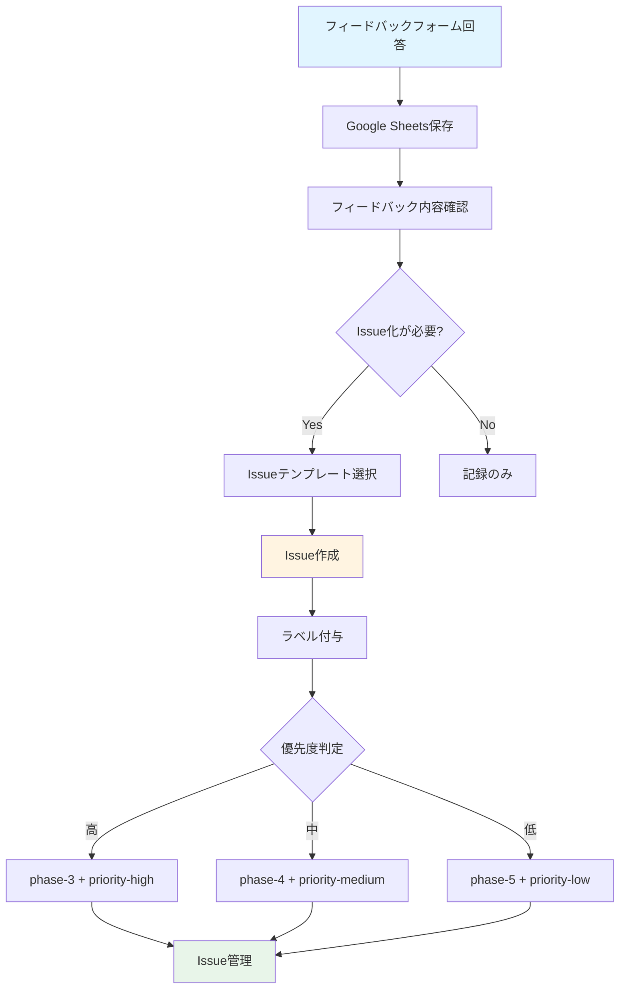
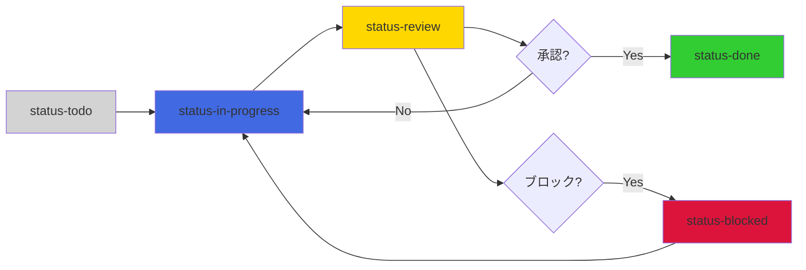

# GitHubラベル定義とIssueテンプレート

**作成日**: 2025-10-20
**Phase**: Phase 2-6（ドキュメント/デモ）
**目的**: フィードバックを効率的に管理するためのラベル定義とIssueテンプレート

---

## 📋 目次

1. [GitHubラベル定義](#githubラベル定義)
2. [Issueテンプレート](#issueテンプレート)
3. [Issue管理フロー](#issue管理フロー)
4. [優先度判定基準](#優先度判定基準)

---

## GitHubラベル定義

### 1. フェーズラベル

| ラベル名 | カラー | 説明 |
|---------|--------|------|
| `phase-3` |  `#FFA500` | Phase 3（既存資産移行とCI整備）で対応 |
| `phase-4` |  `#FFD700` | Phase 4（QA・リリース準備）で対応 |
| `phase-5` |  `#ADFF2F` | Phase 5（リリース後の継続改善）で対応 |

### 2. 優先度ラベル

| ラベル名 | カラー | 説明 |
|---------|--------|------|
| `priority-high` |  `#DC143C` | 高優先度（即座に対応が必要） |
| `priority-medium` |  `#FF8C00` | 中優先度（次フェーズで対応） |
| `priority-low` |  `#32CD32` | 低優先度（長期的な改善） |

### 3. カテゴリラベル

| ラベル名 | カラー | 説明 |
|---------|--------|------|
| `category-ui-ux` |  `#1E90FF` | UI/UX関連の改善 |
| `category-performance` |  `#9370DB` | パフォーマンス関連の改善 |
| `category-accessibility` |  `#FF1493` | アクセシビリティ関連の改善 |
| `category-i18n` |  `#00CED1` | 国際化（i18n）関連の改善 |
| `category-content` |  `#FFB6C1` | コンテンツ構造関連の改善 |
| `category-search` |  `#20B2AA` | 検索機能関連の改善 |

### 4. ステータスラベル

| ラベル名 | カラー | 説明 |
|---------|--------|------|
| `status-todo` |  `#D3D3D3` | 未着手 |
| `status-in-progress` |  `#4169E1` | 作業中 |
| `status-review` |  `#FFD700` | レビュー中 |
| `status-done` |  `#32CD32` | 完了 |
| `status-blocked` |  `#DC143C` | ブロック中 |

### 5. その他のラベル

| ラベル名 | カラー | 説明 |
|---------|--------|------|
| `feedback` |  `#BA55D3` | ステークホルダーフィードバック |
| `bug` |  `#DC143C` | バグ報告 |
| `enhancement` |  `#32CD32` | 機能改善 |
| `documentation` |  `#0366D6` | ドキュメント関連 |

---

## Issueテンプレート

### テンプレート1: フィードバックからのIssue

**ファイル名**: `.github/ISSUE_TEMPLATE/feedback-issue.md`

```markdown
---
name: フィードバックからのIssue
about: ステークホルダーフィードバックをIssue化
title: '[FEEDBACK] '
labels: feedback, status-todo
assignees: ''
---

## 📝 フィードバック内容

**レビュアー**: [レビュアー名]
**所属チーム**: [コンテンツチーム / QAチーム / 翻訳担当 / その他]
**レビュー日**: [YYYY-MM-DD]

### フィードバック詳細

[ステークホルダーからのフィードバック内容をここに記載]

---

## 🎯 提案された改善策

[改善提案の詳細をここに記載]

---

## 📊 評価スコア

| カテゴリ | スコア (1-5) |
|---------|-------------|
| UI/UX | [ ] |
| パフォーマンス | [ ] |
| アクセシビリティ | [ ] |
| 多言語対応 | [ ] |
| コンテンツ構造 | [ ] |

---

## 🏷️ 優先度

- [ ] 高（Phase 3で対応）
- [ ] 中（Phase 4で対応）
- [ ] 低（Phase 5で対応）

---

## 🔗 関連資料

- デモサイトURL: [URL]
- スクリーンショット: [添付]
- フィードバックフォーム回答: [Google Sheetsリンク]

---

## ✅ 完了条件

- [ ] 改善策の実装完了
- [ ] テスト実施（手動/自動）
- [ ] レビュアーへの確認
- [ ] ドキュメント更新（必要に応じて）

---

## 📝 備考

[追加情報や注意事項]
```

---

### テンプレート2: バグ報告

**ファイル名**: `.github/ISSUE_TEMPLATE/bug-report.md`

```markdown
---
name: バグ報告
about: バグを報告する
title: '[BUG] '
labels: bug, status-todo, priority-high
assignees: ''
---

## 🐛 バグの説明

[バグの詳細な説明]

---

## 🔄 再現手順

1. [手順1]
2. [手順2]
3. [手順3]
4. [エラー発生]

---

## 🎯 期待される動作

[正常に動作した場合の期待される挙動]

---

## 🖥️ 環境情報

- **ブラウザ**: [Chrome / Firefox / Safari / Edge]
- **OS**: [Windows / macOS / Linux / iOS / Android]
- **デバイス**: [デスクトップ / タブレット / モバイル]
- **URL**: [問題が発生したページのURL]

---

## 📸 スクリーンショット

[スクリーンショットまたはエラーメッセージを添付]

---

## 📝 追加情報

[その他の情報や注意事項]
```

---

### テンプレート3: 機能改善

**ファイル名**: `.github/ISSUE_TEMPLATE/enhancement.md`

```markdown
---
name: 機能改善
about: 新機能または機能改善を提案する
title: '[ENHANCEMENT] '
labels: enhancement, status-todo
assignees: ''
---

## 💡 改善提案の概要

[改善提案の概要を簡潔に記載]

---

## 🎯 目的

[この改善によって達成したい目的]

---

## 📋 詳細

### 現状の問題

[現在の問題点や不便な点]

### 提案内容

[具体的な改善案]

### 期待される効果

[改善によって得られるメリット]

---

## 🏷️ 優先度

- [ ] 高（Phase 3で対応）
- [ ] 中（Phase 4で対応）
- [ ] 低（Phase 5で対応）

---

## 🔗 関連資料

- デザインモックアップ: [添付]
- 参考サイト: [URL]
- 関連Issue: #[Issue番号]

---

## ✅ 完了条件

- [ ] 実装完了
- [ ] テスト実施
- [ ] ドキュメント更新
- [ ] レビュー承認

---

## 📝 備考

[追加情報や注意事項]
```

---

## Issue管理フロー

### 1. フィードバック収集からIssue化まで



### 2. Issue処理フロー



---

## 優先度判定基準

### 高優先度（priority-high）

**条件**:
- Lighthouseスコアに影響する問題
- ユーザビリティを大きく損なう問題
- アクセシビリティ（WCAG AA）違反
- 複数のレビュアーから同じ指摘
- セキュリティ関連の問題

**対応フェーズ**: Phase 3（即座に対応）

**例**:
- ページロードが10秒以上かかる
- モバイルでナビゲーションが使えない
- キーボード操作が不可能
- 検索結果が全く表示されない

---

### 中優先度（priority-medium）

**条件**:
- UX改善の余地がある
- 軽微なパフォーマンス問題
- 一部の環境でのみ発生する問題
- コンテンツ構造の改善提案

**対応フェーズ**: Phase 4（次フェーズで対応）

**例**:
- サイドバーの折りたたみ動作が少しカクつく
- 検索結果の関連性が低い場合がある
- 一部の翻訳が不自然
- カテゴリ分類が分かりにくい

---

### 低優先度（priority-low）

**条件**:
- Nice-to-haveな機能追加
- 長期的な改善提案
- マイナーなデザイン調整
- 将来的な拡張機能

**対応フェーズ**: Phase 5（リリース後の継続改善）

**例**:
- ダークモードのカラーバリエーション追加
- AIベースの翻訳支援
- 高度な検索フィルタ
- カスタムテーマ機能

---

## ラベル適用例

### 例1: 検索速度の改善

```yaml
Title: [FEEDBACK] 検索結果の表示が遅い
Labels:
  - feedback
  - category-performance
  - category-search
  - priority-high
  - phase-3
  - status-todo
```

### 例2: 翻訳品質の改善

```yaml
Title: [FEEDBACK] 日本語翻訳が不自然な箇所がある
Labels:
  - feedback
  - category-i18n
  - category-content
  - priority-medium
  - phase-4
  - status-todo
```

### 例3: ダークモードの色調整

```yaml
Title: [ENHANCEMENT] ダークモードのコントラストを調整してほしい
Labels:
  - enhancement
  - category-ui-ux
  - category-accessibility
  - priority-low
  - phase-5
  - status-todo
```

---

## GitHubラベル一括作成スクリプト

以下のスクリプトで、定義したラベルを一括作成できます。

**ファイル名**: `scripts/create-github-labels.sh`

```bash
#!/bin/bash

# Phase labels
gh label create "phase-3" --color "FFA500" --description "Phase 3（既存資産移行とCI整備）で対応"
gh label create "phase-4" --color "FFD700" --description "Phase 4（QA・リリース準備）で対応"
gh label create "phase-5" --color "ADFF2F" --description "Phase 5（リリース後の継続改善）で対応"

# Priority labels
gh label create "priority-high" --color "DC143C" --description "高優先度（即座に対応が必要）"
gh label create "priority-medium" --color "FF8C00" --description "中優先度（次フェーズで対応）"
gh label create "priority-low" --color "32CD32" --description "低優先度（長期的な改善）"

# Category labels
gh label create "category-ui-ux" --color "1E90FF" --description "UI/UX関連の改善"
gh label create "category-performance" --color "9370DB" --description "パフォーマンス関連の改善"
gh label create "category-accessibility" --color "FF1493" --description "アクセシビリティ関連の改善"
gh label create "category-i18n" --color "00CED1" --description "国際化（i18n）関連の改善"
gh label create "category-content" --color "FFB6C1" --description "コンテンツ構造関連の改善"
gh label create "category-search" --color "20B2AA" --description "検索機能関連の改善"

# Status labels
gh label create "status-todo" --color "D3D3D3" --description "未着手"
gh label create "status-in-progress" --color "4169E1" --description "作業中"
gh label create "status-review" --color "FFD700" --description "レビュー中"
gh label create "status-done" --color "32CD32" --description "完了"
gh label create "status-blocked" --color "DC143C" --description "ブロック中"

# Other labels
gh label create "feedback" --color "BA55D3" --description "ステークホルダーフィードバック"

echo "✅ All labels created successfully!"
```

**実行方法**:
```bash
chmod +x scripts/create-github-labels.sh
./scripts/create-github-labels.sh
```

---

## 📖 参考資料

- [デモサイトウォークスルー](walkthrough.md)
- [レビューチェックリスト](review-checklist.md)
- [フィードバックフォームテンプレート](feedback-form-template.md)
- [Phase 2-6計画書](../phase-2-6-documentation-demo.md)

---

**作成者**: Claude
**作成日**: 2025-10-20
**最終更新**: 2025-10-20
