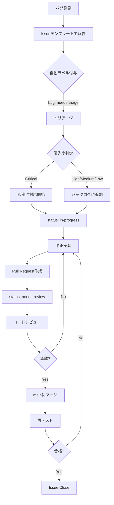

# GitHub ラベル定義とバグ管理フロー

**作成日**: 2025-10-21
**Phase**: Phase 4-1（QA/テスト）
**目的**: バグ管理とIssueトラッキングの標準化

---

## 📋 目次

1. [ラベル定義](#ラベル定義)
2. [バグ管理フロー](#バグ管理フロー)
3. [優先度判定基準](#優先度判定基準)
4. [Issue管理ルール](#issue管理ルール)

---

## ラベル定義

### 1. 優先度ラベル（Priority）

| ラベル | 色 | 説明 | 対応期限 |
|-------|---|------|---------|
| `priority: critical` | 🔴 #d73a4a | システムが使用不能、データ損失の危険 | 即座 |
| `priority: high` | 🟠 #ff9800 | 主要機能が動作しない、重大な不具合 | 1日以内 |
| `priority: medium` | 🟡 #fbca04 | 一部機能に影響、回避策あり | 3日以内 |
| `priority: low` | 🟢 #0e8a16 | 軽微な問題、UIの微調整 | 7日以内 |

### 2. タイプラベル（Type）

| ラベル | 色 | 説明 |
|-------|---|------|
| `type: bug` | 🐛 #d73a4a | バグ・不具合 |
| `type: feature` | ✨ #a2eeef | 新機能 |
| `type: enhancement` | 💡 #84b6eb | 既存機能の改善 |
| `type: documentation` | 📚 #0075ca | ドキュメント関連 |
| `type: refactoring` | ♻️ #fbca04 | リファクタリング |
| `type: test` | 🧪 #bfd4f2 | テスト関連 |
| `type: ci/cd` | 🔧 #d4c5f9 | CI/CD関連 |

### 3. Phaseラベル

| ラベル | 色 | 説明 |
|-------|---|------|
| `phase-1` | #c2e0c6 | Phase 1: レジストリ/CLI基盤 |
| `phase-2` | #bfdadc | Phase 2: Astroビルド/UI統合 |
| `phase-3` | #f9d0c4 | Phase 3: 移行準備/CI整備 |
| `phase-4` | #fef2c0 | Phase 4: QA/リリース準備 |
| `phase-5` | #d4c5f9 | Phase 5: 継続改善 |

### 4. ステータスラベル

| ラベル | 色 | 説明 |
|-------|---|------|
| `status: needs-triage` | #ededed | トリアージ待ち（新規Issue） |
| `status: confirmed` | #0e8a16 | 確認済み |
| `status: in-progress` | #fbca04 | 作業中 |
| `status: needs-review` | #d876e3 | レビュー待ち |
| `status: blocked` | #d73a4a | ブロック中 |
| `status: duplicate` | #cfd3d7 | 重複 |
| `status: wontfix` | #ffffff | 修正しない |

### 5. コンポーネントラベル

| ラベル | 色 | 説明 |
|-------|---|------|
| `component: cli` | #0366d6 | CLIコマンド |
| `component: generator` | #1d76db | レジストリ/ジェネレーター |
| `component: ui` | #5319e7 | UIコンポーネント |
| `component: theme` | #0052cc | テーマシステム |
| `component: i18n` | #006b75 | 国際化 |
| `component: versioning` | #1d76db | バージョン管理 |
| `component: runtime` | #0e8a16 | Astro統合 |
| `component: search` | #d876e3 | Pagefind検索 |
| `component: migration` | #fbca04 | 移行ツール |

### 6. その他ラベル

| ラベル | 色 | 説明 |
|-------|---|------|
| `good first issue` | #7057ff | 初心者向け |
| `help wanted` | #008672 | 協力者募集 |
| `accessibility` | #d876e3 | アクセシビリティ関連 |
| `performance` | #ff9800 | パフォーマンス関連 |
| `security` | #d73a4a | セキュリティ関連 |
| `breaking-change` | #d73a4a | 破壊的変更 |

---

## バグ管理フロー

### 1. バグ発見からクローズまで



### 2. トリアージプロセス

**実施タイミング**: 毎日10:00（Phase 4期間中）

**参加者**:
- テックリード
- QA担当
- 開発担当（必要に応じて）

**手順**:
1. `status: needs-triage`ラベルのIssueを確認
2. 優先度判定（Critical/High/Medium/Low）
3. 担当者アサイン
4. `status: confirmed`ラベルに変更
5. Phase・コンポーネントラベル追加

**判定基準**: [優先度判定基準](#優先度判定基準)を参照

---

## 優先度判定基準

### 🔴 Critical

**定義**: システムが使用不能、データ損失の危険

**例**:
- ビルドが完全に失敗する
- Cloudflare Pagesへのデプロイが不可能
- レジストリファイルが破損する
- CLIコマンドがクラッシュする（全コマンド）
- 全ページで404エラーが発生
- セキュリティ脆弱性（CVSSスコア8.0以上）

**対応**:
- **即座に対応開始**
- 他のタスクを中断
- テックリードに即座にエスカレーション
- 修正完了まで毎日進捗報告

### 🟠 High

**定義**: 主要機能が動作しない、重大な不具合

**例**:
- 検索機能が完全に停止
- 言語切替が動作しない
- ナビゲーションリンクが全て404
- CLIの主要コマンド（add/migrate等）が失敗
- Lighthouseスコアが目標を大幅に下回る（Performance < 80）
- 全ページでアクセシビリティ違反（スクリーンリーダー不可）

**対応**:
- **1日以内に対応開始**
- 修正PRを2日以内に作成
- デイリースタンドアップで進捗報告

### 🟡 Medium

**定義**: 一部機能に影響、回避策あり

**例**:
- 特定言語（韓国語等）の検索結果が不正確
- サイドバーの一部リンクが404
- モバイル表示で軽微なレイアウト崩れ
- Lighthouseスコアが目標をわずかに下回る（Accessibility 90-94）
- 特定ページでのパフォーマンス劣化
- ドキュメントの誤字・脱字（重要箇所）

**対応**:
- **3日以内に対応開始**
- 週次レビューで進捗報告
- 回避策をドキュメント化

### 🟢 Low

**定義**: 軽微な問題、UIの微調整

**例**:
- ボタンのスタイル調整
- ツールチップの文言改善
- ドキュメントの誤字・脱字（軽微）
- コメントの改善
- ログメッセージの改善
- 開発者向けドキュメントの追記

**対応**:
- **7日以内に対応開始**
- 他のタスクの合間に修正
- バッチ処理で複数まとめて修正可

---

## Issue管理ルール

### 1. Issue作成ルール

#### Issueテンプレート使用

**バグレポート**:
- `.github/ISSUE_TEMPLATE/bug_report.yml`を使用
- 全ての必須項目を記入
- スクリーンショット・ログを添付

**フィーチャーリクエスト**（将来追加予定）:
- 新機能の提案用テンプレート

#### タイトル規則

```
[{Type}]: {簡潔な説明}
```

**例**:
- `[Bug]: demo-docsの検索機能で日本語が検索できない`
- `[Bug]: Lighthouseスコアが目標未達（Accessibility: 89）`
- `[Enhancement]: サイドバーのスクロール位置を保持したい`

### 2. ラベル付与ルール

#### 自動付与（Issueテンプレート）
- `type: bug`
- `status: needs-triage`

#### トリアージ時に追加
- 優先度ラベル（1つ必須）
- Phaseラベル（1つ以上）
- コンポーネントラベル（1つ以上）
- `status: confirmed`に変更

#### 作業開始時
- `status: in-progress`に変更
- 担当者をアサイン

#### PR作成時
- `status: needs-review`に変更
- PRにIssue番号をリンク（`Closes #123`）

### 3. Issue更新ルール

#### コメント追加タイミング
- 調査結果の報告
- 回避策の提示
- 進捗状況の更新（週1回以上）
- ブロッカーの報告

#### ステータス更新タイミング
- トリアージ完了: `needs-triage` → `confirmed`
- 作業開始: `confirmed` → `in-progress`
- PR作成: `in-progress` → `needs-review`
- ブロック発生: → `blocked`（理由をコメント）
- 重複発見: → `duplicate`（元Issue番号を記載）
- 修正しない判断: → `wontfix`（理由をコメント）

### 4. Issue クローズルール

#### クローズ条件
- PRがmainにマージされた
- 再テストで合格した
- `duplicate`/`wontfix`で対応不要と判断

#### クローズ手順
1. 最終コメントを追加
   - 修正内容の要約
   - マージされたPR番号
   - 再テスト結果
2. Issueをクローズ
3. 関連するIssueがあればリンクを更新

---

## GitHub Project Boardの活用

### ボード構成

| カラム | 説明 | 対応するラベル |
|-------|------|--------------|
| **Backlog** | 未着手のバグ | `status: confirmed` |
| **In Progress** | 修正中 | `status: in-progress` |
| **In Review** | レビュー中 | `status: needs-review` |
| **Testing** | 再テスト中 | （ステータスなし） |
| **Done** | 完了 | （クローズ済み） |

### 自動化設定

**GitHub Actionsで自動化**:
- PR作成時: Issue → "In Review"
- PRマージ時: Issue → "Testing"
- Issue クローズ時: Issue → "Done"

---

## チェックリスト

### Issue作成時
- [ ] Issueテンプレートを使用
- [ ] タイトルを規則に従って記入
- [ ] 再現手順を詳しく記載
- [ ] 環境情報を記入
- [ ] スクリーンショット・ログを添付（該当する場合）

### トリアージ時
- [ ] 優先度ラベルを付与
- [ ] Phaseラベルを付与
- [ ] コンポーネントラベルを付与
- [ ] 担当者をアサイン
- [ ] `status: confirmed`に変更

### 修正作業時
- [ ] `status: in-progress`に変更
- [ ] 進捗をコメントで報告
- [ ] 修正完了後、PRを作成
- [ ] PR説明にIssue番号をリンク（`Closes #123`）

### PR作成時
- [ ] `status: needs-review`に変更
- [ ] コードレビューを依頼
- [ ] テストが通過していることを確認

### Issue クローズ時
- [ ] 最終コメントを追加
- [ ] 再テスト結果を記録
- [ ] 関連Issueを更新
- [ ] Issueをクローズ

---

## 参照ドキュメント

- [qa-testing.md](./qa-testing.md) - QA/テスト総合ガイド
- [bug_report.yml](../../.github/ISSUE_TEMPLATE/bug_report.yml) - バグレポートテンプレート

---

**最終更新**: 2025-10-21
**作成者**: Claude Code (AI Assistant)
