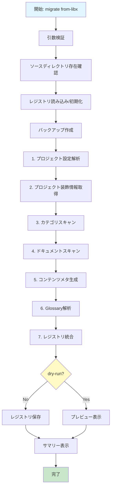
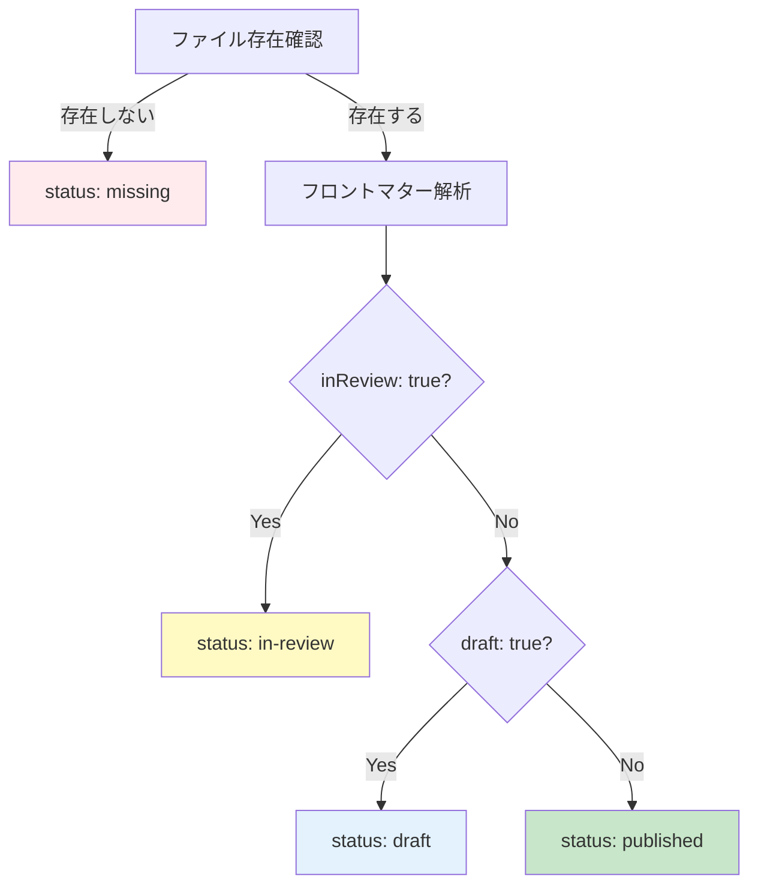

# データ移行ガイド: libx-dev → 新レジストリ形式

**バージョン**: 1.0.0
**作成日**: 2025-10-20
**対象フェーズ**: Phase 3-1（データ変換ロジック）

---

## 📋 目次

1. [概要](#概要)
2. [データ変換フロー](#データ変換フロー)
3. [設定ファイル変換の詳細](#設定ファイル変換の詳細)
4. [カテゴリ・ドキュメント変換の詳細](#カテゴリドキュメント変換の詳細)
5. [コンテンツメタ生成の詳細](#コンテンツメタ生成の詳細)
6. [Glossary変換の詳細](#glossary変換の詳細)
7. [エラーハンドリングとロールバック](#エラーハンドリングとロールバック)
8. [実行例とコマンドオプション](#実行例とコマンドオプション)
9. [トラブルシューティング](#トラブルシューティング)
10. [FAQ](#faq)

---

## 概要

### 目的

既存の **libx-dev プロジェクト**（`project.config.json` 形式）を **新レジストリ形式**（`registry/docs.json`）へ自動変換し、手作業を最小化することを目的としています。

### 変換の範囲

**変換対象**:
- ✅ プロジェクト設定（`project.config.json`）
- ✅ トップページ装飾情報（`projects.config.json`）
- ✅ カテゴリ定義（ファイルシステム構造: `01-guide/`）
- ✅ ドキュメント定義（ファイルシステム構造: `01-getting-started.mdx`）
- ✅ コンテンツメタ情報（`syncHash`, `lastUpdated`, `source`, `reviewer`, `wordCount`）
- ✅ Glossary（用語集、存在する場合）

**変換対象外**:
- ❌ MDXファイル本体の内容（移動・コピーは行わない）
- ❌ アセットファイル（画像、動画など）
- ❌ カスタムスクリプト
- ❌ CI/CD設定

### 前提条件

- Node.js 18以降がインストールされていること
- `docs-cli` がインストールされていること（`packages/cli`）
- 変換元のプロジェクトが`apps/{project-id}/`ディレクトリに存在すること
- `src/config/project.config.json` が存在すること
- Gitリポジトリ内で実行すること（Git情報取得のため、任意）

---

## データ変換フロー

### 全体フロー図



### 処理ステップ

| ステップ | 処理内容 | 期間目安 |
|---------|---------|---------|
| **1. 引数検証** | `--source`, `--project-id`, `--target` の検証 | 即座 |
| **2. ソースディレクトリ存在確認** | ディレクトリとファイルの存在確認 | 即座 |
| **3. レジストリ読み込み/初期化** | 既存レジストリの読み込みまたは新規作成 | 即座 |
| **4. バックアップ作成** | `.backups/` にレジストリをバックアップ | 数秒 |
| **5. プロジェクト設定解析** | `project.config.json` の解析とマッピング | 数秒 |
| **6. プロジェクト装飾情報取得** | `projects.config.json` からアイコン・タグ取得 | 数秒 |
| **7. カテゴリスキャン** | ファイルシステムからカテゴリ抽出 | 数秒 |
| **8. ドキュメントスキャン** | ファイルシステムからドキュメント抽出 | 数秒～数十秒 |
| **9. コンテンツメタ生成** | syncHash計算、Git情報取得、wordCount計算 | 数十秒～数分 |
| **10. Glossary解析** | 用語集の解析（存在する場合） | 数秒 |
| **11. レジストリ統合** | 既存レジストリとマージ | 即座 |
| **12. レジストリ保存** | `registry/docs.json` への書き込み | 数秒 |

---

## 設定ファイル変換の詳細

### 1. `project.config.json` の構造

**場所**: `apps/{project-id}/src/config/project.config.json`

**セクション構成**:

```json
{
  "basic": { /* 基本設定 */ },
  "languageNames": { /* 言語表示名 */ },
  "translations": { /* 多言語コンテンツ */ },
  "versioning": { /* バージョン定義 */ },
  "licensing": { /* ライセンス情報 */ }
}
```

### 2. `basic`セクションの変換

**変換前**（`project.config.json`）:

```json
{
  "basic": {
    "baseUrl": "/docs/sample-docs",
    "supportedLangs": ["en", "ja"],
    "defaultLang": "en"
  }
}
```

**変換後**（レジストリ）:

```json
{
  "id": "sample-docs",
  "languages": [
    {
      "code": "en",
      "displayName": "English",
      "default": true
    },
    {
      "code": "ja",
      "displayName": "日本語",
      "default": false
    }
  ]
}
```

**マッピング表**:

| 既存フィールド | レジストリフィールド | 変換ルール |
|-------------|------------------|---------|
| `basic.baseUrl` | **削除** | 新システムでは`/docs/{project-id}`で自動生成 |
| `basic.supportedLangs[]` | `languages[].code` | 配列に変換 |
| `basic.defaultLang` | `languages[].default = true` | フラグに変換 |

### 3. `languageNames`セクションの変換

**変換前**（`project.config.json`）:

```json
{
  "languageNames": {
    "en": "English",
    "ja": "日本語"
  }
}
```

**変換後**（レジストリ）:

```json
{
  "languages": [
    {
      "code": "en",
      "displayName": "English",
      "default": true
    },
    {
      "code": "ja",
      "displayName": "日本語",
      "default": false
    }
  ]
}
```

### 4. `translations`セクションの変換

**変換前**（`project.config.json`）:

```json
{
  "translations": {
    "en": {
      "displayName": "Sample Documentation",
      "displayDescription": "A comprehensive sample...",
      "categories": {
        "guide": "Guide",
        "components": "Components"
      }
    },
    "ja": {
      "displayName": "サンプルドキュメント",
      "displayDescription": "包括的なサンプル...",
      "categories": {
        "guide": "ガイド",
        "components": "コンポーネント"
      }
    }
  }
}
```

**変換後**（レジストリ）:

```json
{
  "displayName": {
    "en": "Sample Documentation",
    "ja": "サンプルドキュメント"
  },
  "description": {
    "en": "A comprehensive sample...",
    "ja": "包括的なサンプル..."
  },
  "categories": [
    {
      "id": "guide",
      "order": 1,
      "name": {
        "en": "Guide",
        "ja": "ガイド"
      }
    },
    {
      "id": "components",
      "order": 2,
      "name": {
        "en": "Components",
        "ja": "コンポーネント"
      }
    }
  ]
}
```

**注意点**:
- カテゴリ名のみ定義されており、`order`, `description`, `icon` は未定義
- `order` はディレクトリ構造から推定する必要あり

### 5. `versioning`セクションの変換

**変換前**（`project.config.json`）:

```json
{
  "versioning": {
    "versions": [
      {
        "id": "v1",
        "name": "Version 1.0",
        "date": "2024-01-01T00:00:00.000Z",
        "isLatest": false
      },
      {
        "id": "v2",
        "name": "Version 2.0",
        "date": "2025-01-01T00:00:00.000Z",
        "isLatest": true
      }
    ]
  }
}
```

**変換後**（レジストリ）:

```json
{
  "versions": [
    {
      "id": "v1",
      "name": "Version 1.0",
      "date": "2024-01-01T00:00:00.000Z",
      "isLatest": false,
      "status": "stable"
    },
    {
      "id": "v2",
      "name": "Version 2.0",
      "date": "2025-01-01T00:00:00.000Z",
      "isLatest": true,
      "status": "stable"
    }
  ]
}
```

**追加フィールド**:
- `status: "stable"` をデフォルト値として追加

### 6. `licensing`セクションの変換

**変換前**（`project.config.json`）:

```json
{
  "licensing": {
    "sources": [
      {
        "id": "sample-original",
        "name": "Sample Documentation",
        "author": "libx-dev Team",
        "license": "MIT",
        "licenseUrl": "https://opensource.org/licenses/MIT",
        "sourceUrl": "https://github.com/libx-dev/libx-docs"
      }
    ],
    "defaultSource": "sample-original",
    "showAttribution": true,
    "sourceLanguage": "en"
  }
}
```

**変換後**（レジストリ）:

```json
{
  "licenses": [
    {
      "id": "sample-original",
      "name": "Sample Documentation",
      "author": "libx-dev Team",
      "license": "MIT",
      "url": "https://opensource.org/licenses/MIT"
    }
  ]
}
```

**フィールド名変更**:
- `licenseUrl` → `url`

**削除フィールド**:
- `sourceUrl`: ライセンス固有の情報ではないため削除
- `defaultSource`, `showAttribution`, `sourceLanguage`: 新システムでは不要

### 7. `projects.config.json`（トップページ用）の変換

**場所**: `apps/top-page/src/config/projects.config.json`

**変換対象セクション**: `projectDecorations`

**変換前**（`projects.config.json`）:

```json
{
  "projectDecorations": {
    "sample-docs": {
      "icon": "file-text",
      "tags": ["sample", "documentation"],
      "isNew": false
    }
  }
}
```

**変換後**（レジストリ）:

```json
{
  "id": "sample-docs",
  "icon": "file-text",
  "tags": ["sample", "documentation"]
}
```

**削除フィールド**:
- `isNew`: 動的計算に変更（`createdAt`から90日以内など）

---

## カテゴリ・ドキュメント変換の詳細

### 1. ファイルシステム構造の解析

**既存構造** (version-first):

```
apps/sample-docs/src/content/docs/v2/ja/
├── 01-guide/
│   ├── 01-getting-started.mdx
│   └── 02-installation.mdx
├── 02-components/
│   └── 01-button.mdx
└── 03-advanced/
    └── 01-customization.mdx
```

**スキャン対象**:
- 番号付きディレクトリ（`NN-category`）
- 番号付きMDXファイル（`NN-document.mdx`）

### 2. カテゴリ変換アルゴリズム

```javascript
function extractCategoriesFromFileSystem(contentDir, lang) {
  const categories = [];
  const categoryDirs = fs.readdirSync(contentDir)
    .filter(d => fs.statSync(path.join(contentDir, d)).isDirectory())
    .filter(d => /^\d{2}-/.test(d)); // 番号付きディレクトリのみ

  for (const dir of categoryDirs) {
    const match = dir.match(/^(\d{2})-(.+)$/);
    if (match) {
      const [, orderStr, categorySlug] = match;
      const order = parseInt(orderStr, 10);

      // project.config.jsonからカテゴリ名を取得
      const categoryNames = getProjectConfig().translations;

      categories.push({
        id: categorySlug,
        order: order,
        name: {
          en: categoryNames.en.categories[categorySlug] || titleCase(categorySlug),
          ja: categoryNames.ja.categories[categorySlug] || titleCase(categorySlug)
        },
        description: {
          en: "", // 空文字列（未定義）
          ja: ""
        }
      });
    }
  }

  return categories.sort((a, b) => a.order - b.order);
}
```

**出力例**:

```json
{
  "categories": [
    {
      "id": "guide",
      "order": 1,
      "name": {
        "en": "Guide",
        "ja": "ガイド"
      },
      "description": {
        "en": "",
        "ja": ""
      },
      "docs": ["getting-started", "installation"]
    }
  ]
}
```

### 3. ドキュメント変換アルゴリズム

```javascript
function extractDocumentsFromFileSystem(contentDir, version, lang) {
  const documents = [];
  const categoryDirs = getCategories(contentDir);

  for (const categoryDir of categoryDirs) {
    const categoryId = extractCategoryId(categoryDir.name);
    const mdxFiles = fs.readdirSync(path.join(contentDir, categoryDir.name))
      .filter(f => f.endsWith('.mdx'))
      .filter(f => /^\d{2}-/.test(f));

    for (const file of mdxFiles) {
      const match = file.match(/^(\d{2})-(.+)\.mdx$/);
      if (match) {
        const [, orderStr, docSlug] = match;
        const order = parseInt(orderStr, 10);
        const fullPath = path.join(contentDir, categoryDir.name, file);

        // フロントマター解析
        const { data: frontmatter, content } = parseMdxFile(fullPath);

        // docIdは"{docSlug}"
        const docId = docSlug;

        documents.push({
          id: docId,
          slug: docSlug,
          title: {
            [lang]: frontmatter.title || titleCase(docSlug)
          },
          description: {
            [lang]: frontmatter.description || ""
          },
          versions: [version],
          _categoryId: categoryId,
          _order: order,
          _files: {
            [`${version}-${lang}`]: {
              filePath: fullPath,
              path: relativePath
            }
          }
        });
      }
    }
  }

  return documents;
}
```

**出力例**:

```json
{
  "documents": [
    {
      "id": "getting-started",
      "slug": "getting-started",
      "title": {
        "en": "Getting Started",
        "ja": "はじめに"
      },
      "description": {
        "en": "Quick start guide",
        "ja": "クイックスタートガイド"
      },
      "versions": ["v2"],
      "content": { /* コンテンツメタ */ }
    }
  ]
}
```

### 4. docId/slug生成ルール

**ルール**:
1. ファイル名から番号接頭辞を除去: `01-getting-started.mdx` → `getting-started`
2. kebab-case を維持
3. 重複がある場合、末尾に番号を付与: `example` → `example-2`, `example-3`

**例**:

| ファイル名 | docId | slug |
|-----------|-------|------|
| `01-getting-started.mdx` | `getting-started` | `getting-started` |
| `02-installation.mdx` | `installation` | `installation` |
| `01-example.mdx` | `example` | `example` |
| `02-example.mdx` | `example-2` | `example-2` |

---

## コンテンツメタ生成の詳細

### 1. コンテンツメタの構造

**レジストリスキーマ**:

```typescript
interface DocumentContentEntry {
  path: string;                 // コンテンツファイルパス
  status: "draft" | "in-review" | "published" | "missing"; // ステータス
  source?: {                    // 翻訳元情報（任意）
    repository: string;         // リポジトリURL
    branch: string;             // ブランチ名
    commit?: string;            // コミットハッシュ
    path: string;               // リポジトリ内パス
  };
  syncHash?: string;            // SHA-256ハッシュ（同期検知用）
  lastUpdated?: string;         // 最終更新日時（ISO 8601）
  reviewer?: string;            // レビュー担当者
  wordCount?: number;           // 語数
}
```

### 2. ステータス判定ロジック

**判定フロー**:



**実装例**:

```javascript
function determineContentStatus(filePath, frontmatter) {
  if (!existsSync(filePath)) {
    return 'missing';
  }

  // in-reviewチェック（優先度高）
  if (frontmatter?.inReview === true || frontmatter?.['in-review'] === true) {
    return 'in-review';
  }

  // draftチェック
  if (frontmatter?.draft === true) {
    return 'draft';
  }

  // デフォルトはpublished
  return 'published';
}
```

### 3. syncHash計算

**目的**: ファイル内容の変更を検知するためのハッシュ値を生成

**アルゴリズム**: SHA-256

**実装例**:

```javascript
import { createHash } from 'crypto';
import { readFileSync } from 'fs';

function calculateSyncHash(filePath) {
  try {
    const content = readFileSync(filePath, 'utf-8');
    return createHash('sha256').update(content).digest('hex');
  } catch (error) {
    throw new Error(`ハッシュ計算エラー: ${filePath} - ${error.message}`);
  }
}
```

**出力例**:

```json
{
  "syncHash": "a3b5c7d9e1f2g3h4i5j6k7l8m9n0o1p2q3r4s5t6u7v8w9x0y1z2a3b4c5d6e7f8"
}
```

### 4. Git情報取得

**取得情報**:
- `lastUpdated`: 最終更新日時（`git log -1 --format=%cI`）
- `source.repository`: リモートURL（`git remote get-url origin`）
- `source.branch`: ブランチ名（`git rev-parse --abbrev-ref HEAD`）
- `source.commit`: コミットハッシュ（`git log -1 --format=%H`）
- `reviewer`: 最終コミッター名（`git log -1 --format=%cn`）

**実装例**:

```javascript
import { execSync } from 'child_process';

function getLastUpdated(filePath) {
  try {
    const output = execSync(`git log -1 --format=%cI "${filePath}"`, {
      encoding: 'utf-8',
      stdio: ['pipe', 'pipe', 'ignore'],
    });
    return output.trim() || null;
  } catch (error) {
    // Gitが使えない場合はファイルのmtimeを使用
    const stats = statSync(filePath);
    return stats.mtime.toISOString();
  }
}

function getSourceInfo(filePath, relativePath) {
  try {
    const repository = execSync('git remote get-url origin', { encoding: 'utf-8' }).trim();
    const branch = execSync('git rev-parse --abbrev-ref HEAD', { encoding: 'utf-8' }).trim();
    const commit = execSync(`git log -1 --format=%H "${filePath}"`, { encoding: 'utf-8' }).trim();

    if (!repository) {
      return null;
    }

    return {
      repository,
      branch: branch || 'main',
      commit: commit || undefined,
      path: relativePath,
    };
  } catch (error) {
    return null;
  }
}
```

**出力例**:

```json
{
  "lastUpdated": "2025-01-15T10:30:00+09:00",
  "source": {
    "repository": "https://github.com/libx-dev/libx-docs",
    "branch": "main",
    "commit": "a3b5c7d9e1f2g3h4i5j6k7l8m9n0o1p2q3r4s5t6",
    "path": "src/content/docs/v2/en/01-guide/01-getting-started.mdx"
  },
  "reviewer": "John Doe"
}
```

### 5. wordCount計算

**カウント対象**:
- 本文テキストのみ

**カウント対象外**:
- コードブロック（``` ～ ```）
- インラインコード（`code`）
- HTMLコメント（`<!-- ～ -->`）
- マークダウン記号（`#`, `*`, `_`, など）

**実装例**:

```javascript
function countWords(content) {
  if (!content || typeof content !== 'string') {
    return 0;
  }

  // コードブロックを除外
  let cleaned = content.replace(/```[\s\S]*?```/g, '');

  // インラインコードを除外
  cleaned = cleaned.replace(/`[^`]+`/g, '');

  // HTMLコメントを除外
  cleaned = cleaned.replace(/<!--[\s\S]*?-->/g, '');

  // マークダウン記号を空白に置換
  cleaned = cleaned
    .replace(/[#*_\[\]()]/g, ' ')
    .replace(/\s+/g, ' ')
    .trim();

  // 空白で分割して語数をカウント
  return cleaned ? cleaned.split(/\s+/).length : 0;
}
```

**出力例**:

```json
{
  "wordCount": 325
}
```

### 6. 完全なコンテンツメタの例

```json
{
  "content": {
    "en": {
      "path": "content/getting-started/en.mdx",
      "status": "published",
      "syncHash": "a3b5c7d9e1f2g3h4i5j6k7l8m9n0o1p2q3r4s5t6u7v8w9x0y1z2a3b4c5d6e7f8",
      "lastUpdated": "2025-01-15T10:30:00+09:00",
      "source": {
        "repository": "https://github.com/libx-dev/libx-docs",
        "branch": "main",
        "commit": "a3b5c7d9e1f2g3h4i5j6k7l8m9n0o1p2q3r4s5t6",
        "path": "src/content/docs/v2/en/01-guide/01-getting-started.mdx"
      },
      "reviewer": "John Doe",
      "wordCount": 325
    },
    "ja": {
      "path": "content/getting-started/ja.mdx",
      "status": "published",
      "syncHash": "b4c6d8e0f2g4h6i8j0k2l4m6n8o0p2q4r6s8t0u2v4w6x8y0z2a4b6c8d0e2f4g6",
      "lastUpdated": "2025-01-16T14:20:00+09:00",
      "source": {
        "repository": "https://github.com/libx-dev/libx-docs",
        "branch": "main",
        "commit": "b4c6d8e0f2g4h6i8j0k2l4m6n8o0p2q4r6s8t0u2",
        "path": "src/content/docs/v2/ja/01-guide/01-getting-started.mdx"
      },
      "reviewer": "Jane Smith",
      "wordCount": 280
    }
  }
}
```

---

## Glossary変換の詳細

### 1. Glossaryの構造

**既存形式**（`src/config/glossary.json`）:

```json
[
  {
    "id": "api",
    "term": {
      "en": "API",
      "ja": "API"
    },
    "definition": {
      "en": "Application Programming Interface",
      "ja": "アプリケーションプログラミングインターフェース"
    }
  }
]
```

**新レジストリ形式**:

```json
{
  "glossary": [
    {
      "id": "api",
      "slug": "api",
      "term": {
        "en": "API",
        "ja": "API"
      },
      "definition": {
        "en": "Application Programming Interface",
        "ja": "アプリケーションプログラミングインターフェース"
      }
    }
  ]
}
```

### 2. 変換ルール

**追加フィールド**:
- `slug`: `id` から自動生成（kebab-case）

**重複ID処理**:
- 重複するIDがある場合、末尾に番号を付与: `api` → `api-2`, `api-3`

### 3. 変換アルゴリズム

```javascript
function parseGlossary(projectPath, projectId) {
  const glossaryPath = join(projectPath, 'src/config/glossary.json');

  if (!existsSync(glossaryPath)) {
    return [];
  }

  try {
    const content = readFileSync(glossaryPath, 'utf-8');
    const glossaryData = JSON.parse(content);

    if (!Array.isArray(glossaryData)) {
      return [];
    }

    const glossary = [];
    const seenIds = new Set();

    for (const item of glossaryData) {
      let id = item.id;

      // 重複チェック
      if (seenIds.has(id)) {
        let counter = 2;
        while (seenIds.has(`${id}-${counter}`)) {
          counter++;
        }
        id = `${id}-${counter}`;
      }

      seenIds.add(id);

      glossary.push({
        id,
        slug: id,
        term: item.term,
        definition: item.definition,
      });
    }

    return glossary;
  } catch (error) {
    logger.warn(`Glossary解析エラー: ${error.message}`);
    return [];
  }
}
```

---

## エラーハンドリングとロールバック

### 1. バックアップ戦略

**バックアップディレクトリ**: `.backups/`

**バックアップタイミング**:
- レジストリファイル書き込み前

**バックアップ構造**:

```
.backups/
└── 2025-01-20T10-30-00/          # セッションごとのディレクトリ
    └── docs.json.backup           # バックアップファイル
```

**バックアップコマンド**:

```bash
# バックアップ作成（自動）
docs-cli migrate from-libx \
  --source apps/sample-docs \
  --project-id sample-docs \
  --target registry/docs.json \
  --backup .backups
```

### 2. ロールバック手順

**自動ロールバック**:

エラーが発生した場合、自動的にバックアップから復元します。

```javascript
try {
  // マイグレーション処理
  await migrateFromLibx(globalOpts, cmdOpts);
} catch (error) {
  logger.error(`エラー: ${error.message}`);

  // バックアップが存在する場合はロールバック
  if (backupManager.backups.size > 0) {
    logger.warn('エラーが発生したため、ロールバックを実行します...');
    await backupManager.rollback();
    logger.success('ロールバックが完了しました');
  }
}
```

**手動ロールバック**:

```bash
# バックアップ一覧を表示
ls -la .backups/

# 特定のバックアップから復元
cp .backups/2025-01-20T10-30-00/docs.json.backup registry/docs.json

# または、docs-cliのロールバックコマンドを使用
docs-cli migrate rollback \
  --backup-dir .backups \
  --session 2025-01-20T10-30-00
```

### 3. エラーケースと緩和策

| エラーケース | 発生条件 | 緩和策 | 自動対応可否 |
|------------|---------|--------|-------------|
| **スラッグ重複** | 同じカテゴリ内で同じファイル名 | 末尾に番号付与（`-2`, `-3`） | ✅ 自動 |
| **カテゴリ番号欠番** | `01-guide/`, `03-api/`（02が不在） | orderをそのまま利用、警告ログ出力 | ✅ 自動 |
| **フロントマター不正** | YAMLパースエラー | デフォルト値で続行、警告ログ出力 | ✅ 自動 |
| **Git情報取得失敗** | `.git/`ディレクトリ不在 | ファイルmtimeをフォールバック | ✅ 自動 |
| **ファイルエンコーディング異常** | UTF-8以外 | エラー、手動確認要求 | ❌ 手動 |
| **ライセンスID不一致** | project.config.jsonとレジストリで異なる | 警告、プロンプトで選択 | ⚠️ 対話 |
| **設定ファイル不在** | `project.config.json`が存在しない | エラー、処理中止 | ❌ 手動 |
| **不正なJSON** | `project.config.json`のJSON構文エラー | エラー、処理中止 | ❌ 手動 |

### 4. バックアップクリーンアップ

**保持ポリシー**: 最大5件のバックアップを保持

**自動クリーンアップ**:

```bash
# マイグレーション実行時に自動クリーンアップ
docs-cli migrate from-libx \
  --source apps/sample-docs \
  --project-id sample-docs \
  --target registry/docs.json
```

**手動クリーンアップ**:

```bash
# 古いバックアップを削除（最大5件保持）
docs-cli migrate cleanup-backups \
  --backup-dir .backups \
  --keep 5
```

---

## 実行例とコマンドオプション

### 1. 基本的な実行例

```bash
# 基本実行
docs-cli migrate from-libx \
  --source apps/sample-docs \
  --project-id sample-docs \
  --target registry/docs.json

# dry-runモード（ファイルを書き込まない）
docs-cli migrate from-libx \
  --source apps/sample-docs \
  --project-id sample-docs \
  --target registry/docs.json \
  --dry-run

# 詳細ログを表示
docs-cli migrate from-libx \
  --source apps/sample-docs \
  --project-id sample-docs \
  --target registry/docs.json \
  --verbose
```

### 2. コマンドオプション

| オプション | 説明 | 必須 | デフォルト値 |
|-----------|------|------|------------|
| `--source <path>` | 変換元プロジェクトのパス | ✅ | カレントディレクトリ |
| `--project-id <id>` | プロジェクトID | ✅ | - |
| `--target <path>` | 変換先レジストリファイルのパス | ❌ | `registry/docs.json` |
| `--top-page <path>` | トップページディレクトリのパス | ❌ | `apps/top-page` |
| `--backup <dir>` | バックアップディレクトリ | ❌ | `.backups` |
| `--dry-run` | ファイルを書き込まない（プレビューのみ） | ❌ | `false` |
| `--verbose` | 詳細ログを表示 | ❌ | `false` |

### 3. 実行例: 複数プロジェクトの変換

```bash
# プロジェクト1を変換
docs-cli migrate from-libx \
  --source apps/sample-docs \
  --project-id sample-docs \
  --target registry/docs.json

# プロジェクト2を追加（既存レジストリに統合）
docs-cli migrate from-libx \
  --source apps/test-verification \
  --project-id test-verification \
  --target registry/docs.json

# プロジェクト3を追加
docs-cli migrate from-libx \
  --source apps/project-template \
  --project-id project-template \
  --target registry/docs.json
```

### 4. 実行例: 特定のプロジェクトのみ変換

```bash
# sample-docsのみ変換（既存レジストリがある場合、上書き）
docs-cli migrate from-libx \
  --source apps/sample-docs \
  --project-id sample-docs \
  --target registry/docs.json
```

### 5. 実行例: dry-runで確認後、本番実行

```bash
# 1. dry-runで確認
docs-cli migrate from-libx \
  --source apps/sample-docs \
  --project-id sample-docs \
  --target registry/docs.json \
  --dry-run

# 2. 確認後、本番実行
docs-cli migrate from-libx \
  --source apps/sample-docs \
  --project-id sample-docs \
  --target registry/docs.json
```

### 6. 出力サマリーの例

```
============================================================
migrate from-libx: 既存プロジェクトの変換を開始
============================================================
変換元: /Users/user/libx-dev/apps/sample-docs
プロジェクトID: sample-docs
変換先: /Users/user/libx-dev/registry/docs.json
dry-run: いいえ

[1/7] プロジェクト設定を解析中...
✓ プロジェクト設定解析完了

[2/7] プロジェクト装飾情報を取得中...
✓ プロジェクト装飾情報取得完了

[3/7] カテゴリをスキャン中...
✓ カテゴリ発見: guide (order: 1)
✓ カテゴリ発見: components (order: 2)
✓ カテゴリスキャン完了: 2件

[4/7] ドキュメントをスキャン中...
✓ ドキュメント発見: getting-started (カテゴリ: guide)
✓ ドキュメント発見: installation (カテゴリ: guide)
✓ ドキュメント発見: button (カテゴリ: components)
✓ ドキュメントスキャン完了: 3件

[5/7] コンテンツメタを生成中...
✓ コンテンツメタ生成中: getting-started
  en: 完了 (status: published, wordCount: 325, syncHash: a3b5c7d9...)
  ja: 完了 (status: published, wordCount: 280, syncHash: b4c6d8e0...)
✓ コンテンツメタ生成完了: 3件

[6/7] Glossary（用語集）を解析中...
✓ Glossary解析完了: 5件

[7/7] レジストリに統合中...
✓ レジストリへの統合完了

============================================================
変換サマリー
============================================================
プロジェクトID: sample-docs
言語数: 2
バージョン数: 2
カテゴリ数: 2
ドキュメント数: 3
コンテンツファイル数: 6
  published: 5
  missing: 1
  draft: 0
============================================================

✓ レジストリ保存完了

✓ migrate from-libx: 変換が完了しました！

次のステップ:
  1. レジストリを検証: docs-cli validate
  2. プロジェクト一覧を表示: docs-cli list projects
  3. ドキュメント一覧を表示: docs-cli list docs sample-docs
```

---

## トラブルシューティング

### 1. よくあるエラー

#### エラー1: `設定ファイルが見つかりません`

**原因**: `src/config/project.config.json` が存在しない

**解決策**:
```bash
# ファイルの存在を確認
ls apps/sample-docs/src/config/project.config.json

# ファイルが存在しない場合、手動で作成
mkdir -p apps/sample-docs/src/config
touch apps/sample-docs/src/config/project.config.json
```

#### エラー2: `プロジェクトIDが必要です`

**原因**: `--project-id` オプションが指定されていない

**解決策**:
```bash
docs-cli migrate from-libx \
  --source apps/sample-docs \
  --project-id sample-docs \  # 必須
  --target registry/docs.json
```

#### エラー3: `ソースディレクトリが見つかりません`

**原因**: `--source` で指定したディレクトリが存在しない

**解決策**:
```bash
# ディレクトリの存在を確認
ls apps/sample-docs

# 正しいパスを指定
docs-cli migrate from-libx \
  --source apps/sample-docs \  # 正しいパス
  --project-id sample-docs \
  --target registry/docs.json
```

#### エラー4: `レジストリの読み込みに失敗しました`

**原因**: `registry/docs.json` のJSON構文エラー

**解決策**:
```bash
# JSONの検証
cat registry/docs.json | jq .

# エラーがある場合、手動で修正するか、バックアップから復元
cp .backups/latest/docs.json.backup registry/docs.json
```

### 2. パフォーマンス最適化

#### 問題: 変換が遅い

**原因**: Git情報取得に時間がかかる

**解決策**:
- Git情報取得を無効化する（将来的に実装予定）
- 並列処理を有効化する（将来的に実装予定）

### 3. デバッグ方法

```bash
# 詳細ログを表示
docs-cli migrate from-libx \
  --source apps/sample-docs \
  --project-id sample-docs \
  --target registry/docs.json \
  --verbose

# dry-runでプレビュー
docs-cli migrate from-libx \
  --source apps/sample-docs \
  --project-id sample-docs \
  --target registry/docs.json \
  --dry-run

# ログファイルに出力
docs-cli migrate from-libx \
  --source apps/sample-docs \
  --project-id sample-docs \
  --target registry/docs.json \
  --verbose > migration.log 2>&1
```

---

## FAQ

### Q1. 変換後、既存のMDXファイルは削除されますか？

**A**: いいえ、削除されません。`migrate from-libx` コマンドは既存のMDXファイルを移動・削除せず、レジストリに情報を記録するのみです。

---

### Q2. 変換を複数回実行できますか？

**A**: はい、可能です。同じプロジェクトIDで複数回実行すると、既存のプロジェクトデータが上書きされます。

---

### Q3. 変換に失敗した場合、どうすればよいですか？

**A**: 自動ロールバックが実行されますが、手動でバックアップから復元することもできます。

```bash
# バックアップ一覧を表示
ls -la .backups/

# バックアップから復元
cp .backups/2025-01-20T10-30-00/docs.json.backup registry/docs.json
```

---

### Q4. Gitリポジトリでない環境でも使えますか？

**A**: はい、使えます。Git情報の取得に失敗した場合、ファイルのmtime（最終更新日時）がフォールバックとして使用されます。

---

### Q5. 変換後、レジストリを手動で編集できますか？

**A**: はい、可能です。ただし、次回の変換で上書きされる可能性があるため、編集後は必ずバックアップを取ってください。

---

### Q6. 変換時にカスタムフィールドを追加できますか？

**A**: 現在は対応していません。将来的に `--custom-fields` オプションを追加する予定です。

---

### Q7. 変換にかかる時間の目安は？

**A**: プロジェクトの規模によりますが、以下が目安です：

| プロジェクト規模 | ドキュメント数 | 言語数 | 変換時間 |
|---------------|-------------|--------|---------|
| 小規模 | 10-20 | 2 | 10-30秒 |
| 中規模 | 50-100 | 2-3 | 1-3分 |
| 大規模 | 200+ | 3+ | 5-10分 |

---

### Q8. 変換後、`docs-cli validate` でエラーが出ます。

**A**: 変換結果がレジストリスキーマに準拠していない可能性があります。以下を確認してください：

```bash
# スキーマ検証
docs-cli validate

# エラー詳細を表示
docs-cli validate --verbose
```

---

### Q9. 特定のドキュメントのみを変換できますか？

**A**: 現在は対応していません。プロジェクト全体を変換する必要があります。

---

### Q10. 変換後、レジストリのサイズが大きくなりすぎます。

**A**: コンテンツメタ（`syncHash`, `source`など）が多くのスペースを占めている可能性があります。将来的に圧縮オプションを追加する予定です。

---

## まとめ

このガイドでは、**libx-dev プロジェクトから新レジストリ形式への自動変換**について、以下の内容を詳しく説明しました：

1. ✅ **データ変換フロー**: 全7ステップの変換プロセス
2. ✅ **設定ファイル変換**: `project.config.json` と `projects.config.json` のマッピング
3. ✅ **カテゴリ・ドキュメント変換**: ファイルシステム構造の解析とdocId/slug生成
4. ✅ **コンテンツメタ生成**: `syncHash`, `lastUpdated`, `source`, `reviewer`, `wordCount` の計算
5. ✅ **Glossary変換**: 用語集の解析と重複ID処理
6. ✅ **エラーハンドリング**: バックアップとロールバック戦略
7. ✅ **実行例**: コマンドオプションと出力サマリー
8. ✅ **トラブルシューティング**: よくあるエラーと解決策
9. ✅ **FAQ**: 10個の頻出質問と回答

### 次のステップ

1. **Phase 3-2**: 差分レポート/検証の実装
2. **Phase 3-3**: 互換レイヤーの実装
3. **Phase 3-4**: CI/自動化の整備
4. **Phase 3-5**: 移行作業計画の策定
5. **Phase 3-6**: ドキュメント完成

---

**作成者**: Claude
**作成日**: 2025-10-20
**レビュー**: （記入してください）
**次回更新予定**: Phase 3-2完了後
