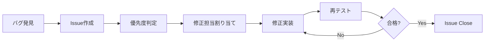

# Phase 4-1: QA/テスト総合ガイド

**作成日**: 2025-10-21
**Phase**: Phase 4-1（QA/テスト）
**目的**: 新ドキュメントサイトジェネレーターの総合的な品質保証とローンチ判断のためのエビデンス収集

---

## 📋 目次

1. [テスト戦略概要](#テスト戦略概要)
2. [テスト環境](#テスト環境)
3. [機能テスト](#機能テスト)
4. [アクセシビリティテスト](#アクセシビリティテスト)
5. [パフォーマンステスト](#パフォーマンステスト)
6. [国際化テスト](#国際化テスト)
7. [自動テスト](#自動テスト)
8. [バグ管理](#バグ管理)
9. [QAレポート](#qaレポート)
10. [完了基準](#完了基準)

---

## テスト戦略概要

### 目的

Phase 2-3で構築した新ドキュメントサイトジェネレーターの機能を総合的にテストし、**プロダクションリリース可能な品質**を保証する。

### テスト対象

#### 1. デモサイト（demo-docs）
- **対象**: `apps/demo-docs/`
- **レジストリ**: `registry/demo-docs.json`
- **範囲**:
  - 3言語（en/ja/ko）
  - 1バージョン（v1）
  - 3カテゴリ（guide/api/examples）
  - 6ドキュメント

#### 2. 既存プロジェクト（参照）
- **project-template**: テンプレート検証
- **test-verification**: 多言語対応検証
- **sample-docs**: 実際のコンテンツ検証

#### 3. 共有パッケージ
- **@docs/generator**: レジストリ駆動のルーティング
- **@docs/ui**: UIコンポーネント
- **@docs/theme**: テーマシステム
- **@docs/i18n**: 国際化
- **@docs/versioning**: バージョン管理
- **@docs/runtime**: Astro統合

### テストレベル

| レベル | 目的 | 担当 | 優先度 |
|-------|------|------|--------|
| **ユニットテスト** | 個別関数・モジュールの検証 | 開発 | 🔴 高 |
| **統合テスト** | モジュール間の連携検証 | 開発 | 🔴 高 |
| **E2Eテスト** | エンドツーエンドのワークフロー検証 | QA | 🟡 中 |
| **手動テスト** | UI/UX、アクセシビリティ検証 | QA | 🔴 高 |
| **パフォーマンステスト** | Lighthouse、ページロード時間 | QA | 🟡 中 |

### 合格基準

#### 必須項目（Must Have）
- ✅ ユニットテスト カバレッジ: **80%以上**
- ✅ 統合テスト: **全テストケース成功**
- ✅ Lighthouse Performance: **90以上**
- ✅ Lighthouse Accessibility: **95以上**
- ✅ 重大バグ（Critical/High）: **0件**

#### 推奨項目（Should Have）
- ✅ Lighthouse Best Practices: **90以上**
- ✅ Lighthouse SEO: **90以上**
- ✅ ページロード時間: **2秒以内**
- ✅ 中程度バグ（Medium）: **5件以下**

---

## テスト環境

### 環境構成

#### 1. ローカル環境
```bash
# 開発サーバー起動
pnpm dev

# ビルド実行
pnpm build:local

# プレビュー
pnpm preview
```

**使用用途**:
- 開発中のテスト
- 手動QA
- パフォーマンス測定

#### 2. CI/CD環境
```yaml
# .github/workflows/test-and-validate.yml
```

**使用用途**:
- 自動テスト実行
- Pull Request検証
- 継続的な品質チェック

#### 3. プレビュー環境（Cloudflare Pages）
```bash
# デプロイ
pnpm deploy:pages
```

**使用用途**:
- ステークホルダーレビュー
- 本番環境に近い検証
- パフォーマンス測定

### テストデータ

#### demo-docs プロジェクト
- **言語**: en, ja, ko
- **ドキュメント数**: 6件
- **カテゴリ数**: 3件
- **用語集**: 2件

#### テスト用コンテンツ
- **場所**: `apps/demo-docs/src/content/`
- **形式**: MDX
- **言語別**: en/ja/ko

---

## 機能テスト

### 1. ルーティング・ナビゲーション

#### テストケース一覧

| ID | テストケース | 期待結果 | 優先度 |
|----|------------|---------|--------|
| RT-01 | トップページ（`/`）にアクセス | プロジェクト一覧が表示される | 🔴 高 |
| RT-02 | プロジェクトページ（`/demo-docs/`）にアクセス | デフォルト言語・バージョンにリダイレクト | 🔴 高 |
| RT-03 | ドキュメントページ（`/demo-docs/v1/en/guide/getting-started`）にアクセス | 正しいコンテンツが表示される | 🔴 高 |
| RT-04 | 存在しないページにアクセス | 404ページが表示される | 🟡 中 |
| RT-05 | 言語切替（en → ja） | 同じドキュメントの日本語版にリダイレクト | 🔴 高 |
| RT-06 | バージョン切替（v1 → v2） | 同じドキュメントの別バージョンにリダイレクト | 🟡 中 |

#### テスト手順

**RT-03の例**:
1. ローカル環境でビルド実行: `pnpm build:local`
2. プレビューサーバー起動: `pnpm preview`
3. ブラウザで`http://localhost:4321/demo-docs/v1/en/guide/getting-started`にアクセス
4. 期待結果:
   - ページタイトル: "Getting Started"
   - サイドバーにカテゴリ一覧表示
   - 本文が正しく表示
   - フッターにナビゲーションリンク

### 2. サイドバー・ナビゲーション

#### テストケース一覧

| ID | テストケース | 期待結果 | 優先度 |
|----|------------|---------|--------|
| SB-01 | サイドバーのカテゴリ表示 | 3カテゴリ（guide/api/examples）が正しく表示 | 🔴 高 |
| SB-02 | サイドバーのドキュメントリンク | 各カテゴリ配下のドキュメントが表示される | 🔴 高 |
| SB-03 | アクティブページのハイライト | 現在のページがハイライト表示される | 🟡 中 |
| SB-04 | サイドバーのスクロール | 長いサイドバーがスクロール可能 | 🟢 低 |
| SB-05 | モバイル表示でのサイドバー | ハンバーガーメニューで開閉可能 | 🟡 中 |

### 3. 検索機能（Pagefind）

#### テストケース一覧

| ID | テストケース | 期待結果 | 優先度 |
|----|------------|---------|--------|
| SE-01 | キーワード検索 | "getting started"で該当ページが表示 | 🔴 高 |
| SE-02 | 日本語検索 | "インストール"で該当ページが表示 | 🔴 高 |
| SE-03 | 韓国語検索 | "시작하기"で該当ページが表示 | 🟡 中 |
| SE-04 | ファセット検索（プロジェクト） | demo-docsでフィルタリング | 🟡 中 |
| SE-05 | ファセット検索（言語） | 日本語でフィルタリング | 🟡 中 |
| SE-06 | ページネーション | 10件/ページで表示 | 🟢 低 |
| SE-07 | 検索ハイライト | 検索語が`<mark>`タグでハイライト | 🟢 低 |
| SE-08 | ゼロヒット | 検索結果0件時に適切なメッセージ表示 | 🟡 中 |

#### テスト手順

**SE-01の例**:
1. `/demo-docs/v1/en/guide/getting-started`にアクセス
2. 検索ボックスに"getting started"を入力
3. 期待結果:
   - 検索結果に"Getting Started"ページが表示
   - 検索語がハイライトされる
   - クリックで該当ページに遷移

### 4. 言語切替

#### テストケース一覧

| ID | テストケース | 期待結果 | 優先度 |
|----|------------|---------|--------|
| LG-01 | 言語セレクタの表示 | en/ja/koが選択可能 | 🔴 高 |
| LG-02 | 英語→日本語切替 | 同じドキュメントの日本語版に遷移 | 🔴 高 |
| LG-03 | 日本語→韓国語切替 | 同じドキュメントの韓国語版に遷移 | 🟡 中 |
| LG-04 | 未翻訳ページの処理 | フォールバック言語（en）に遷移 | 🟡 中 |
| LG-05 | URL言語パラメータの保持 | `/v1/ja/`から言語切替時も`/v1/en/`に遷移 | 🔴 高 |

### 5. バージョン管理

#### テストケース一覧

| ID | テストケース | 期待結果 | 優先度 |
|----|------------|---------|--------|
| VR-01 | バージョンセレクタの表示 | v1が選択可能（demo-docsは1バージョンのみ） | 🟡 中 |
| VR-02 | バージョン切替（複数バージョンある場合） | 同じドキュメントの別バージョンに遷移 | 🟡 中 |
| VR-03 | 最新バージョンのバッジ表示 | v1に"Latest"バッジが表示 | 🟢 低 |

---

## アクセシビリティテスト

### 1. キーボードナビゲーション

#### テストケース一覧

| ID | テストケース | 期待結果 | 優先度 |
|----|------------|---------|--------|
| KB-01 | Tabキーでのフォーカス移動 | 論理的な順序でフォーカスが移動 | 🔴 高 |
| KB-02 | フォーカスインジケーター | フォーカス中の要素が視覚的に識別可能 | 🔴 高 |
| KB-03 | Enterキーでリンク遷移 | リンクがキーボードで選択可能 | 🔴 高 |
| KB-04 | Escキーでモーダル閉じる | 検索モーダルをEscで閉じられる | 🟡 中 |
| KB-05 | スキップリンク | "Skip to content"リンクが機能する | 🔴 高 |

#### テスト手順

**KB-02の例**:
1. ページを開く
2. Tabキーを複数回押してフォーカスを移動
3. 期待結果:
   - フォーカス中の要素に青い枠線（`outline: 2px solid var(--color-primary)`）が表示
   - フォーカスが明確に識別可能

### 2. スクリーンリーダー対応

#### テストケース一覧

| ID | テストケース | 期待結果 | 優先度 |
|----|------------|---------|--------|
| SR-01 | ページタイトルの読み上げ | `<title>`タグが正しく読み上げられる | 🔴 高 |
| SR-02 | ナビゲーションの読み上げ | `role="navigation"`が適切に設定 | 🔴 高 |
| SR-03 | メインコンテンツの識別 | `role="main"`が適切に設定 | 🔴 高 |
| SR-04 | ランドマークの使用 | header/nav/main/footerが適切に使用 | 🔴 高 |
| SR-05 | aria-labelの適切性 | ボタン・リンクに適切なaria-label | 🟡 中 |
| SR-06 | aria-currentの使用 | 現在のページに`aria-current="page"` | 🟡 中 |

#### テスト手順

**SR-02の例**（macOS VoiceOverを使用）:
1. VoiceOverを起動（Cmd + F5）
2. VO + U でランドマーク一覧を開く
3. 期待結果:
   - "navigation"ランドマークが表示される
   - サイドバーナビゲーション、ヘッダーナビゲーションが識別可能

### 3. カラーコントラスト

#### テストケース一覧

| ID | テストケース | 期待結果 | 優先度 |
|----|------------|---------|--------|
| CC-01 | 本文テキストのコントラスト | WCAG AA基準（4.5:1以上）を満たす | 🔴 高 |
| CC-02 | リンクテキストのコントラスト | WCAG AA基準を満たす | 🔴 高 |
| CC-03 | ボタンテキストのコントラスト | WCAG AA基準を満たす | 🔴 高 |
| CC-04 | ダークモードのコントラスト | ダークモードでもWCAG AA基準を満たす | 🟡 中 |

#### テスト手順

**CC-01の例**（Chrome DevToolsを使用）:
1. Chrome DevToolsを開く（F12）
2. Elements タブで `<p>` 要素を選択
3. Computed → Contrast の項目を確認
4. 期待結果:
   - コントラスト比が4.5:1以上
   - ✅ マークが表示される

---

## パフォーマンステスト

### 1. Lighthouse測定

#### 測定対象ページ

| ページ | URL | 優先度 |
|-------|-----|--------|
| Getting Started（英語） | `/demo-docs/v1/en/guide/getting-started` | 🔴 高 |
| Getting Started（日本語） | `/demo-docs/v1/ja/guide/getting-started` | 🔴 高 |
| Installation（韓国語） | `/demo-docs/v1/ko/guide/installation` | 🟡 中 |
| Components API | `/demo-docs/v1/en/api/components` | 🟡 中 |

#### 目標スコア（Phase 2-4で達成済み）

| カテゴリ | 目標スコア | Phase 2-4実績 | ステータス |
|---------|-----------|--------------|-----------|
| Performance | ≥90 | **100** | ✅ 達成 |
| Accessibility | ≥95 | **91** | ⚠️ 要確認 |
| Best Practices | ≥90 | **96** | ✅ 達成 |
| SEO | ≥90 | **100** | ✅ 達成 |

**注**: Phase 2-4ではAccessibilityが91点で目標（95点）に未達。Phase 4-1で改善項目を確認。

#### 測定手順

```bash
# 1. ビルド実行
pnpm build:local

# 2. プレビューサーバー起動
pnpm preview

# 3. Chrome DevToolsでLighthouse実行
# - Lighthouseタブを開く
# - Mode: Navigation
# - Device: Desktop / Mobile
# - 「Analyze page load」をクリック

# 4. レポート保存
# - 右上の「Save report」→ HTML形式で保存
# - ファイル名: lighthouse-{page}-{date}.html
```

#### 主要メトリクス目標値

| メトリクス | 目標値 | Phase 2-4実績 | 説明 |
|----------|--------|--------------|------|
| **FCP** (First Contentful Paint) | <1.8秒 | 0.3秒 | 最初のコンテンツ表示時間 |
| **LCP** (Largest Contentful Paint) | <2.5秒 | 0.4秒 | 最大コンテンツ表示時間 |
| **TBT** (Total Blocking Time) | <200ms | 0ms | 総ブロッキング時間 |
| **CLS** (Cumulative Layout Shift) | <0.1 | 0 | レイアウトシフト累積 |
| **SI** (Speed Index) | <3.4秒 | 0.3秒 | 視覚的表示速度 |

### 2. ページロード時間測定

#### 測定対象

- トップページ
- プロジェクトページ
- ドキュメントページ（小）
- ドキュメントページ（大）

#### 測定手順

**Chrome DevTools Networkタブを使用**:
1. DevToolsを開く（F12）
2. Network タブを選択
3. 「Disable cache」をチェック
4. ページをリロード（Cmd/Ctrl + Shift + R）
5. DOMContentLoaded と Load のタイミングを確認

**目標値**:
- **DOMContentLoaded**: <1秒
- **Load**: <2秒

### 3. Pagefind検索パフォーマンス

#### 測定項目

| 項目 | 目標値 | 測定方法 |
|-----|--------|---------|
| インデックスサイズ | <500KB | `dist/_pagefind/`のサイズ確認 |
| 検索レスポンス時間 | <100ms | Chrome DevTools Performance タブ |
| インデックス化ドキュメント数 | 全ドキュメント | ビルドログ確認 |

#### テスト手順

```bash
# 1. ビルド実行
pnpm build:local

# 2. Pagefindインデックスサイズ確認
du -sh dist/_pagefind/

# 3. 検索レスポンス時間測定
# - Chrome DevTools Performance タブでRecord
# - 検索ボックスに入力
# - 検索結果表示までの時間を測定
```

---

## 国際化テスト

### 1. 多言語表示

#### テストケース一覧

| ID | テストケース | 期待結果 | 優先度 |
|----|------------|---------|--------|
| I18N-01 | 英語ページの表示 | 英語コンテンツが正しく表示 | 🔴 高 |
| I18N-02 | 日本語ページの表示 | 日本語コンテンツが正しく表示 | 🔴 高 |
| I18N-03 | 韓国語ページの表示 | 韓国語コンテンツが正しく表示 | 🟡 中 |
| I18N-04 | フォールバック処理 | 未翻訳ページで英語にフォールバック | 🟡 中 |
| I18N-05 | 言語メタタグ | `<html lang="ja">`が適切に設定 | 🔴 高 |

### 2. RTL（右から左）言語対応

**注**: demo-docsはRTL言語（アラビア語等）をサポートしていないため、将来的なテスト項目として記録。

#### テストケース一覧

| ID | テストケース | 期待結果 | 優先度 |
|----|------------|---------|--------|
| RTL-01 | RTL言語の表示 | レイアウトが右から左に反転 | 🟢 低（将来） |
| RTL-02 | テキスト方向 | `dir="rtl"`が適切に設定 | 🟢 低（将来） |
| RTL-03 | アイコンの向き | 矢印アイコンが反転 | 🟢 低（将来） |

### 3. 翻訳ステータス確認

#### 確認項目

| プロジェクト | 言語 | ドキュメント数 | 翻訳率 | ステータス |
|------------|------|-------------|--------|-----------|
| demo-docs | en | 6 | 100% | ✅ 完了 |
| demo-docs | ja | 4 | 67% | ⚠️ 一部未翻訳 |
| demo-docs | ko | 3 | 50% | ⚠️ 一部未翻訳 |

**確認方法**:
```bash
# レジストリから翻訳ステータスを確認
cat registry/demo-docs.json | jq '.projects[0].documents[] | {docId, title}'

# 実際のMDXファイル確認
ls apps/demo-docs/src/content/*/ja.mdx
ls apps/demo-docs/src/content/*/ko.mdx
```

---

## 自動テスト

### 1. ユニットテスト（Vitest）

#### 現在のテストスイート

**packages/cli/tests/unit/**:
- `backup.test.js` - BackupManager機能
- `logger.test.js` - Logger機能
- `registry.test.js` - RegistryManager機能
- `migrate/content-meta.test.js` - コンテンツメタ生成
- `migrate/glossary-parser.test.js` - 用語集パーサー
- `migrate/category-scanner.test.js` - カテゴリスキャナー
- `migrate/config-parser.test.js` - 設定ファイルパーサー
- `migrate/document-scanner.test.js` - ドキュメントスキャナー

**packages/validator/tests/unit/**:
- `validator.test.js` - スキーマバリデーター

#### テスト実行

```bash
# 全テスト実行
pnpm test

# ウォッチモード
pnpm test:watch

# カバレッジレポート
pnpm test:coverage
```

#### カバレッジ目標

| パッケージ | Lines | Functions | Branches | Statements |
|----------|-------|-----------|----------|------------|
| @docs/cli | ≥80% | ≥80% | ≥70% | ≥80% |
| @docs/validator | ≥80% | ≥80% | ≥70% | ≥80% |

### 2. 統合テスト

#### 現在のテストスイート

**packages/cli/tests/integration/**:
- `add-project.test.js` - プロジェクト追加機能
- `search.test.js` - 検索機能（一部失敗、要調査）
- `export.test.js` - エクスポート機能
- `migrate/from-libx.test.js` - libx-docsからの移行
- `migrate/edge-cases.test.js` - エッジケース

#### 既知の問題

**search.test.js の失敗**（Phase 4-1で調査）:
```
stdout | packages/cli/tests/integration/search.test.js
{"level":"error","message":"検索に失敗しました: text.toLowerCase is not a function"}
```

### 3. CI/CD自動テスト

#### GitHub Actions ワークフロー

**.github/workflows/test-and-validate.yml**:
- スキーマバリデーション
- ユニットテスト実行
- 統合テスト実行
- ビルドテスト

**実行タイミング**:
- Pull Request作成時
- main ブランチへのpush時

---

## バグ管理

### 1. バグレポートフロー



### 2. 優先度定義

| 優先度 | 説明 | 対応期限 | 例 |
|-------|------|---------|---|
| **🔴 Critical** | システムが使用不能 | 即座 | ビルド失敗、デプロイ不可 |
| **🟠 High** | 主要機能が動作しない | 1日以内 | 検索機能の完全停止、ルーティング不正 |
| **🟡 Medium** | 一部機能に影響 | 3日以内 | 特定言語の表示崩れ、リンク切れ |
| **🟢 Low** | 軽微な問題 | 7日以内 | UIの微調整、タイポ |

### 3. Issueテンプレート

#### バグレポート

```markdown
## バグ概要
（バグの簡潔な説明）

## 再現手順
1. ...
2. ...
3. ...

## 期待結果
（期待される動作）

## 実際の結果
（実際に発生した動作）

## 環境
- OS:
- ブラウザ:
- Node.js:
- pnpm:

## スクリーンショット
（必要に応じて）

## 優先度
- [ ] Critical
- [ ] High
- [ ] Medium
- [ ] Low

## 関連情報
（関連Issue、Pull Request等）
```

### 4. バグトラッキング

**GitHub Project Board使用**:
- **Backlog**: 未着手のバグ
- **In Progress**: 修正中
- **Testing**: 再テスト中
- **Done**: 修正完了

---

## QAレポート

### 1. テスト実施状況レポート

#### テンプレート

```markdown
# QAレポート: {日付}

## テスト実施サマリー

| カテゴリ | 総テスト数 | 成功 | 失敗 | スキップ | 成功率 |
|---------|----------|-----|-----|---------|--------|
| 機能テスト | X | Y | Z | W | XX% |
| アクセシビリティ | X | Y | Z | W | XX% |
| パフォーマンス | X | Y | Z | W | XX% |
| 国際化 | X | Y | Z | W | XX% |

## 新規発見バグ

| ID | タイトル | 優先度 | ステータス |
|----|---------|--------|-----------|
| #XXX | ... | High | Open |

## 修正完了バグ

| ID | タイトル | 優先度 | 修正PR |
|----|---------|--------|--------|
| #XXX | ... | Medium | #YYY |

## 次のアクション

1. ...
2. ...

## 備考

...
```

### 2. Lighthouseレポート

**保存場所**: `docs/new-generator-plan/reports/lighthouse/`

**ファイル命名規則**: `lighthouse-{page}-{date}.html`

**例**:
- `lighthouse-getting-started-en-20251021.html`
- `lighthouse-getting-started-ja-20251021.html`

### 3. カバレッジレポート

**保存場所**: `coverage/`（自動生成）

**確認方法**:
```bash
pnpm test:coverage
open coverage/index.html
```

---

## 完了基準

### Phase 4-1完了の定義

#### 必須項目（Must Have）

- ✅ **テスト計画書**: 本ドキュメントが完成
- ✅ **ユニットテストカバレッジ**: 80%以上達成
- ✅ **統合テスト**: 全テストケース成功
- ✅ **機能テスト**: 全優先度🔴高のテスト成功
- ✅ **Lighthouse Performance**: 90以上
- ✅ **Lighthouse Accessibility**: 95以上
- ✅ **重大バグ（Critical/High）**: 0件
- ✅ **QAレポート**: 完成

#### 推奨項目（Should Have）

- ✅ **機能テスト**: 全優先度🟡中のテスト成功
- ✅ **Lighthouse Best Practices**: 90以上
- ✅ **Lighthouse SEO**: 90以上
- ✅ **ページロード時間**: 2秒以内
- ✅ **中程度バグ（Medium）**: 5件以下

#### オプション項目（Nice to Have）

- ✅ **機能テスト**: 全優先度🟢低のテスト成功
- ✅ **E2Eテスト**: 自動化
- ✅ **視覚回帰テスト**: 導入

---

## チェックリスト

### Phase 4-1開始前

- [ ] テスト環境準備完了
- [ ] demo-docsビルド成功確認
- [ ] QAツールインストール（Lighthouse、axe DevTools等）
- [ ] バグトラッキングシステム準備（GitHub Project Board）
- [ ] テスト計画書レビュー完了

### QA実施中

- [ ] 機能テスト実施（RT-01〜RT-06）
- [ ] サイドバーテスト実施（SB-01〜SB-05）
- [ ] 検索機能テスト実施（SE-01〜SE-08）
- [ ] 言語切替テスト実施（LG-01〜LG-05）
- [ ] キーボードナビゲーションテスト実施（KB-01〜KB-05）
- [ ] スクリーンリーダーテスト実施（SR-01〜SR-06）
- [ ] カラーコントラストテスト実施（CC-01〜CC-04）
- [ ] Lighthouse測定実施（全対象ページ）
- [ ] ページロード時間測定実施
- [ ] Pagefindパフォーマンス測定実施
- [ ] 多言語表示テスト実施（I18N-01〜I18N-05）

### Phase 4-1完了前

- [ ] 全優先度🔴高のテストケース成功
- [ ] 重大バグ（Critical/High）が0件
- [ ] Lighthouseスコア目標達成
- [ ] QAレポート作成完了
- [ ] Phase 4-1完了レポート作成
- [ ] ステークホルダーレビュー完了

---

## 参照ドキュメント

### Phase 2成果物
- [phase-2-4-completion-report.md](../status/phase-2-4-completion-report.md) - パフォーマンス最適化報告
- [shared-packages.md](./shared-packages.md) - 共有パッケージガイド
- [testing.md](./testing.md) - テストポリシーガイド

### Phase 3成果物
- [migration.md](./migration.md) - マイグレーション手順書
- [ci.md](./ci.md) - CIガイド

### Phase 4計画
- [phase-4-0-release.md](../phase-4-0-release.md) - リリース全体計画
- [phase-4-1-qa-testing.md](../phase-4-1-qa-testing.md) - QA/テスト詳細計画

---

**最終更新**: 2025-10-21
**作成者**: Claude Code (AI Assistant)
**バージョン**: v1.0.0
