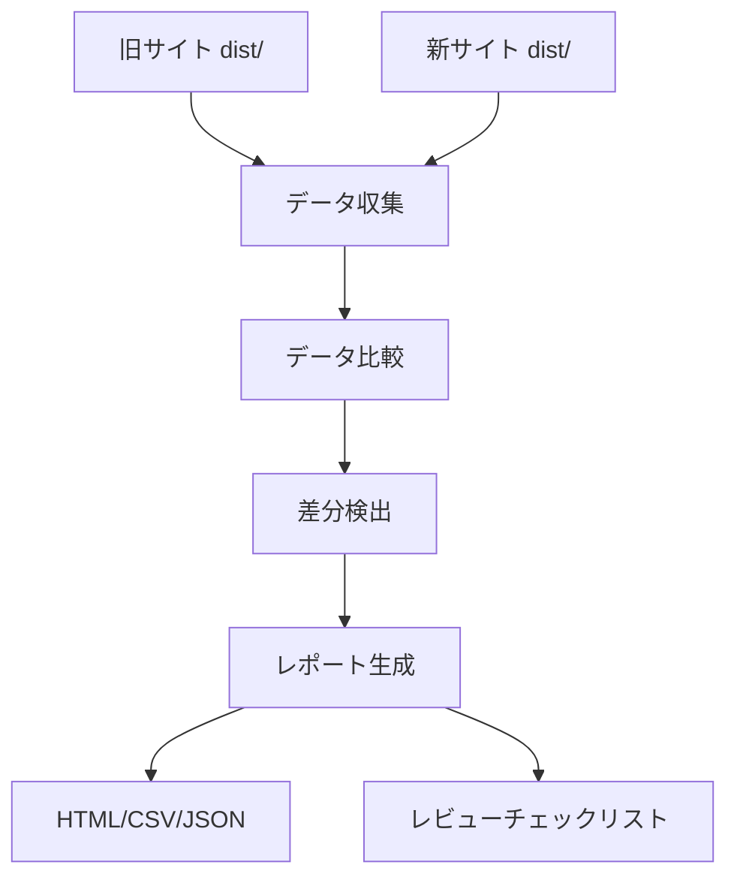

# Phase 3-2 → Phase 3-3 引き継ぎドキュメント

**作成日**: 2025-10-21
**前フェーズ**: Phase 3-2 (CLI統合・バリデーション)
**次フェーズ**: Phase 3-3 (差分レポート生成)

---

## 📋 目次

1. [Phase 3-2 完了状況](#phase-3-2-完了状況)
2. [Phase 3-3 で実装すべき内容](#phase-3-3-で実装すべき内容)
3. [既存実装の理解](#既存実装の理解)
4. [利用可能なツールと基盤](#利用可能なツールと基盤)
5. [実装ガイドライン](#実装ガイドライン)
6. [テスト戦略](#テスト戦略)
7. [注意事項](#注意事項)
8. [参考資料](#参考資料)

---

## Phase 3-2 完了状況

### ✅ 完了した作業

#### 1. CLIコマンド統合（確認完了）

**場所**: `packages/cli/src/index.js` (334-351行)

**機能**:
- `migrate from-libx` コマンドの統合
- Commander.js との完全な連携
- グローバルオプション (`--dry-run`, `--verbose`)
- コマンドオプション (`--source`, `--project-id`, `--target`, `--top-page`, `--backup`)

#### 2. バリデーション機能（新規実装）

**新規ファイル**: `packages/cli/src/validators/registry-validator.js` (360行)

**機能**:
- `validateRegistry()`: レジストリ全体の検証
- `validateProject()`: プロジェクト単位の検証
- `validateDocument()`: ドキュメント単位の検証
- `logValidationResult()`: 結果の出力

**検証項目**:
- 必須フィールドの存在確認
- データ型の検証
- 相互参照の整合性チェック
- ID・スラッグの重複検出
- エラーと警告の分離

**使用例**:
```bash
docs-cli validate registry/docs.json
docs-cli validate --strict
docs-cli validate --report json
```

#### 3. スラッグ重複検知（新規実装）

**新規ファイル**: `packages/cli/src/commands/migrate/slug-deduplicator.js` (95行)

**機能**:
- `deduplicateSlugs()`: 重複検知と自動リネーム
- `findDuplicateSlugs()`: 重複検出のみ
- `reportDuplicateSlugs()`: 重複レポート出力

**統合先**: `from-libx.js` の Step 4.5

**注**: 現在のアーキテクチャでは実際には使用されないが、将来的な変更に備えて実装済み。

#### 4. プログレスバー表示（新規実装）

**パッケージ**: `cli-progress` v3.12.0

**統合先**: `from-libx.js`

**機能**:
- 8段階の処理進捗表示
- カスタムステージメッセージ
- 視覚的な進行状況バー

#### 5. 統計情報の出力（強化実装）

**統合先**: `from-libx.js`

**表示項目**:
- 処理時間（ミリ秒/秒）
- プロジェクト情報（言語数、バージョン数）
- コンテンツ情報（カテゴリ数、ドキュメント数、Glossary用語数）
- コンテンツファイル（ステータス別集計）
- 警告・エラー数

### 📊 テスト結果

```
✅ Test Files: 8 passed (8)
✅ Tests: 45 passed | 1 skipped (46)
⏱️ Duration: 5.03s
```

---

## Phase 3-3 で実装すべき内容

Phase 3-3 の計画書: `docs/new-generator-plan/phase-3-2-diff-report.md`

### 🎯 主要タスク

#### タスク1: データ収集機能

**実装すべきファイル**:
```
packages/cli/src/commands/migrate/
├── collectors/
│   ├── url-collector.js          # URL収集
│   ├── metadata-collector.js     # メタデータ収集
│   └── content-collector.js      # コンテンツ収集
```

**実装内容**:

1. **旧サイト（libx-dev）のデータ収集**
```javascript
// url-collector.js
export async function collectUrls(distPath) {
  // dist/ ディレクトリから生成されたHTMLファイルを収集
  // URL一覧を抽出
  // サイトマップも読み込み
}

// metadata-collector.js
export async function collectMetadata(distPath) {
  // HTML の <head> セクションからメタデータを抽出
  // title, description, OG tags, keywords など
}

// content-collector.js
export async function collectContent(distPath) {
  // HTMLからメインコンテンツを抽出
  // Markdown形式に変換（オプション）
  // 主要な見出し・段落・リストを抽出
}
```

2. **新サイトのデータ収集**
```javascript
// 新ジェネレーターのビルド出力を収集
// 同じ形式でデータを構造化
```

#### タスク2: 比較ロジック

**実装すべきファイル**:
```
packages/cli/src/commands/migrate/
├── comparators/
│   ├── url-comparator.js         # URL比較
│   ├── metadata-comparator.js    # メタデータ比較
│   └── content-comparator.js     # コンテンツ比較
```

**実装内容**:

1. **URL比較**
```javascript
export function compareUrls(oldUrls, newUrls) {
  return {
    added: [],      // 新規追加されたURL
    removed: [],    // 削除されたURL
    moved: [],      // 移動されたURL（リダイレクト）
    unchanged: [],  // 変更なし
  };
}
```

2. **メタデータ比較**
```javascript
export function compareMetadata(oldMeta, newMeta) {
  return {
    titleChanges: [],       // タイトル変更
    descriptionChanges: [], // 説明文変更
    ogChanges: [],          // OGタグ変更
    keywordChanges: [],     // キーワード変更
  };
}
```

3. **コンテンツ比較**
```javascript
export function compareContent(oldContent, newContent) {
  // Markdown AST ベースの差分検出
  // 主要変更点の抽出
  return {
    structuralChanges: [],  // 構造変更（見出し追加/削除など）
    textChanges: [],        // テキスト変更
    linkChanges: [],        // リンク変更
  };
}
```

#### タスク3: レポート生成

**実装すべきファイル**:
```
packages/cli/src/commands/migrate/
├── reporters/
│   ├── html-reporter.js          # HTMLレポート
│   ├── csv-reporter.js           # CSVレポート
│   ├── json-reporter.js          # JSONレポート
│   └── markdown-reporter.js      # Markdownレポート
```

**実装内容**:

1. **HTMLレポート**
```javascript
export function generateHtmlReport(diffResult, options) {
  // 見やすいHTML形式でレポートを生成
  // 概要セクション
  // 詳細セクション（URL別、カテゴリ別）
  // プレビューリンク
}
```

**テンプレート構造**:
```html
<!DOCTYPE html>
<html>
<head>
  <title>マイグレーション差分レポート</title>
  <style>/* スタイル */</style>
</head>
<body>
  <h1>マイグレーション差分レポート</h1>

  <!-- 概要セクション -->
  <section class="summary">
    <h2>概要</h2>
    <ul>
      <li>追加: 10件</li>
      <li>削除: 5件</li>
      <li>変更: 20件</li>
    </ul>
  </section>

  <!-- 詳細セクション -->
  <section class="details">
    <h2>詳細</h2>
    <!-- URL別の差分表示 -->
  </section>
</body>
</html>
```

2. **CSVレポート**
```javascript
export function generateCsvReport(diffResult, options) {
  // スプレッドシートで開けるCSV形式
  // レビュー用のチェックリスト付き
}
```

**CSV構造**:
```csv
URL,タイプ,変更内容,優先度,レビュー済み,コメント
/docs/guide/intro,変更,タイトル変更: "Introduction" → "Getting Started",中,,
/docs/api/overview,追加,新規ページ,高,,
/docs/legacy/old,削除,削除予定,低,,
```

3. **JSONレポート**
```javascript
export function generateJsonReport(diffResult, options) {
  // 機械可読なJSON形式
  // CI/CDでの自動処理用
}
```

**JSON構造**:
```json
{
  "version": "1.0.0",
  "timestamp": "2025-10-21T12:00:00Z",
  "summary": {
    "totalPages": 100,
    "added": 10,
    "removed": 5,
    "changed": 20,
    "unchanged": 65
  },
  "details": [
    {
      "url": "/docs/guide/intro",
      "type": "changed",
      "changes": [
        {
          "field": "title",
          "old": "Introduction",
          "new": "Getting Started"
        }
      ]
    }
  ]
}
```

#### タスク4: CLIコマンド統合

**実装すべきファイル**:
```
packages/cli/src/commands/
└── diff.js                        # diff コマンド（新規作成）
```

**実装内容**:

```javascript
// diff.js
import { Command } from 'commander';

export function createDiffCommand() {
  const diff = new Command('diff')
    .description('旧サイトと新サイトの差分を比較');

  diff
    .command('report')
    .description('差分レポートを生成')
    .requiredOption('--old <path>', '旧サイトのdistパス')
    .requiredOption('--new <path>', '新サイトのdistパス')
    .option('--format <format>', 'レポート形式（html,csv,json,markdown）', 'html')
    .option('--output <path>', '出力先ファイル')
    .option('--ignore-whitespace', '空白の変更を無視', false)
    .option('--ignore-case', '大文字小文字を無視', false)
    .action(async (options) => {
      const { default: diffReportCommand } = await import('./diff/report.js');
      await diffReportCommand(program.opts(), options);
    });

  return diff;
}
```

**メインCLIに追加**:
```javascript
// packages/cli/src/index.js
import { createDiffCommand } from './commands/diff.js';

program.addCommand(createDiffCommand());
```

**使用例**:
```bash
# HTMLレポート生成
docs-cli diff report \
  --old=dist-old \
  --new=dist-new \
  --format=html \
  --output=reports/diff.html

# CSVレポート生成
docs-cli diff report \
  --old=dist-old \
  --new=dist-new \
  --format=csv \
  --output=reports/diff.csv

# JSONレポート生成（CI用）
docs-cli diff report \
  --old=dist-old \
  --new=dist-new \
  --format=json \
  --output=reports/diff.json
```

#### タスク5: レビュー支援

**実装すべきファイル**:
```
packages/cli/src/commands/diff/
├── review.js                      # レビューコマンド
└── templates/
    └── review-checklist.md        # レビューテンプレート
```

**実装内容**:

1. **レビューチェックリスト生成**
```javascript
export function generateReviewChecklist(diffResult) {
  // Markdownチェックリスト形式
  // カテゴリ別、優先度別に整理
}
```

**テンプレート**:
```markdown
# マイグレーション差分レビューチェックリスト

## 高優先度（必須確認）

- [ ] `/docs/guide/intro` - タイトル変更: "Introduction" → "Getting Started"
- [ ] `/docs/api/overview` - 新規ページ追加

## 中優先度（推奨確認）

- [ ] `/docs/tutorial/basics` - 説明文変更
- [ ] `/docs/reference/api` - メタデータ変更

## 低優先度（任意確認）

- [ ] `/docs/legacy/old` - ページ削除予定

## レビュー結果

- レビュー担当者:
- レビュー日:
- 承認/差し戻し:
- コメント:
```

2. **レビューステータス管理**
```javascript
export function updateReviewStatus(checklistPath, itemId, status) {
  // チェックリストのステータスを更新
  // [ ] → [x]
}

export function generateReviewSummary(checklistPath) {
  // レビュー進捗サマリーを生成
  // 完了率、未完了項目など
}
```

---

## 既存実装の理解

### Phase 3-2 で実装された機能

#### 1. バリデーション機能

**場所**: `packages/cli/src/validators/registry-validator.js`

**主要な関数**:
```javascript
validateRegistry(registry, options)   // レジストリ全体の検証
validateProject(project, options)     // プロジェクト単位の検証
validateDocument(document, project)   // ドキュメント単位の検証
logValidationResult(result)           // 結果の出力
```

**活用方法**:
- レポート生成前のデータ検証に使用
- 差分検出結果の整合性確認に使用

#### 2. 統計情報の収集

**場所**: `packages/cli/src/commands/migrate/from-libx.js` (220-297行)

**収集項目**:
- 処理時間
- プロジェクト情報
- コンテンツ情報
- ステータス別集計

**活用方法**:
- レポートのサマリーセクションに統合
- 変換前後の比較データとして使用

#### 3. プログレスバー

**場所**: `packages/cli/src/commands/migrate/from-libx.js`

**使用例**:
```javascript
const progressBar = new cliProgress.SingleBar({
  format: '進行状況 |{bar}| {percentage}% | {stage}',
  barCompleteChar: '\u2588',
  barIncompleteChar: '\u2591',
  hideCursor: true,
});

progressBar.start(totalSteps, 0, { stage: '初期化中...' });
progressBar.update(currentStep, { stage: 'データ収集中...' });
progressBar.stop();
```

**活用方法**:
- 差分レポート生成時の進捗表示
- データ収集・比較処理の進捗表示

---

## 利用可能なツールと基盤

### 1. ファイルシステムユーティリティ

**既存実装**:
- `category-scanner.js`: ディレクトリのスキャン
- `document-scanner.js`: ファイルのスキャン
- `content-meta.js`: ファイル内容の読み込みと解析

**活用方法**:
```javascript
import { scanAllDocuments } from './document-scanner.js';

// 旧サイトのHTMLファイルをスキャン
const oldFiles = scanDirectory(oldDistPath, '**/*.html');

// 新サイトのHTMLファイルをスキャン
const newFiles = scanDirectory(newDistPath, '**/*.html');
```

### 2. Git情報の取得

**場所**: `packages/cli/src/utils/git.js`

**活用方法**:
```javascript
import { getGitLog, getGitCommit } from '../../utils/git.js';

// 最終更新日時を取得
const lastUpdated = await getGitLog(filePath);

// コミット情報を取得
const commitInfo = await getGitCommit(filePath);
```

### 3. ハッシュ生成

**場所**: `packages/cli/src/utils/hash.js`

**活用方法**:
```javascript
import { generateHash } from '../../utils/hash.js';

// ファイル内容のハッシュを生成
const oldHash = generateHash(oldContent);
const newHash = generateHash(newContent);

if (oldHash !== newHash) {
  // コンテンツが変更された
}
```

### 4. ロガー

**場所**: `packages/cli/src/utils/logger.js`

**活用方法**:
```javascript
import * as logger from '../../utils/logger.js';

logger.info('データ収集を開始します...');
logger.success('✅ データ収集完了');
logger.warn('⚠️  警告: 一部のページが見つかりません');
logger.error('❌ エラー: データ収集に失敗しました');
```

### 5. バックアップマネージャー

**場所**: `packages/cli/src/utils/backup.js`

**活用方法**:
```javascript
import { BackupManager } from '../../utils/backup.js';

const backupManager = new BackupManager({
  backupDir: '.backups'
});

// レポート生成前にバックアップ
backupManager.backupFile(reportPath);
```

---

## 実装ガイドライン

### 1. ディレクトリ構造

```
packages/cli/src/commands/
├── diff/
│   ├── index.js                   # diff コマンドのエントリポイント
│   ├── report.js                  # report サブコマンド
│   ├── review.js                  # review サブコマンド
│   ├── collectors/
│   │   ├── url-collector.js
│   │   ├── metadata-collector.js
│   │   └── content-collector.js
│   ├── comparators/
│   │   ├── url-comparator.js
│   │   ├── metadata-comparator.js
│   │   └── content-comparator.js
│   ├── reporters/
│   │   ├── html-reporter.js
│   │   ├── csv-reporter.js
│   │   ├── json-reporter.js
│   │   └── markdown-reporter.js
│   └── templates/
│       ├── html-report.html
│       └── review-checklist.md
```

### 2. データフロー



### 3. エラーハンドリング

すべての処理でエラーハンドリングを実装してください：

```javascript
try {
  // データ収集
  const oldData = await collectData(oldPath);
  const newData = await collectData(newPath);

  // データ比較
  const diff = compareData(oldData, newData);

  // レポート生成
  await generateReport(diff, options);

  logger.success('✅ レポート生成完了');
} catch (error) {
  logger.error(`❌ エラー: ${error.message}`);

  if (globalOpts.verbose) {
    logger.error(error.stack);
  }

  throw error;
}
```

### 4. dry-run モード

`--dry-run` オプションをサポートしてください：

```javascript
if (!globalOpts.dryRun) {
  await writeFile(outputPath, reportContent);
  logger.success(`レポート保存完了: ${outputPath}`);
} else {
  logger.warn('dry-runモード: レポートは保存されません');
  logger.info('生成されたレポート（抜粋）:');
  console.log(reportContent.substring(0, 500) + '...');
}
```

### 5. プログレスバー

長時間の処理には必ずプログレスバーを表示してください：

```javascript
const progressBar = new cliProgress.SingleBar({
  format: '進行状況 |{bar}| {percentage}% | {stage}',
  barCompleteChar: '\u2588',
  barIncompleteChar: '\u2591',
  hideCursor: true,
});

const totalSteps = 5;
progressBar.start(totalSteps, 0, { stage: '初期化中...' });

// Step 1
progressBar.update(1, { stage: '旧サイトのデータを収集中...' });
const oldData = await collectOldData(oldPath);

// Step 2
progressBar.update(2, { stage: '新サイトのデータを収集中...' });
const newData = await collectNewData(newPath);

// Step 3
progressBar.update(3, { stage: 'データを比較中...' });
const diff = compareData(oldData, newData);

// Step 4
progressBar.update(4, { stage: 'レポートを生成中...' });
const report = generateReport(diff);

// Step 5
progressBar.update(5, { stage: '完了' });
progressBar.stop();
```

---

## テスト戦略

### Phase 3-3 で追加すべきテスト

#### 1. ユニットテスト

**ファイル**: `packages/cli/tests/unit/diff/`

```
tests/unit/diff/
├── url-collector.test.js          # URL収集のテスト
├── metadata-collector.test.js     # メタデータ収集のテスト
├── content-collector.test.js      # コンテンツ収集のテスト
├── url-comparator.test.js         # URL比較のテスト
├── metadata-comparator.test.js    # メタデータ比較のテスト
├── content-comparator.test.js     # コンテンツ比較のテスト
├── html-reporter.test.js          # HTMLレポート生成のテスト
├── csv-reporter.test.js           # CSVレポート生成のテスト
└── json-reporter.test.js          # JSONレポート生成のテスト
```

**テスト例**:
```javascript
// url-collector.test.js
describe('url-collector', () => {
  it('HTMLファイルからURLを収集できる', async () => {
    const urls = await collectUrls(fixturesPath);

    expect(urls).toContain('/docs/guide/intro');
    expect(urls).toContain('/docs/api/overview');
  });

  it('サイトマップからもURLを収集できる', async () => {
    const urls = await collectUrls(fixturesPath, {
      includeSitemap: true
    });

    expect(urls.length).toBeGreaterThan(0);
  });
});
```

#### 2. 統合テスト

**ファイル**: `packages/cli/tests/integration/diff/`

```
tests/integration/diff/
├── report.test.js                 # レポート生成のE2Eテスト
└── review.test.js                 # レビュー機能のE2Eテスト
```

**テスト例**:
```javascript
// report.test.js
describe('diff report (統合テスト)', () => {
  it('旧サイトと新サイトの差分レポートを生成できる', async () => {
    const oldPath = join(FIXTURES_DIR, 'old-site');
    const newPath = join(FIXTURES_DIR, 'new-site');
    const outputPath = join(TEMP_DIR, 'diff.html');

    await diffReport({
      old: oldPath,
      new: newPath,
      format: 'html',
      output: outputPath,
    });

    expect(existsSync(outputPath)).toBe(true);

    const report = readFileSync(outputPath, 'utf-8');
    expect(report).toContain('マイグレーション差分レポート');
  });
});
```

#### 3. スナップショットテスト

**ファイル**: `packages/cli/tests/snapshots/diff/`

```
tests/snapshots/diff/
└── report-output.test.js          # レポート出力のスナップショット
```

**テスト例**:
```javascript
// report-output.test.js
describe('diff report output', () => {
  it('HTMLレポートの構造が正しい', async () => {
    const diff = {
      summary: { added: 10, removed: 5, changed: 20 },
      details: [/* ... */],
    };

    const html = generateHtmlReport(diff);

    expect(html).toMatchSnapshot();
  });
});
```

### テストフィクスチャ

以下のフィクスチャを作成してください：

```
packages/cli/tests/fixtures/diff/
├── old-site/                      # 旧サイトのビルド出力
│   ├── index.html
│   ├── docs/
│   │   ├── guide/
│   │   │   └── intro.html
│   │   └── api/
│   │       └── overview.html
│   └── sitemap.xml
└── new-site/                      # 新サイトのビルド出力
    ├── index.html
    ├── docs/
    │   ├── guide/
    │   │   └── getting-started.html  # intro → getting-started に変更
    │   └── api/
    │       └── overview.html
    └── sitemap.xml
```

### テスト実行コマンド

```bash
# 全テスト実行
npm test

# diff関連のテストのみ
npm test tests/unit/diff/ tests/integration/diff/ tests/snapshots/diff/

# 特定のテストファイル
npm test tests/unit/diff/url-collector.test.js

# watchモード
npm test -- --watch

# カバレッジ
npm test -- --coverage
```

---

## 注意事項

### 1. HTMLパース

HTMLファイルからデータを抽出する際は、適切なパーサーを使用してください：

**推奨パッケージ**:
- `cheerio`: jQueryライクなHTMLパース
- `jsdom`: DOM操作が可能

**使用例**:
```javascript
import * as cheerio from 'cheerio';

export async function parseHtml(htmlPath) {
  const html = readFileSync(htmlPath, 'utf-8');
  const $ = cheerio.load(html);

  // メタデータ抽出
  const title = $('head title').text();
  const description = $('head meta[name="description"]').attr('content');

  // コンテンツ抽出
  const content = $('main').html();

  return { title, description, content };
}
```

### 2. パフォーマンス

大量のファイルを処理する際は、パフォーマンスに注意してください：

**最適化手法**:
- 並列処理（`Promise.all()`）
- ストリーミング処理
- キャッシュの活用

**例**:
```javascript
// 並列処理
const results = await Promise.all(
  files.map(file => processFile(file))
);

// ストリーミング処理
import { createReadStream } from 'fs';

const stream = createReadStream(filePath);
stream.on('data', chunk => {
  // チャンク単位で処理
});
```

### 3. メモリ使用量

大きなファイルを扱う際は、メモリ使用量に注意してください：

**対策**:
- ファイルを一度に全部読み込まない
- 不要なデータは即座に破棄
- ストリーミング処理を使用

### 4. エンコーディング

HTMLファイルのエンコーディングに注意してください：

```javascript
// UTF-8を明示的に指定
const html = readFileSync(htmlPath, 'utf-8');

// エンコーディングが不明な場合
import { detectEncoding } from 'chardet';

const encoding = detectEncoding(buffer);
const text = buffer.toString(encoding);
```

### 5. パス処理

クロスプラットフォーム対応のため、パス処理は `path` モジュールを使用してください：

```javascript
import { join, relative, resolve } from 'path';

// 絶対パスに変換
const absolutePath = resolve(relativePath);

// 相対パスに変換
const relPath = relative(basePath, targetPath);

// パスを結合
const fullPath = join(baseDir, subDir, file);
```

### 6. 差分の粒度

差分検出の粒度を調整可能にしてください：

**オプション例**:
```javascript
{
  ignoreWhitespace: true,   // 空白の変更を無視
  ignoreCase: true,          // 大文字小文字を無視
  ignoreLineBreaks: true,    // 改行の変更を無視
  ignoreComments: true,      // コメントの変更を無視
  threshold: 0.1,            // 10%以下の変更は無視
}
```

### 7. レポートのサイズ

大量の差分がある場合、レポートが巨大になる可能性があります：

**対策**:
- サマリーと詳細を分離
- ページネーション
- フィルタリング機能
- 圧縮（gzip）

---

## 参考資料

### ドキュメント

1. **Phase 3-2 完了レポート**
   - `docs/new-generator-plan/phase-3-2-completion-report.md`
   - 完了した作業の詳細

2. **Phase 3-2 計画書**
   - `docs/new-generator-plan/phase-3-2-diff-report.md`
   - 次フェーズの詳細計画

3. **Phase 3-1 完了レポート**
   - `docs/new-generator-plan/phase-3-1-completion-report.md`
   - データ移行ロジックの詳細

4. **データ移行ガイド**
   - `docs/new-generator-plan/guides/migration-data.md`
   - データ変換の詳細仕様（1,381行）

### 実装ファイル

**バリデーション**:
- `packages/cli/src/validators/registry-validator.js` (360行)

**データ移行**:
- `packages/cli/src/commands/migrate/from-libx.js` (300行)
- `packages/cli/src/commands/migrate/config-parser.js` (160行)
- `packages/cli/src/commands/migrate/category-scanner.js` (180行)
- `packages/cli/src/commands/migrate/document-scanner.js` (230行)
- `packages/cli/src/commands/migrate/content-meta.js` (190行)
- `packages/cli/src/commands/migrate/glossary-parser.js` (90行)

**ユーティリティ**:
- `packages/cli/src/utils/logger.js`
- `packages/cli/src/utils/backup.js`
- `packages/cli/src/utils/hash.js`
- `packages/cli/src/utils/git.js`

### テストファイル

**ユニットテスト**:
- `packages/cli/tests/unit/migrate/*.test.js` (32テスト)

**統合テスト**:
- `packages/cli/tests/integration/migrate/*.test.js` (11テスト)

**スナップショットテスト**:
- `packages/cli/tests/snapshots/migrate/*.test.js` (3テスト)

---

## 次のステップ

### Phase 3-3 開始時のチェックリスト

- [ ] Phase 3-2 のテストが全て通ることを確認
- [ ] `docs/new-generator-plan/phase-3-2-diff-report.md` を読む
- [ ] この引き継ぎドキュメントを熟読
- [ ] 既存実装のコードを確認
- [ ] 利用可能なツールと基盤を理解
- [ ] テストフィクスチャの構造を設計

### 最初に実装すべき内容

1. **データ収集機能** (最優先)
   - `collectors/url-collector.js` を作成
   - HTMLファイルからURL一覧を抽出
   - 動作確認

2. **比較ロジック** (重要)
   - `comparators/url-comparator.js` を作成
   - URL の追加/削除/変更を検出
   - テストを作成

3. **HTMLレポート生成** (中優先)
   - `reporters/html-reporter.js` を作成
   - 基本的なHTMLテンプレートを作成
   - レポートを出力

4. **CLIコマンド統合** (中優先)
   - `commands/diff/index.js` を作成
   - `report` サブコマンドを実装

5. **その他の形式** (低優先)
   - CSV、JSON、Markdownレポート
   - レビューチェックリスト生成

### 開発フロー

```bash
# 1. Phase 3-2 のテストを実行（全て通ることを確認）
npm test tests/unit/migrate/ tests/integration/migrate/ tests/snapshots/migrate/

# 2. 新機能を実装

# 3. テストを追加

# 4. テストを実行
npm test

# 5. 動作確認
docs-cli diff report --old=dist-old --new=dist-new --format=html
```

---

## 質問・相談先

Phase 3-3 の実装中に不明点があれば、以下を参照してください:

1. **既存実装**: `packages/cli/src/` 内のコード
2. **テスト**: `packages/cli/tests/` 内のテストコード
3. **ドキュメント**: `docs/new-generator-plan/` 内のドキュメント
4. **データ構造**: Phase 3-1 引き継ぎドキュメントの「データ構造」セクション

---

**Phase 3-2 完了日**: 2025-10-21
**次フェーズ開始予定**: Phase 3-3 (差分レポート生成)

**引き継ぎ担当**: Claude Code
**作成日**: 2025-10-21
