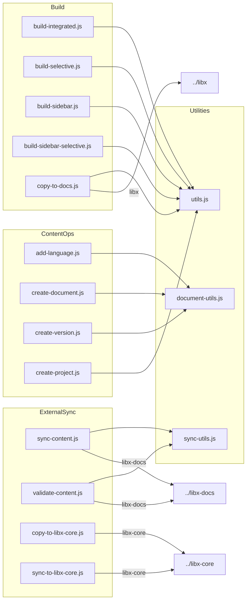

# 現行スクリプトと自動化フロー調査メモ（フェーズ0）

## 1. 調査対象
- ディレクトリ: `scripts/` 配下、および関連する `scripts/dev/`, `scripts/plugins/`, `scripts/schemas/`.
- パッケージスクリプト: `package.json` の `scripts` セクション（pnpm コマンド連携）。
- 外部連携先: `../libx-docs`（コンテンツ同期）、`../libx-core`（コア同期）、`../libx`（ビルド成果コピー）。

## 2. スクリプト一覧と役割
| スクリプト/モジュール | カテゴリ | 主な役割 | 内部依存 | 外部操作・備考 |
| --- | --- | --- | --- | --- |
| `add-language.js` | コンテンツ運用 | 既存プロジェクトへ新言語を追加し設定/ディレクトリ/テンプレートを自動生成 | `document-utils.js` | `pnpm --filter=apps-<project> build` 実行、バックアップ・ロールバック機構 |
| `build-integrated.js` | ビルド統合 | 各アプリをビルドし `dist/` へ統合、ベースパス調整 | `utils.js` (`copyDirRecursive`) | `pnpm --filter=apps-<project> build` を順次実行、ローカルモード対応 |
| `build-selective.js` | ビルド統合 | 指定プロジェクトのみ再ビルドし `dist/` を部分更新 | `utils.js` | `build-integrated.js` に類似、`--projects` 指定 |
| `build-sidebar.js` | 補助ビルド | 各プロジェクトのサイドバー JSON を生成し圧縮保存 | `utils.js` (`saveCompressedJson`, `parseMarkdownFile`) | フロントマター解析、`dist/sidebar/` 等へ出力 |
| `build-sidebar-selective.js` | 補助ビルド | 指定プロジェクト分のサイドバーのみ再生成 | `utils.js` | `build-sidebar.js` の部分実行版 |
| `copy-to-docs.js` | デプロイ補助 | `dist/` 全体を `../libx/` にコピー | `utils.js` | 既存 `libx/` がなければ作成 |
| `copy-to-libx-core.js` | リポジトリ同期 | `.gitignore` + 追加除外ルールを用いた rsync 同期 | なし | `rsync` 実行、`--dry-run` 対応、保護ファイル維持 |
| `create-document.js` | コンテンツ運用 | ドキュメントファイルを採番して生成、カテゴリ管理 | `document-utils.js` | 対話・自動生成モード対応、テンプレ挿入 |
| `create-project.js` | コンテンツ運用 | テンプレートから新規プロジェクト作成、設定更新、依存インストール | なし | `pnpm install`, `pnpm --filter=apps-<project> build`, 設定書き換え |
| `create-version.js` | コンテンツ運用 | 指定プロジェクトに新バージョンを追加、構造複製 | `document-utils.js` | 前バージョン複製や空生成オプション等 |
| `document-utils.js` | 共通ユーティリティ | プロジェクト設定読み書き、カテゴリ/ファイル採番、名称正規化 | なし（標準 Node API のみ） | `add-language/create-document/create-version` の基盤 |
| `sync-content.js` | 外部同期 | `../libx-docs` からコンテンツ同期、差分検出、コピー | `sync-utils.js` | `git`/`rsync` ベースのディレクトリコピー、`--dry-run`/`--content-hash` 等オプション |
| `sync-to-libx-core.js` | リポジトリ同期 | `libx-core` への選択的同期、バックアップ重視 | なし | `rsync -a --delete` を使用、`--dry-run`/`--verbose` 対応 |
| `sync-utils.js` | 共通ユーティリティ | ディレクトリスキャン、構造比較、ハッシュ計算、コピー処理 | なし | `sync-content.js` / `validate-content.js` から利用 |
| `validate-content.js` | 外部同期 | `../libx-docs` の構造・命名・スキーマを検証し必要に応じて修正 | `sync-utils.js`, `schemas/libx-docs-config.schema.json` | `Ajv` でスキーマ検証、`--fix` オプション |
| `build-integrated.js`, `build-selective.js`, `copy-to-docs.js` | ビルド/デプロイ | ※上記重複 | `utils.js` | `pnpm` コマンド連携 |
| `utils.js` | 共通ユーティリティ | JSON圧縮保存、ディレクトリコピー、MDX解析 | `gray-matter` | build/sidebar/copy 系で再利用 |
| `plugins/remark-link-transformer.js` | Astro プラグイン | Astro `astro.config.mjs` から参照、リンク変換 | なし | 各アプリのビルド時に読み込まれる |
| `schemas/libx-docs-config.schema.json` | スキーマ | libx-docs config バリデーション定義 | - | `validate-content.js` が利用 |
| `dev/start_server.sh` | ローカル開発 | `dist/` を Python HTTP サーバーでプレビュー | - | `pnpm build` 後の確認用 |

## 3. pnpm スクリプトとフロー
- `pnpm build` → `scripts/build-integrated.js`
  - 各 `apps/*`（テンプレ除く）を `pnpm --filter` でビルド → `dist/` にコピー → ベースパス調整。
- `pnpm build:local` → `build-integrated.js --local`
- `pnpm build:selective` / `build:selective:local` → `build-selective.js`
- `pnpm build:sidebar` / `build:sidebar-selective` → サイドバー JSON 生成 → `utils.saveCompressedJson` を利用。
- `pnpm build:deploy` → `build-sidebar.js` → `build-integrated.js` → `copy-to-docs.js` の直列実行。
- `pnpm copy:docs` → `copy-to-docs.js`（`../libx/` へコピー）。
- `pnpm create:project` → `create-project.js`（テンプレ複製 → 設定更新 → `pnpm install` → 試験ビルド）。
- `pnpm copy:libx-core` / `sync:libx-core` → `copy-to-libx-core.js` / `sync-to-libx-core.js`。
- `pnpm lint` → ルート ESLint 設定、`pnpm format` → Prettier。

## 4. 依存関係図（主要スクリプトとユーティリティ）

## 5. 主要自動化フローの流れ
- **コンテンツ同期フロー**: `validate-content` で構造確認 → 問題なければ `sync-content` で `libx-docs` → `libx-dev` へ同期 → 必要に応じて `build:sidebar` や `build` を再実行。
- **コア同期フロー**: `copy-to-libx-core` で包括的なコピー → 差分調整が必要な場合に `sync-to-libx-core` を実行（包含ベース指定、ロールバックは手動）。
- **言語追加フロー**: `add-language` 実行 → バックアップ取得 → 設定・ディレクトリ生成 → テンプレ MDX 生成 → テストビルド。
- **プロジェクト作成フロー**: `create-project` でテンプレ複製 → 設定書き換え → 依存インストール → 初回ビルド検証 → `projects.config.json` などへ登録。
- **ビルド & デプロイフロー**: `build:deploy` でサイドバー生成 → 統合ビルド → `../libx/` へ成果物コピー → Cloudflare Pages デプロイは `pnpm deploy` で `wrangler` 実行。

## 6. 所感・メモ
- `document-utils` と `sync-utils` が CLI 群のハブとして機能し、レジストリ化を進める際はここで扱うメタ情報の棚卸しが重要。
- `add-language` / `create-project` は `execSync` で `pnpm` コマンドを多用しており、非同期処理やエラーハンドリングの標準化が課題。
- `sync-content` は `--content-hash` や `--benchmark` など高度なオプションを提供しており、変更検知ロジックの再設計時に考慮が必要。
- `copy-to-libx-core` と `sync-to-libx-core` は似ているが、前者は除外リストベース（rsync + gitignore）、後者は包含リストベースで履歴保護重視。新プロダクトでは目的を統合できる可能性がある。
- `build-integrated` 系はベースパス書き換えなどポストプロセスが複雑化しており、単一ビルド化ではルーティング処理をAstro側へ寄せる余地がある。
