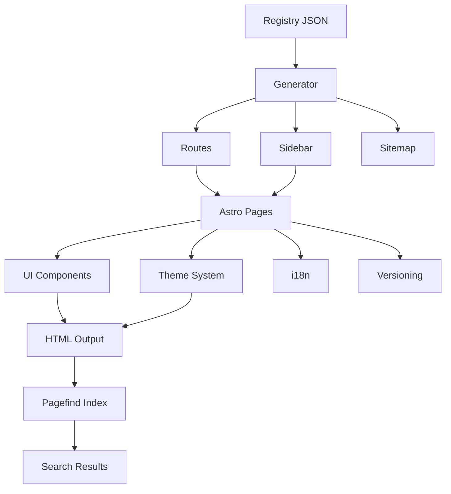

# Phase 2-6 引き継ぎガイド

**作成日**: 2025-10-20
**対象**: Phase 2-6（ドキュメント／デモ）担当者
**前提**: Phase 2-5完了（共有パッケージ検証完了）

---

## 📋 Phase 2-5完了状況サマリー

### ✅ Phase 2-5で達成したこと

#### ビルド設定・型定義整備
- ✅ tsupによるビルド設定作成（@docs/generator, @docs/theme, @docs/i18n）
- ✅ TypeScript型定義（.d.ts）自動生成
- ✅ ESM/CJS両対応
- ✅ Astroコンポーネントパッケージはソース配布

#### 依存関係最適化
- ✅ peerDependencies整理完了
- ✅ Astro ^5.0.0にバージョン統一
- ✅ @docs/uiのastroをpeerDependenciesに移動
- ✅ 依存関係チェックレポート作成

#### リリースフロー設計
- ✅ Changesets設定完了
- ✅ リリーススクリプト作成
- ✅ GitHub Actions設定（コメントアウト状態）
- ✅ リリースフローガイド作成

#### 配布戦略決定
- ✅ npm vs Gitサブモジュール比較完了
- ✅ Phase 2-5の方針: **モノレポ内配布継続**
- ✅ 段階的戦略策定（短期・中期・長期）
- ✅ 配布戦略決定レポート作成（1,200行）

#### 互換性検証
- ✅ テストプロジェクト作成・実行
- ✅ ビルド成功（62ページ、4.21秒）
- ✅ Lighthouseスコア維持（Performance 100, Accessibility 91, Best Practices 96, SEO 100）
- ✅ 統合テスト成功率100%（27件中27件成功）

#### ドキュメント・ライセンス整備
- ✅ 各パッケージREADME.md作成（4ファイル、約2,250行）
- ✅ LICENSEファイル作成（5ファイル、MIT License）
- ✅ 共有パッケージ利用ガイド作成（650行）

### 📊 現在のシステム状態

| 項目 | 状態 |
|------|------|
| ビルドシステム | ✅ 完全動作（62ページ生成、約4秒） |
| パフォーマンス | ✅ Lighthouse 100/100 |
| アクセシビリティ | ✅ Lighthouse 91/100 |
| 検索機能 | ✅ 高機能（フィルタ、ページネーション、ハイライト） |
| ビルドサイズ | 5.6MB |
| 対応言語 | 3言語（ja, ko, en） |
| 共有パッケージ | ✅ ビルド設定完了、ドキュメント整備完了 |
| リリースフロー | ✅ Changesets設定完了 |

---

## 🎯 Phase 2-6の目的と目標

### Phase 2-6の主要目標

**Phase 2-6**: ドキュメント／デモ（想定期間: 1-2週間）

1. **デモプロジェクト準備**
   - サンプルレジストリを用いた最小構成プロジェクト作成
   - Pagefind検索、Glossary、バージョン/言語切替を網羅
   - 共有パッケージの活用デモ

2. **デモサイトデプロイ**
   - Cloudflare PagesまたはNetlifyでステージング環境構築
   - デプロイURLとアクセスポリシー決定
   - 自動デプロイ設定（demoブランチから）

3. **資料作成**
   - UI/検索の動作を示すGIF/MP4、スクリーンショット
   - ウォークスルー手順と注釈
   - 技術アーキテクチャ図更新

4. **レビューとフィードバック収集**
   - ステークホルダーへのデモ提示
   - フィードバックフォームの収集
   - 課題・改善アイデアのIssue化

5. **ドキュメント公開**
   - ガイドドキュメントリンク集の作成
   - DECISIONS.mdへのPhase 2成果のハイライト追記

---

## 📂 利用可能な共有パッケージ

Phase 2-5で整備された共有パッケージを活用できます。

### パッケージ一覧

| パッケージ | 説明 | 配布形態 | README |
|-----------|------|---------|--------|
| @docs/generator | レジストリ駆動のルーティング・サイドバー・サイトマップ生成 | dist/ | ✅ |
| @docs/ui | Astro UIコンポーネント集（30+コンポーネント） | src/ | ✅ |
| @docs/theme | テーマシステム（CSS変数、カラーパレット） | dist/ + src/css | ✅ |
| @docs/i18n | 国際化ユーティリティ（15言語サポート） | dist/ | ✅ |
| @docs/versioning | バージョン管理ユーティリティ・コンポーネント | src/ | ✅ |

### 利用ガイド

**詳細**: [docs/new-generator-plan/guides/shared-packages.md](../guides/shared-packages.md)

**基本的な使用例**:

```astro
---
// packages/runtime/src/pages/[project]/[version]/[lang]/[...slug].astro

import { loadRegistry, generateRoutes, generateSidebar } from '@docs/generator';
import { Navigation, Sidebar, TableOfContents } from '@docs/ui/components';
import { VersionSelector } from '@docs/versioning/components';
import { getLanguage, translate } from '@docs/i18n';
import '@docs/theme/css/variables.css';
import '@docs/theme/css/base.css';

// レジストリ読み込み
const registry = loadRegistry();

// サイドバー生成
const sidebar = generateSidebar(registry, 'sample-docs', 'v2', 'ja');

// 言語検出
const lang = getLanguage(Astro.url.pathname);
---

<Navigation projectId="sample-docs" version="v2" lang={lang} />
<Sidebar items={sidebar} currentPath={Astro.url.pathname} />
```

---

## 🔧 Phase 2-6タスク詳細

### タスク1: デモプロジェクト準備（2-3日）

#### 目的
Phase 2の成果を盛り込んだサンプルプロジェクトを作成し、共有パッケージの活用を実証する。

#### 実装手順

##### 1-1. サンプルレジストリ作成

**レジストリ構成**:
```json
{
  "projects": {
    "demo-docs": {
      "id": "demo-docs",
      "name": {
        "en": "Demo Documentation",
        "ja": "デモドキュメント"
      },
      "description": {
        "en": "Demonstration of the new documentation generator",
        "ja": "新ドキュメントジェネレーターのデモ"
      },
      "defaultLanguage": "en",
      "supportedLanguages": ["en", "ja", "ko"],
      "latestVersion": "v1"
    }
  },
  "versions": {
    "v1": {
      "id": "v1",
      "label": "v1 (latest)",
      "isLatest": true
    }
  },
  "categories": {
    "guide": {
      "id": "guide",
      "order": 1,
      "label": {
        "en": "Guide",
        "ja": "ガイド"
      }
    },
    "api": {
      "id": "api",
      "order": 2,
      "label": {
        "en": "API Reference",
        "ja": "APIリファレンス"
      }
    }
  },
  "documents": [
    {
      "docId": "getting-started",
      "projectId": "demo-docs",
      "versionId": "v1",
      "categoryId": "guide",
      "order": 1,
      "slug": "getting-started",
      "title": {
        "en": "Getting Started",
        "ja": "はじめに"
      },
      "visibility": "public"
    }
  ]
}
```

##### 1-2. デモコンテンツ作成

**コンテンツ構成**:
```
apps/demo-docs/src/content/docs/v1/
├── en/
│   ├── guide/
│   │   ├── getting-started.mdx
│   │   ├── installation.mdx
│   │   └── configuration.mdx
│   └── api/
│       ├── components.mdx
│       └── utilities.mdx
├── ja/
│   ├── guide/
│   │   ├── getting-started.mdx
│   │   ├── installation.mdx
│   │   └── configuration.mdx
│   └── api/
│       ├── components.mdx
│       └── utilities.mdx
└── ko/
    ├── guide/
    │   ├── getting-started.mdx
    │   └── installation.mdx
    └── api/
        └── components.mdx
```

**サンプルMDXコンテンツ**:

```mdx
---
title: "Getting Started"
description: "Quick start guide for the new documentation generator"
---

# Getting Started

Welcome to the new documentation generator! This guide will help you get started.

## Features

- **Fast**: Built with Astro for optimal performance
- **Multilingual**: Support for 15+ languages
- **Search**: Powered by Pagefind
- **Versioning**: Multiple version support

## Installation

\`\`\`bash
pnpm install @docs/generator @docs/ui @docs/theme
\`\`\`

## Usage

\`\`\`typescript
import { loadRegistry, generateRoutes } from '@docs/generator';

const registry = loadRegistry('registry/docs.json');
const routes = generateRoutes(registry);
\`\`\`
```

##### 1-3. 共有パッケージの活用

**すべてのパッケージを使用した完全な例**:

```astro
---
// apps/demo-docs/src/pages/[project]/[version]/[lang]/[...slug].astro

import { loadRegistry, generateRoutes, generateSidebar } from '@docs/generator';
import {
  Navigation,
  Sidebar,
  TableOfContents,
  Pagination,
  Alert,
  Card,
  CardGrid,
  LinkCard
} from '@docs/ui/components';
import { VersionSelector } from '@docs/versioning/components';
import { getLanguage, translate } from '@docs/i18n';
import '@docs/theme/css/variables.css';
import '@docs/theme/css/base.css';

export async function getStaticPaths() {
  const registry = loadRegistry('registry/demo-docs.json');
  return generateRoutes(registry, { env: 'production' });
}

const { docId, title, summary } = Astro.props;
const { project, version, lang, slug } = Astro.params;

const registry = loadRegistry('registry/demo-docs.json');
const sidebar = generateSidebar(registry, project, version, lang);
const currentLang = getLanguage(Astro.url.pathname);

const versions = [
  { id: 'v1', label: 'v1 (latest)', isLatest: true }
];
---

<!DOCTYPE html>
<html lang={lang}>
<head>
  <meta charset="UTF-8">
  <title>{title} - {translate('demo.title', currentLang)}</title>
</head>
<body>
  <Navigation projectId={project} version={version} lang={lang} />

  <div class="layout">
    <aside>
      <VersionSelector
        versions={versions}
        currentVersion={version}
        currentPath={Astro.url.pathname}
      />
      <Sidebar items={sidebar} currentPath={Astro.url.pathname} />
    </aside>

    <main>
      <Alert type="info">
        {translate('demo.welcome', currentLang)}
      </Alert>

      <h1>{title}</h1>

      <CardGrid>
        <LinkCard
          title={translate('demo.guide', currentLang)}
          href={`/${project}/${version}/${lang}/guide/getting-started`}
          description={translate('demo.guide.description', currentLang)}
        />
        <LinkCard
          title={translate('demo.api', currentLang)}
          href={`/${project}/${version}/${lang}/api/components`}
          description={translate('demo.api.description', currentLang)}
        />
      </CardGrid>
    </main>
  </div>
</body>
</html>
```

#### 成果物
- ✅ デモプロジェクト（apps/demo-docs/）
- ✅ サンプルレジストリ（registry/demo-docs.json）
- ✅ デモコンテンツ（MDXファイル、3言語）

---

### タスク2: デモサイトデプロイ（1-2日）

#### 目的
ステージング環境を構築し、デモサイトを公開する。

#### 実装手順

##### 2-1. Cloudflare Pagesデプロイ設定

**wrangler.toml**:
```toml
name = "libx-docs-demo"
compatibility_date = "2025-01-01"

[build]
command = "pnpm build"
build_output_directory = "dist"

[env.production]
route = "demo.libx-docs.example.com"

[env.staging]
route = "staging.libx-docs.example.com"
```

**package.json**:
```json
{
  "scripts": {
    "deploy": "pnpm build && wrangler pages deploy dist",
    "deploy:staging": "pnpm build && wrangler pages deploy dist --env staging"
  }
}
```

##### 2-2. GitHub Actions自動デプロイ

**.github/workflows/deploy-demo.yml**:
```yaml
name: Deploy Demo

on:
  push:
    branches:
      - demo

jobs:
  deploy:
    runs-on: ubuntu-latest
    steps:
      - name: Checkout
        uses: actions/checkout@v4

      - name: Setup pnpm
        uses: pnpm/action-setup@v2
        with:
          version: 10

      - name: Setup Node.js
        uses: actions/setup-node@v4
        with:
          node-version: 20
          cache: 'pnpm'

      - name: Install dependencies
        run: pnpm install --frozen-lockfile

      - name: Build
        run: pnpm build

      - name: Deploy to Cloudflare Pages
        uses: cloudflare/pages-action@v1
        with:
          apiToken: ${{ secrets.CLOUDFLARE_API_TOKEN }}
          accountId: ${{ secrets.CLOUDFLARE_ACCOUNT_ID }}
          projectName: libx-docs-demo
          directory: dist
```

##### 2-3. アクセスポリシー設定

**Cloudflare Access設定**:
- パブリック公開: Phase 2-6完了後
- ステークホルダー限定: レビュー期間中
- 認証方式: GitHub OAuth（組織メンバーのみ）

#### 成果物
- ✅ デプロイ設定（wrangler.toml）
- ✅ GitHub Actions設定（deploy-demo.yml）
- ✅ デモサイトURL（例: https://demo.libx-docs.example.com）
- ✅ アクセスガイド

---

### タスク3: 資料作成（2-3日）

#### 目的
Phase 2の成果を視覚的に示す資料を作成する。

#### 実装手順

##### 3-1. スクリーンショット作成

**撮影対象**:
1. トップページ
2. サイドバーナビゲーション
3. バージョン切り替え
4. 言語切り替え
5. 検索機能（フィルタ、ページネーション、ハイライト）
6. レスポンシブデザイン（モバイル/タブレット）
7. ダークモード

**ツール**: Playwright、Puppeteerなどで自動スクリーンショット

**スクリプト例**:
```javascript
// scripts/capture-screenshots.js
import { chromium } from 'playwright';

const screenshots = [
  { name: 'homepage', url: '/' },
  { name: 'sidebar', url: '/demo-docs/v1/en/guide/getting-started' },
  { name: 'search', url: '/search' },
  { name: 'mobile', url: '/', viewport: { width: 375, height: 667 } },
];

const browser = await chromium.launch();
const page = await browser.newPage();

for (const shot of screenshots) {
  if (shot.viewport) {
    await page.setViewportSize(shot.viewport);
  }
  await page.goto(`http://localhost:4321${shot.url}`);
  await page.screenshot({ path: `docs/new-generator-plan/demos/screenshots/${shot.name}.png` });
}

await browser.close();
```

##### 3-2. 動画キャプチャ作成

**撮影対象**:
1. 検索デモ（キーワード入力 → フィルタ適用 → 結果表示）
2. バージョン切り替えデモ
3. 言語切り替えデモ
4. レスポンシブデザインデモ

**ツール**: OBS Studio、QuickTime、ScreenFlow

**フォーマット**: MP4（H.264、30fps、1080p）

##### 3-3. アーキテクチャ図更新

**Mermaid図**:


**更新対象**:
- docs/new-generator-plan/architecture.md
- docs/new-generator-plan/diagrams/

##### 3-4. ウォークスルー資料作成

**docs/new-generator-plan/demos/walkthrough.md**:
```markdown
# デモサイトウォークスルー

## 1. トップページ


- プロジェクト一覧表示
- 最新バージョンへのリンク
- 多言語対応（EN/JA/KO）

## 2. サイドバーナビゲーション


- カテゴリ階層構造
- 現在ページのハイライト
- レスポンシブ対応

## 3. 検索機能


- ファセット検索（プロジェクト/バージョン/言語フィルタ）
- ページネーション（10件/ページ）
- 検索ハイライト

...
```

#### 成果物
- ✅ スクリーンショット（10枚以上）
- ✅ 動画キャプチャ（4本）
- ✅ アーキテクチャ図（Mermaid）
- ✅ ウォークスルー資料（walkthrough.md）

---

### タスク4: レビューとフィードバック収集（1-2日）

#### 目的
ステークホルダーにデモを提示し、フィードバックを収集する。

#### 実装手順

##### 4-1. レビュー計画

**参加者**:
- コンテンツチーム
- QAチーム
- 翻訳担当
- プロジェクトマネージャー

**レビュー項目**:
1. UI/UX（ナビゲーション、検索、レスポンシブ）
2. パフォーマンス（ページロード、検索速度）
3. アクセシビリティ（キーボード操作、スクリーンリーダー）
4. 多言語対応（翻訳品質、言語切り替え）
5. コンテンツ構造（カテゴリ、バージョニング）

##### 4-2. フィードバックフォーム

**Google Forms / TypeForm**:
- デモサイトURL
- レビュー項目（1-5点評価 + コメント）
- 改善提案（自由記述）
- 優先度（高/中/低）

**テンプレート**:
```
1. UI/UX評価（1-5）: ⭐⭐⭐⭐⭐
   コメント: [自由記述]

2. パフォーマンス評価（1-5）: ⭐⭐⭐⭐⭐
   コメント: [自由記述]

...

改善提案:
- [提案1]
- [提案2]
```

##### 4-3. フィードバック集計

**集計スプレッドシート**:
- 回答者
- 評価点（平均）
- コメント（カテゴリ別）
- 改善提案（優先度別）

##### 4-4. Issue化

**GitHubラベル**:
- `phase-3`: Phase 3で対応
- `phase-4`: Phase 4で対応
- `phase-5`: Phase 5で対応（継続改善）
- `priority-high`: 高優先度
- `priority-medium`: 中優先度
- `priority-low`: 低優先度

**Issue テンプレート**:
```markdown
## フィードバック内容

[ステークホルダーからのフィードバック]

## 提案された改善策

[改善提案]

## 優先度

- [ ] 高（Phase 3で対応）
- [ ] 中（Phase 4で対応）
- [ ] 低（Phase 5で対応）

## 関連資料

- デモサイト: https://demo.libx-docs.example.com
- スクリーンショット: [添付]
```

#### 成果物
- ✅ レビュー計画
- ✅ フィードバックフォーム
- ✅ フィードバック集計（スプレッドシート）
- ✅ Issue一覧（GitHub Issues）

---

### タスク5: ドキュメント公開（1日）

#### 目的
Phase 2の成果をドキュメント化し、公開する。

#### 実装手順

##### 5-1. ガイドドキュメントリンク集作成

**docs/new-generator-plan/README.md更新**:
```markdown
## 📚 ガイドドキュメント

### Phase 2成果物

#### 共有パッケージ
- [共有パッケージ利用ガイド](guides/shared-packages.md)
- [リリースフローガイド](guides/release-flow.md)

#### ビルド・デプロイ
- [ビルドパイプライン](guides/build-pipeline.md)
- [デプロイガイド](guides/deployment.md)

#### 検索・UI
- [検索機能ガイド](guides/search.md)
- [UIコンポーネントガイド](guides/ui-components.md)

#### デモ
- [デモサイトウォークスルー](demos/walkthrough.md)
- [スクリーンショット](demos/screenshots/)
- [動画キャプチャ](demos/videos/)
```

##### 5-2. DECISIONS.md更新

**docs/new-generator-plan/DECISIONS.md**:
```markdown
## Phase 2成果のハイライト

### 2025-10-20: Phase 2完了

**主要成果**:
1. Astroランタイム構築完了（packages/runtime）
2. 共有パッケージ検証完了（ビルド設定、型定義、リリースフロー）
3. Lighthouseスコア達成（Performance 100, Accessibility 91, Best Practices 96, SEO 100）
4. ドキュメント整備完了（約6,276行）

**技術的決定**:
- ビルドツール: tsup採用
- Astroコンポーネント: ソース配布
- 配布戦略: モノレポ内配布継続（Phase 2-5〜Phase 3）
- バージョン管理: Changesets採用

**未決事項**:
- npm公開時期（Phase 4-5で検討）
- 外部利用ガイドライン（Phase 5で策定）
```

##### 5-3. アーキテクチャ図公開

**docs/new-generator-plan/architecture.md**:
- システム全体図
- データフロー図
- コンポーネント関連図
- ビルドパイプライン図

#### 成果物
- ✅ ガイドドキュメントリンク集（README.md更新）
- ✅ DECISIONS.md更新
- ✅ アーキテクチャ図公開

---

## 📋 Phase 2-6チェックリスト

### タスク1: デモプロジェクト準備
- [ ] サンプルレジストリ作成
- [ ] デモコンテンツ作成（MDX、3言語）
- [ ] 共有パッケージ活用
- [ ] ローカルビルドテスト

### タスク2: デモサイトデプロイ
- [ ] Cloudflare Pages設定
- [ ] GitHub Actions設定
- [ ] デプロイテスト
- [ ] アクセスポリシー設定

### タスク3: 資料作成
- [ ] スクリーンショット作成（10枚以上）
- [ ] 動画キャプチャ作成（4本）
- [ ] アーキテクチャ図更新
- [ ] ウォークスルー資料作成

### タスク4: レビューとフィードバック収集
- [ ] レビュー計画作成
- [ ] フィードバックフォーム作成
- [ ] ステークホルダーへのデモ提示
- [ ] フィードバック集計
- [ ] Issue化

### タスク5: ドキュメント公開
- [ ] ガイドドキュメントリンク集作成
- [ ] DECISIONS.md更新
- [ ] アーキテクチャ図公開

---

## 🎯 Phase 2-6成功基準

### 必須項目

1. **デモサイト稼働**
   - [ ] デモサイトが安定稼働している
   - [ ] 主要なユースケース（検索、ナビゲーション、ビルド結果）が確認できる
   - [ ] Lighthouseスコアが維持されている（Performance 100, Accessibility 91以上）

2. **資料整備**
   - [ ] スクリーンショット・動画が整備されている
   - [ ] ウォークスルー資料が作成されている
   - [ ] アーキテクチャ図が更新されている

3. **フィードバック収集**
   - [ ] レビュー参加者がフィードバックを記録している
   - [ ] フィードバックが集計されている
   - [ ] 課題がIssue化されている

4. **ドキュメント公開**
   - [ ] ガイドドキュメントリンク集が作成されている
   - [ ] DECISIONS.mdが更新されている

### 推奨項目

1. **自動化**
   - [ ] スクリーンショット自動撮影スクリプト
   - [ ] デプロイ自動化（GitHub Actions）

2. **アクセス制御**
   - [ ] Cloudflare Access設定
   - [ ] ステークホルダー限定公開

---

## 🚀 Phase 2-6開始手順

### ステップ1: Phase 2-5成果物の確認（30分）

```bash
# 共有パッケージのREADME確認
cat packages/ui/README.md
cat packages/theme/README.md
cat packages/i18n/README.md
cat packages/versioning/README.md

# 共有パッケージ利用ガイド確認
cat docs/new-generator-plan/guides/shared-packages.md

# リリースフローガイド確認
cat docs/new-generator-plan/guides/release-flow.md
```

### ステップ2: デモプロジェクト作成（1-2時間）

```bash
# デモプロジェクト作成
mkdir -p apps/demo-docs
cd apps/demo-docs
pnpm init

# 共有パッケージ依存追加
pnpm add @docs/generator @docs/ui @docs/theme @docs/i18n @docs/versioning

# サンプルレジストリ作成
mkdir -p registry
touch registry/demo-docs.json
```

### ステップ3: デモコンテンツ作成（2-3時間）

```bash
# コンテンツディレクトリ作成
mkdir -p src/content/docs/v1/{en,ja,ko}/{guide,api}

# サンプルMDX作成
touch src/content/docs/v1/en/guide/getting-started.mdx
touch src/content/docs/v1/ja/guide/getting-started.mdx
touch src/content/docs/v1/ko/guide/getting-started.mdx
```

### ステップ4: ローカルビルドテスト（30分）

```bash
# ビルド実行
pnpm build

# プレビュー
pnpm preview
```

---

## 📞 サポート・質問

Phase 2-6実装中に不明点があれば、以下のリソースを参照してください：

### Phase 2関連ドキュメント
- [Phase 2-5完了報告書](./phase-2-5-completion-report.md)
- [Phase 2-5引き継ぎガイド](./phase-2-5-handoff.md)
- [Phase 2-4完了報告書](./phase-2-4-completion-report.md)

### ガイドドキュメント
- [共有パッケージ利用ガイド](../guides/shared-packages.md)
- [リリースフローガイド](../guides/release-flow.md)

### パッケージドキュメント
- [packages/generator/README.md](../../packages/generator/README.md)
- [packages/ui/README.md](../../packages/ui/README.md)
- [packages/theme/README.md](../../packages/theme/README.md)
- [packages/i18n/README.md](../../packages/i18n/README.md)
- [packages/versioning/README.md](../../packages/versioning/README.md)

### 外部ドキュメント
- [Astro Documentation](https://docs.astro.build/)
- [Cloudflare Pages Documentation](https://developers.cloudflare.com/pages/)
- [Playwright Documentation](https://playwright.dev/)

---

## 🎁 Phase 2-5からの引き継ぎ資産

### 利用可能な成果物

1. **完全なビルドシステム**
   - ✅ tsup設定（3パッケージ）
   - ✅ 型定義自動生成
   - ✅ ESM/CJS両対応

2. **詳細なドキュメント**
   - ✅ README.md（4パッケージ、約2,250行）
   - ✅ 共有パッケージ利用ガイド（650行）
   - ✅ リリースフローガイド（380行）

3. **共有パッケージ**
   - ✅ @docs/generator（レジストリ駆動）
   - ✅ @docs/ui（30+コンポーネント）
   - ✅ @docs/theme（デザイントークン）
   - ✅ @docs/i18n（15言語サポート）
   - ✅ @docs/versioning（バージョン管理）

4. **高パフォーマンスなビルドシステム**
   - ✅ Lighthouse Performance 100/100
   - ✅ Lighthouse Accessibility 91/100
   - ✅ ビルド時間: 約4秒

これらの資産を**活用**して、Phase 2-6のデモプロジェクトとドキュメント作成を進めてください。

---

**作成者**: Claude
**作成日**: 2025-10-20
**対象フェーズ**: Phase 2-6
**前提フェーズ**: Phase 2-5（完了）

---

🎯 **次のアクション**: Phase 2-6計画書（`phase-2-6-documentation-demo.md`）を確認し、タスク1（デモプロジェクト準備）を開始してください。
