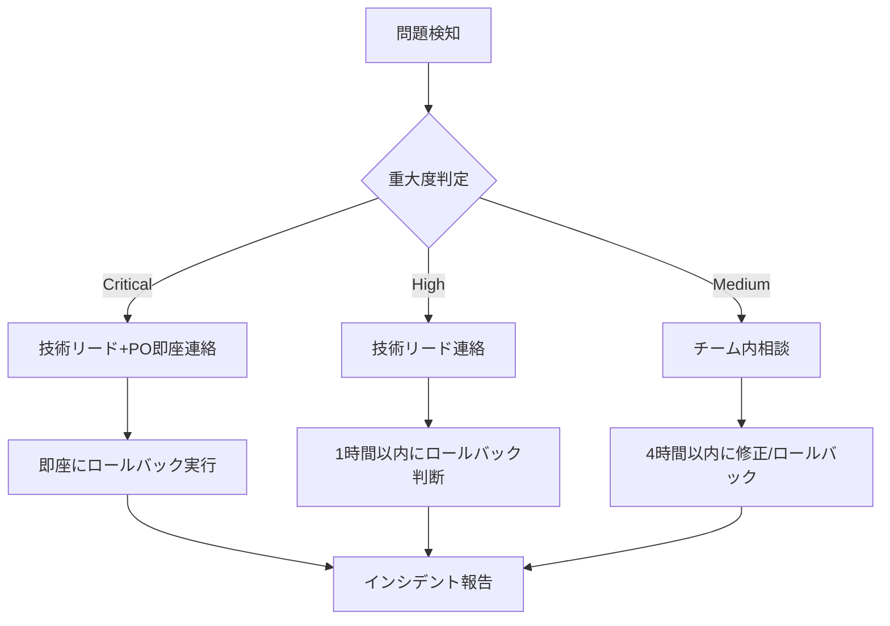

# Phase 4-3: 切り戻しテストレポート

**作成日**: 2025-10-26
**作成者**: Claude (Phase 4-3 Release Preparation)
**ステータス**: 🔄 進行中

---

## 📋 概要

本番デプロイ時の緊急切り戻し手順を検証するため、ステージング環境で切り戻しテストを実施します。

### 目的

1. 2種類の切り戻し方法を検証
2. 各方法の所要時間を計測
3. 緊急時の判断基準とエスカレーション手順を確立
4. 切り戻し手順書を作成

### 検証する切り戻し方法

1. **方法1**: Cloudflare Dashboardでのロールバック（推奨）
2. **方法2**: Git revertによる切り戻し

---

## 🎯 切り戻しテスト計画

### テスト環境

| 項目 | 値 |
|-----|-----|
| **環境** | Staging |
| **URL** | https://libx-staging.pages.dev |
| **ブランチ** | staging |
| **テスト実施者** | [記録] |

### 破壊的変更のシナリオ

**シナリオ1**: ページレイアウト破壊
```astro
<!-- apps/demo-docs/src/pages/index.astro に追加 -->
<!-- BREAKING CHANGE: Layout broken intentionally -->
<style>
  * { display: none !important; }
</style>
```

**シナリオ2**: JavaScriptエラー
```javascript
// apps/demo-docs/src/layouts/DocLayout.astro に追加
<script>
  // BREAKING CHANGE: Intentional error
  throw new Error('Rollback test error');
</script>
```

---

## 🔄 方法1: Cloudflare Dashboardでの切り戻し

### 手順

**Step 1: 破壊的変更の導入**
```bash
git checkout staging
echo "<!-- BREAKING CHANGE: Test 1 -->" >> apps/demo-docs/src/pages/index.astro
echo "<style>* { display: none !important; }</style>" >> apps/demo-docs/src/pages/index.astro
git add .
git commit -m "test: 切り戻しテスト - レイアウト破壊"
git push origin staging
```

**Step 2: デプロイ完了を待つ**
- GitHub Actionsの実行を確認
- デプロイ完了を確認
- 破壊的変更が反映されていることを確認

**Step 3: Cloudflare Dashboardでロールバック**
1. Cloudflare Dashboard にログイン
2. `Workers & Pages` → `libx-staging`
3. `Deployments` タブを開く
4. 最新のデプロイ（破壊的変更あり）を確認
5. その1つ前のデプロイ（正常版）を選択
6. `Manage deployment` → `Rollback to this deployment`
7. 確認ダイアログで `Rollback` をクリック

**Step 4: 切り戻し完了を確認**
- ページが正常に表示されることを確認
- 破壊的変更が取り消されていることを確認

### 実施記録

**実施日**: [未実施]

| 項目 | 結果 | 備考 |
|-----|------|------|
| **破壊的変更デプロイ開始** | [時刻記録] | - |
| **破壊的変更デプロイ完了** | [時刻記録] | - |
| **破壊的変更確認** | [ ] ✅ / [ ] ❌ | ページが意図通り破壊されている |
| **ロールバック開始** | [時刻記録] | - |
| **ロールバック完了** | [時刻記録] | - |
| **切り戻し所要時間** | [分:秒] | ロールバック開始から完了まで |
| **サイト復旧確認** | [ ] ✅ / [ ] ❌ | ページが正常に表示される |

**スクリーンショット**:
- [ ] 破壊的変更反映後
- [ ] 切り戻し後

---

## 🔄 方法2: Git revertによる切り戻し

### 手順

**Step 1: 破壊的変更の導入**
```bash
git checkout staging
echo "<!-- BREAKING CHANGE: Test 2 -->" >> apps/demo-docs/src/layouts/DocLayout.astro
echo "<script>throw new Error('Rollback test error');</script>" >> apps/demo-docs/src/layouts/DocLayout.astro
git add .
git commit -m "test: 切り戻しテスト - JavaScriptエラー"
git push origin staging
```

**Step 2: デプロイ完了を待つ**
- GitHub Actionsの実行を確認
- デプロイ完了を確認
- 破壊的変更が反映されていることを確認

**Step 3: Git revertで切り戻し**
```bash
# 最新コミットを確認
git log --oneline -5

# 破壊的変更のコミットをrevert
git revert HEAD

# リモートにプッシュ（自動的に再デプロイされる）
git push origin staging
```

**Step 4: 再デプロイ完了を待つ**
- GitHub Actionsの実行を確認
- デプロイ完了を確認

**Step 5: 切り戻し完了を確認**
- ページが正常に表示されることを確認
- JavaScriptエラーが解消されていることを確認

### 実施記録

**実施日**: [未実施]

| 項目 | 結果 | 備考 |
|-----|------|------|
| **破壊的変更デプロイ開始** | [時刻記録] | - |
| **破壊的変更デプロイ完了** | [時刻記録] | - |
| **破壊的変更確認** | [ ] ✅ / [ ] ❌ | JavaScriptエラーが発生 |
| **Git revert実行** | [時刻記録] | - |
| **再デプロイ開始** | [時刻記録] | - |
| **再デプロイ完了** | [時刻記録] | - |
| **切り戻し所要時間** | [分:秒] | Git revert実行から再デプロイ完了まで |
| **サイト復旧確認** | [ ] ✅ / [ ] ❌ | JavaScriptエラーが解消 |

**スクリーンショット**:
- [ ] 破壊的変更反映後（ブラウザコンソールのエラー）
- [ ] 切り戻し後（エラーなし）

---

## 📊 切り戻し方法の比較

### 所要時間比較

| 方法 | 所要時間 | 備考 |
|-----|---------|------|
| **方法1**: Cloudflare Dashboard | [未測定] | ロールバック処理のみ |
| **方法2**: Git revert | [未測定] | ビルド+デプロイ時間含む |

**推奨方法**: 方法1（Cloudflare Dashboard）
- 理由: [方法1の方が高速/確実/簡単 等]

### 長所・短所

#### 方法1: Cloudflare Dashboard

**長所**:
- ✅ 即座にロールバック可能（ビルド不要）
- ✅ GUI操作で簡単
- ✅ デプロイ履歴が保持される
- ✅ 技術的知識が少なくても実行可能

**短所**:
- ❌ Cloudflare Dashboardへのアクセス権限が必要
- ❌ Gitリポジトリとの同期が必要

#### 方法2: Git revert

**長所**:
- ✅ Gitリポジトリと完全に同期
- ✅ 変更履歴がGitに残る
- ✅ ローカルからの操作で完結

**短所**:
- ❌ ビルド+デプロイ時間がかかる
- ❌ Git操作の知識が必要
- ❌ CI/CDパイプラインが正常動作する必要あり

---

## 🚨 緊急切り戻しの判断基準

### 即座に切り戻しが必要な状況

**Level 1: Critical (即座に切り戻し実行)**

| シナリオ | 判断基準 | 対応時間 |
|---------|---------|---------|
| **サービス停止** | サイト全体が表示されない | 即座（5分以内） |
| **セキュリティインシデント** | 認証情報漏洩、XSS脆弱性等 | 即座（5分以内） |
| **データ損失の恐れ** | ユーザーデータが消失する可能性 | 即座（5分以内） |

**対応**: 方法1（Cloudflare Dashboard）で即座にロールバック

**Level 2: High (1時間以内に切り戻し)**

| シナリオ | 判断基準 | 対応時間 |
|---------|---------|---------|
| **主要機能の停止** | 検索、ナビゲーション等が動作しない | 1時間以内 |
| **パフォーマンス著しく低下** | Lighthouseスコアが50以下 | 1時間以内 |
| **多数のページで404** | 複数のページが表示されない | 1時間以内 |

**対応**: 状況を確認し、修正が困難な場合は切り戻し

**Level 3: Medium (4時間以内に修正または切り戻し)**

| シナリオ | 判断基準 | 対応時間 |
|---------|---------|---------|
| **一部ページの表示崩れ** | レイアウトが崩れているが閲覧可能 | 4時間以内 |
| **軽微な機能不具合** | 言語切替UIが一部動作しない等 | 4時間以内 |

**対応**: 修正を試みる。修正が困難な場合は切り戻し

---

## 📞 エスカレーション手順

### 連絡体制

| 役割 | 担当者 | 連絡先 | 対応時間 |
|-----|-------|--------|---------|
| **技術リード** | [名前] | [連絡先] | 即座 |
| **プロダクトオーナー** | [名前] | [連絡先] | 即座 |
| **インフラ担当** | [名前] | [連絡先] | 即座 |
| **バックアップ担当** | [名前] | [連絡先] | 1時間以内 |

### エスカレーションフロー



---

## 📝 切り戻し手順書

### 緊急切り戻し実施手順（本番環境）

**前提条件**:
- Cloudflare Dashboardへのアクセス権限がある
- 問題が切り戻しで解決できると判断されている

**手順**:

1. **状況確認** (1分)
   - 問題の内容を記録
   - 影響範囲を特定
   - 重大度を判定

2. **関係者への連絡** (2分)
   - Slackの緊急チャンネルで通知
   - 技術リード・POに電話連絡（Criticalの場合）

3. **ロールバック実行** (2分)
   ```
   Cloudflare Dashboard → Workers & Pages → libx
   → Deployments → [前回の正常版を選択]
   → Manage deployment → Rollback to this deployment
   → 確認ダイアログで Rollback をクリック
   ```

4. **復旧確認** (3分)
   - サイトが正常に表示されることを確認
   - 主要機能が動作することを確認
   - Lighthouseスコアを測定

5. **インシデント報告** (10分)
   - 発生時刻、問題内容、対応内容を記録
   - Gitリポジトリとの同期（必要に応じてGit revertも実行）

**総所要時間**: 約15-20分（Critical対応）

---

## 💡 学んだ教訓

### 改善点

1. **[改善点1]**: [内容記録予定]
2. **[改善点2]**: [内容記録予定]

### ベストプラクティス

1. **[ベストプラクティス1]**: [内容記録予定]
2. **[ベストプラクティス2]**: [内容記録予定]

---

## 🎯 完了基準達成状況

| 完了基準 | 達成状況 |
|---------|---------|
| ✅ 方法1（Cloudflare Dashboard）のテスト完了 | [ ] 達成 / [ ] 未達 |
| ✅ 方法2（Git revert）のテスト完了 | [ ] 達成 / [ ] 未達 |
| ✅ 各方法の所要時間を計測 | [ ] 達成 / [ ] 未達 |
| ✅ 推奨方法を決定 | [ ] 達成 / [ ] 未達 |
| ✅ 緊急切り戻し手順書を作成 | [ ] 達成 / [ ] 未達 |

---

## 📎 関連ドキュメント

- [phase-4-3-staging-deployment-report.md](./phase-4-3-staging-deployment-report.md) - ステージングデプロイレポート
- [phase-4-3-deployment-runbook.md](./phase-4-3-deployment-runbook.md) - 本番デプロイ手順書
- [build-deploy-operations.md](../guides/build-deploy-operations.md) - ビルド・デプロイ運用ガイド

---

## 🎉 まとめ

**ステータス**: [ ] ✅ 完了 / [🔄] 進行中

**次のステップ**:
1. 切り戻しテストの実施
2. 結果の分析
3. 本番デプロイ手順書への反映

---

**作成者**: Claude Code (AI Assistant)
**作成日**: 2025-10-26
**最終更新**: 2025-10-26
